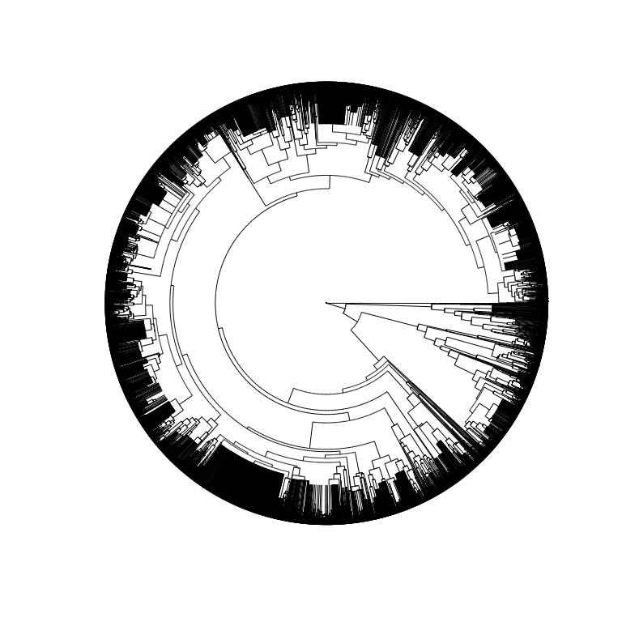
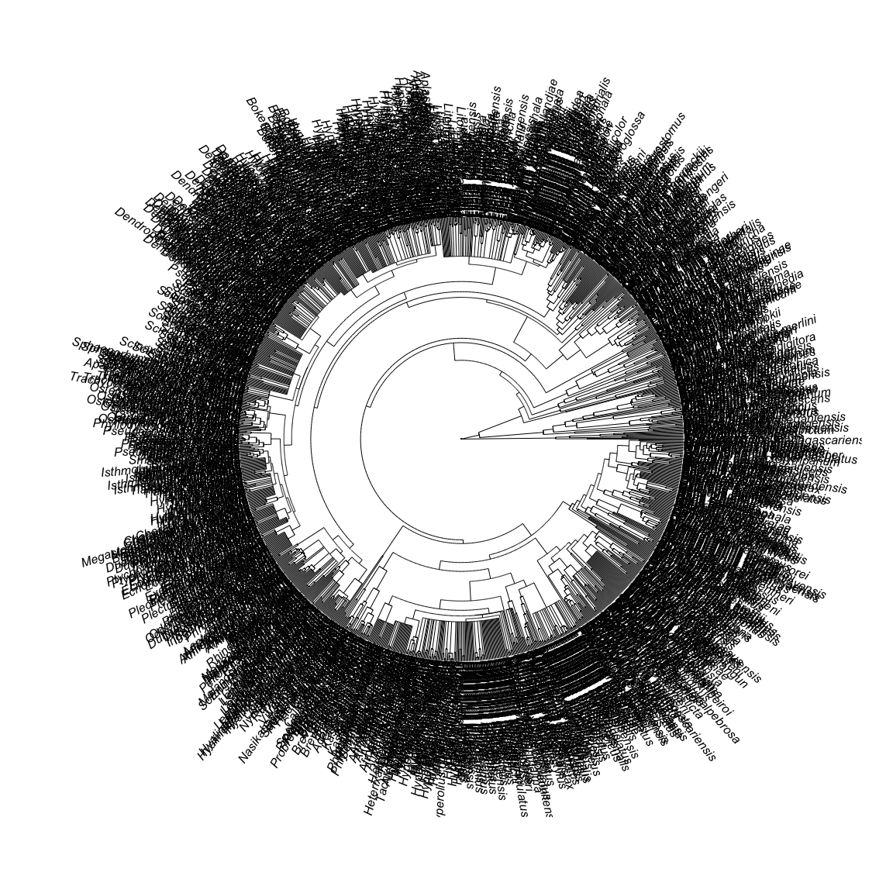
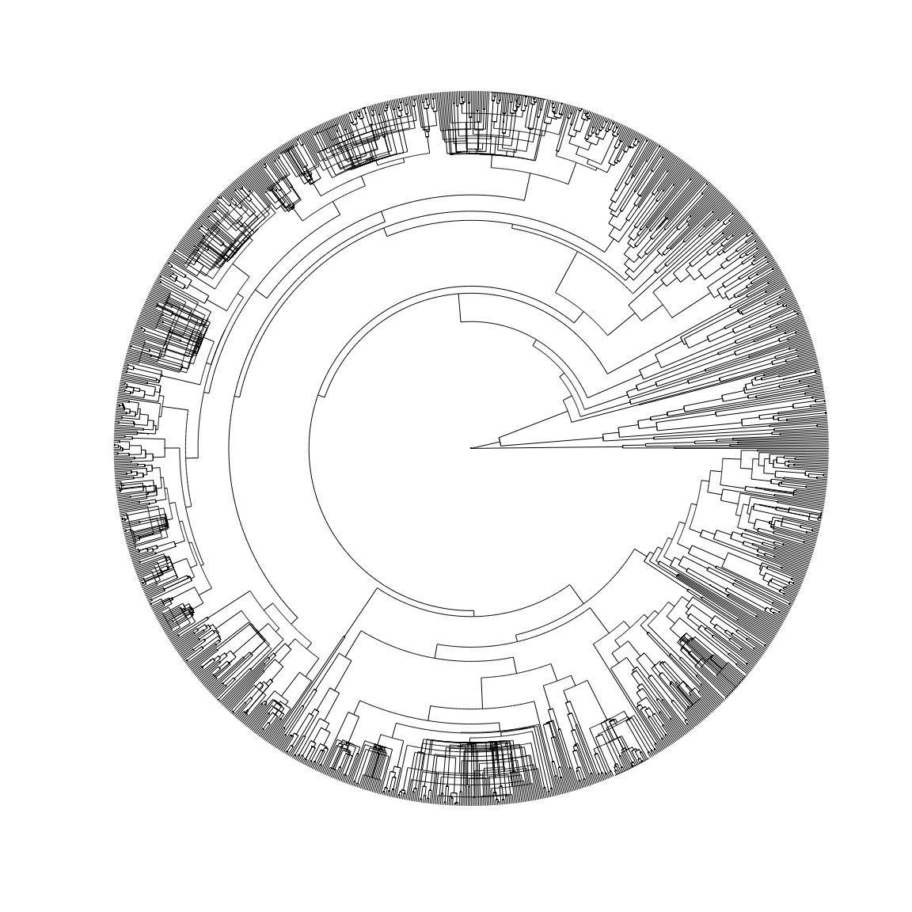
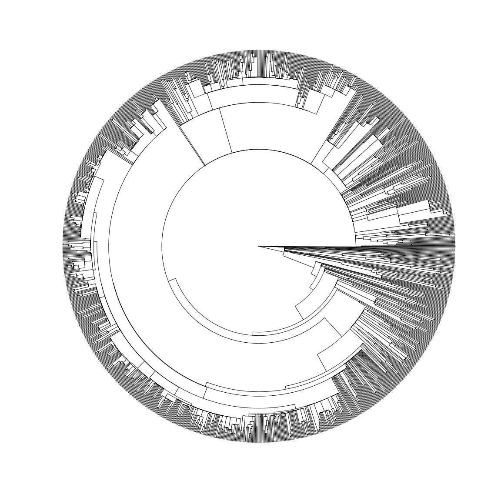
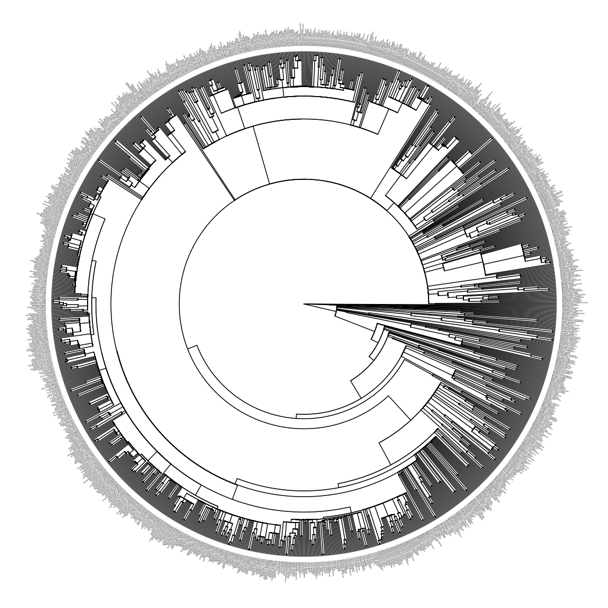
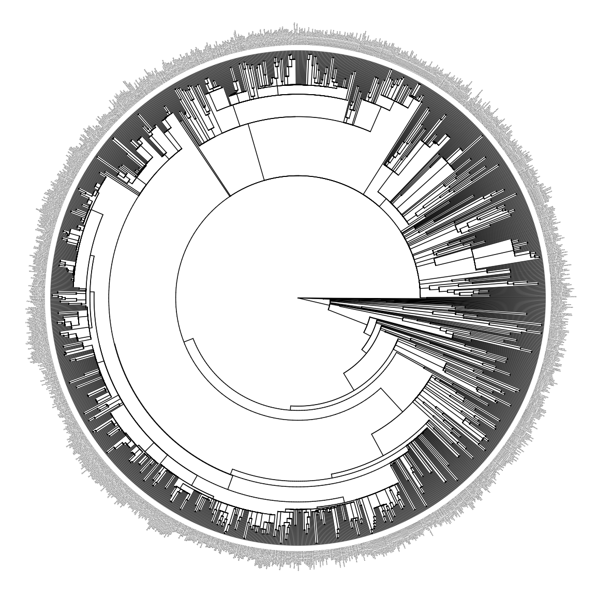

<style type="text/css">

body{ /* Normal  */
      font-size: 17px;
  }
  
</style>


# Load data

## Pupil data

We have two pupil data sheets: one for adults and one for tadpoles. Both are structured the same way. Each row represents one species, and includes full taxonomic information, pupil and iris categorical data, and sources for images used to classify each species. The adult data sheet also has ecological traits for each species listed. 


```r
# Load pupil data ---------

#import adult data
pupils_adults_raw <- data.frame(read.csv("../Data/Raw data/anuran_pupils_data.csv",
                                         header=TRUE, 
                                         na.strings=c("", "NA", " "))) 


#tidy adult data
pupils_adults <- pupils_adults_raw %>% 
  mutate(genus_species = as.factor(paste(Genus, Species, sep = "_"))) %>%
  mutate(DROPS = replace_na(DROPS, "keep")) %>%
  filter(DROPS != "drop") %>%
  filter(genus_species != "eyes beneath bone_NA") %>% #remove non-eyed caecilians
  filter(genus_species != "eyes beneath bone?_NA") %>% #remove non-eyed caecilians
  #select(genus_species, Order, Family, Genus, Species, Final_Constriction, Final_Shape, aquatic, fossorial, arboreal, diurnal) %>%
  select(genus_species, Order, Family, Genus, Species, Final_Constriction, Final_Shape, aquatic, fossorial, arboreal, diurnal, Source, Pupil_link, Pupil_link_2, AH_source, AP_source, references) %>%
filter_at(vars(Final_Constriction, Final_Shape), any_vars(!is.na(.))) %>% #omit species missing both pupil constriction and shape data. 
  droplevels() 

# check for duplicates of species
n_occur <- data.frame(table(pupils_adults$genus_species))
#View(n_occur)

#import tadpole data
pupils_tadpole_raw <- data.frame(read.csv("../Data/Raw data/tadpole_pupils_data.csv", 
                                          header = TRUE, 
                                          na.strings = c("", "NA", " "))) 

#tidy tadpole data
pupils_tadpole <- pupils_tadpole_raw %>% 
  filter(Genus != "(direct development)") %>% #remove direct developers
  mutate(genus_species = as.factor(paste(Genus, Species, sep = "_"))) %>%
  mutate(Tadpole_constriction = Final_Constriction, Tadpole_shape = Final_Shape) %>%
  #select(genus_species, Order, Family, Genus, Species, Tadpole_constriction, Tadpole_shape) %>%
  mutate(Tadpole_source = Source, Tad_pupil_link = Pupil_link, Tad_pupil_link2 = Pupil_link_2) %>%
  select(genus_species, Order, Family, Genus, Species, Tadpole_constriction, Tadpole_shape, Tadpole_source, Tad_pupil_link, Tad_pupil_link2) %>%
  filter_at(vars(Tadpole_constriction, Tadpole_shape), any_vars(!is.na(.))) #omit species missing both pupil constriction and shape data. 

#Merge tadpole dataset with adult dataset
pupils_full <- full_join(pupils_adults, pupils_tadpole, by = c("genus_species", "Order","Family","Genus", "Species"))

# check for duplicates of species
n_occur <- data.frame(table(pupils_full$genus_species))
#View(n_occur)

# check for tads with no matching adult
missing_ads <- pupils_full %>%
  filter(!is.na(Tadpole_constriction)) %>%
  filter(is.na(Final_Constriction))

# Add eye size from Thomas et al. 2020;  https://doi.org/10.5061/dryad.1zcrjdfq7-------

#import data
eyesize_raw <- data.frame(read.csv("../Data/Raw data/Thomas_museum_specimens.csv", header = TRUE, na.strings = c("", "NA", " "))) 

#tidy data
eyesize1 <- eyesize_raw %>%
  mutate(eyemean = rowMeans(eyesize_raw[c('ED_right_mm', 'ED_left_mm')], na.rm=TRUE)) %>% #adds mean of L/R eyes
  mutate(eyemean = na_if(eyemean, "NaN")) %>% #remove missing values
   select(genus_species, eyemean) #keeps only columns of interest for analyses

#find species means
eyesize <- eyesize1 %>% 
  mutate_if(is.character, as.factor) %>% 
  filter(!is.na(eyemean)) %>% 
  group_by(genus_species) %>%
  summarise(eye_av = mean(eyemean))

#fix synonyms for the missing species

# Tidy up the factors ------

#combine almond and slit categories to one
pupils <- pupils_full %>%
  #combine almond and slit categories to one
  mutate(Final_Shape = recode_factor(Final_Shape, "almond" = "almond/slit", "slit" = "almond/slit")) %>%
  #change (yes) and (no) ecological states to yes and no
  mutate(aquatic = recode_factor(aquatic, "(no)" = "no", "(yes)" = "yes")) %>%
  mutate(fossorial = recode_factor(fossorial, "(no)" = "no", "No" = "no", "no " = "no")) %>%
  mutate(arboreal = recode_factor(arboreal, "Yes" = "yes", "(yes)" = "yes", "(no)" = "no")) %>%
  mutate(diurnal = recode_factor(diurnal, "(no)" = "no", "no " = "no", "no?" = "no")) %>%
  mutate(diurnal = na_if(diurnal, "Unknown")) %>%
  droplevels()

#check factor levels for pupil shape/constriction
levels(as.factor(pupils$Final_Constriction))
levels(pupils$Final_Shape)

#check factor levels for binary ecology traits
levels(as.factor(pupils$aquatic))
levels(as.factor(pupils$fossorial))
levels(as.factor(pupils$arboreal))
levels(as.factor(pupils$diurnal))

# Taxon sampling -----

#Number of speciessampled acros taxa
counts <-ddply(pupils, .(pupils$Order, pupils$Family), nrow)
names(counts) <- c("Order", "Family","Species Sampled")

#total sampling
length(levels(as.factor(pupils$genus_species)))
length(levels(as.factor(pupils$Genus)))
length(levels(as.factor(pupils$Family)))

#frog sampling
frogs<-pupils %>% filter(Order=="Anura")
length(levels(as.factor(frogs$genus_species)))
length(levels(as.factor(frogs$Family)))

#caudatan sampling
caudata<-pupils %>% filter(Order=="Caudata")
length(levels(as.factor(caudata$genus_species)))
length(levels(as.factor(caudata$Family)))

#caecilian sampling
gymno <- pupils %>% filter(Order=="Gymnophiona")
length(levels(as.factor(gymno$genus_species)))
length(levels(as.factor(gymno$Family)))
```

We have collected amphibian pupil data from 1293 species representing 345 genera and 72 families. 

Sampling within family is uneven due to increased focus on families that seemed to exhibit more diversity in pupil shapes and constriction. 


```r
#create scrolling RMarkdown table of sampling
kable(counts[ , c("Order", "Family","Species Sampled")], caption = "Sampling of pupil shape across taxonomic groups of amphibians") %>%
  kable_styling(full_width = F) %>%
  collapse_rows(columns = 1, valign = "top") %>%
  scroll_box(height = "500px")
```

<div style="border: 1px solid #ddd; padding: 0px; overflow-y: scroll; height:500px; "><table class="table" style="width: auto !important; margin-left: auto; margin-right: auto;">
<caption>Sampling of pupil shape across taxonomic groups of amphibians</caption>
 <thead>
  <tr>
   <th style="text-align:left;position: sticky; top:0; background-color: #FFFFFF;"> Order </th>
   <th style="text-align:left;position: sticky; top:0; background-color: #FFFFFF;"> Family </th>
   <th style="text-align:right;position: sticky; top:0; background-color: #FFFFFF;"> Species Sampled </th>
  </tr>
 </thead>
<tbody>
  <tr>
   <td style="text-align:left;"> Anura </td>
   <td style="text-align:left;"> Allophrynidae </td>
   <td style="text-align:right;"> 1 </td>
  </tr>
  <tr>
   <td style="text-align:left;"> Anura </td>
   <td style="text-align:left;"> Alsodidae </td>
   <td style="text-align:right;"> 4 </td>
  </tr>
  <tr>
   <td style="text-align:left;"> Anura </td>
   <td style="text-align:left;"> Alytidae </td>
   <td style="text-align:right;"> 5 </td>
  </tr>
  <tr>
   <td style="text-align:left;"> Anura </td>
   <td style="text-align:left;"> Aromobatidae </td>
   <td style="text-align:right;"> 3 </td>
  </tr>
  <tr>
   <td style="text-align:left;"> Anura </td>
   <td style="text-align:left;"> Arthroleptidae </td>
   <td style="text-align:right;"> 63 </td>
  </tr>
  <tr>
   <td style="text-align:left;"> Anura </td>
   <td style="text-align:left;"> Ascaphidae </td>
   <td style="text-align:right;"> 1 </td>
  </tr>
  <tr>
   <td style="text-align:left;"> Anura </td>
   <td style="text-align:left;"> Batrachylidae </td>
   <td style="text-align:right;"> 2 </td>
  </tr>
  <tr>
   <td style="text-align:left;"> Anura </td>
   <td style="text-align:left;"> Bombinatoridae </td>
   <td style="text-align:right;"> 5 </td>
  </tr>
  <tr>
   <td style="text-align:left;"> Anura </td>
   <td style="text-align:left;"> Brachycephalidae </td>
   <td style="text-align:right;"> 5 </td>
  </tr>
  <tr>
   <td style="text-align:left;"> Anura </td>
   <td style="text-align:left;"> Brevicipitidae </td>
   <td style="text-align:right;"> 26 </td>
  </tr>
  <tr>
   <td style="text-align:left;"> Anura </td>
   <td style="text-align:left;"> Bufonidae </td>
   <td style="text-align:right;"> 45 </td>
  </tr>
  <tr>
   <td style="text-align:left;"> Anura </td>
   <td style="text-align:left;"> Calyptocephalellidae </td>
   <td style="text-align:right;"> 1 </td>
  </tr>
  <tr>
   <td style="text-align:left;"> Anura </td>
   <td style="text-align:left;"> Centrolenidae </td>
   <td style="text-align:right;"> 18 </td>
  </tr>
  <tr>
   <td style="text-align:left;"> Anura </td>
   <td style="text-align:left;"> Ceratobatrachidae </td>
   <td style="text-align:right;"> 3 </td>
  </tr>
  <tr>
   <td style="text-align:left;"> Anura </td>
   <td style="text-align:left;"> Ceratophryidae </td>
   <td style="text-align:right;"> 4 </td>
  </tr>
  <tr>
   <td style="text-align:left;"> Anura </td>
   <td style="text-align:left;"> Conrauidae </td>
   <td style="text-align:right;"> 2 </td>
  </tr>
  <tr>
   <td style="text-align:left;"> Anura </td>
   <td style="text-align:left;"> Craugastoridae </td>
   <td style="text-align:right;"> 14 </td>
  </tr>
  <tr>
   <td style="text-align:left;"> Anura </td>
   <td style="text-align:left;"> Cycloramphidae </td>
   <td style="text-align:right;"> 4 </td>
  </tr>
  <tr>
   <td style="text-align:left;"> Anura </td>
   <td style="text-align:left;"> Dendrobatidae </td>
   <td style="text-align:right;"> 5 </td>
  </tr>
  <tr>
   <td style="text-align:left;"> Anura </td>
   <td style="text-align:left;"> Dicroglossidae </td>
   <td style="text-align:right;"> 14 </td>
  </tr>
  <tr>
   <td style="text-align:left;"> Anura </td>
   <td style="text-align:left;"> Eleutherodactylidae </td>
   <td style="text-align:right;"> 5 </td>
  </tr>
  <tr>
   <td style="text-align:left;"> Anura </td>
   <td style="text-align:left;"> Heleophrynidae </td>
   <td style="text-align:right;"> 4 </td>
  </tr>
  <tr>
   <td style="text-align:left;"> Anura </td>
   <td style="text-align:left;"> Hemiphractidae </td>
   <td style="text-align:right;"> 9 </td>
  </tr>
  <tr>
   <td style="text-align:left;"> Anura </td>
   <td style="text-align:left;"> Hemisotidae </td>
   <td style="text-align:right;"> 4 </td>
  </tr>
  <tr>
   <td style="text-align:left;"> Anura </td>
   <td style="text-align:left;"> Hylidae </td>
   <td style="text-align:right;"> 421 </td>
  </tr>
  <tr>
   <td style="text-align:left;"> Anura </td>
   <td style="text-align:left;"> Hylodidae </td>
   <td style="text-align:right;"> 4 </td>
  </tr>
  <tr>
   <td style="text-align:left;"> Anura </td>
   <td style="text-align:left;"> Hyperoliidae </td>
   <td style="text-align:right;"> 141 </td>
  </tr>
  <tr>
   <td style="text-align:left;"> Anura </td>
   <td style="text-align:left;"> Leiopelmatidae </td>
   <td style="text-align:right;"> 1 </td>
  </tr>
  <tr>
   <td style="text-align:left;"> Anura </td>
   <td style="text-align:left;"> Leptodactylidae </td>
   <td style="text-align:right;"> 17 </td>
  </tr>
  <tr>
   <td style="text-align:left;"> Anura </td>
   <td style="text-align:left;"> Limnodynastidae </td>
   <td style="text-align:right;"> 4 </td>
  </tr>
  <tr>
   <td style="text-align:left;"> Anura </td>
   <td style="text-align:left;"> Mantellidae </td>
   <td style="text-align:right;"> 25 </td>
  </tr>
  <tr>
   <td style="text-align:left;"> Anura </td>
   <td style="text-align:left;"> Megophryidae </td>
   <td style="text-align:right;"> 16 </td>
  </tr>
  <tr>
   <td style="text-align:left;"> Anura </td>
   <td style="text-align:left;"> Micrixalidae </td>
   <td style="text-align:right;"> 3 </td>
  </tr>
  <tr>
   <td style="text-align:left;"> Anura </td>
   <td style="text-align:left;"> Microhylidae </td>
   <td style="text-align:right;"> 89 </td>
  </tr>
  <tr>
   <td style="text-align:left;"> Anura </td>
   <td style="text-align:left;"> Myobatrachidae </td>
   <td style="text-align:right;"> 42 </td>
  </tr>
  <tr>
   <td style="text-align:left;"> Anura </td>
   <td style="text-align:left;"> Nasikabatrachidae </td>
   <td style="text-align:right;"> 1 </td>
  </tr>
  <tr>
   <td style="text-align:left;"> Anura </td>
   <td style="text-align:left;"> Nyctibatrachidae </td>
   <td style="text-align:right;"> 15 </td>
  </tr>
  <tr>
   <td style="text-align:left;"> Anura </td>
   <td style="text-align:left;"> Odontobatrachidae </td>
   <td style="text-align:right;"> 1 </td>
  </tr>
  <tr>
   <td style="text-align:left;"> Anura </td>
   <td style="text-align:left;"> Odontophrynidae </td>
   <td style="text-align:right;"> 3 </td>
  </tr>
  <tr>
   <td style="text-align:left;"> Anura </td>
   <td style="text-align:left;"> Pelobatidae </td>
   <td style="text-align:right;"> 2 </td>
  </tr>
  <tr>
   <td style="text-align:left;"> Anura </td>
   <td style="text-align:left;"> Pelodryadidae </td>
   <td style="text-align:right;"> 76 </td>
  </tr>
  <tr>
   <td style="text-align:left;"> Anura </td>
   <td style="text-align:left;"> Pelodytidae </td>
   <td style="text-align:right;"> 2 </td>
  </tr>
  <tr>
   <td style="text-align:left;"> Anura </td>
   <td style="text-align:left;"> Petropedetidae </td>
   <td style="text-align:right;"> 6 </td>
  </tr>
  <tr>
   <td style="text-align:left;"> Anura </td>
   <td style="text-align:left;"> Phrynobatrachidae </td>
   <td style="text-align:right;"> 5 </td>
  </tr>
  <tr>
   <td style="text-align:left;"> Anura </td>
   <td style="text-align:left;"> Phyllomedusidae </td>
   <td style="text-align:right;"> 46 </td>
  </tr>
  <tr>
   <td style="text-align:left;"> Anura </td>
   <td style="text-align:left;"> Pipidae </td>
   <td style="text-align:right;"> 12 </td>
  </tr>
  <tr>
   <td style="text-align:left;"> Anura </td>
   <td style="text-align:left;"> Ptychadenidae </td>
   <td style="text-align:right;"> 4 </td>
  </tr>
  <tr>
   <td style="text-align:left;"> Anura </td>
   <td style="text-align:left;"> Pyxicephalidae </td>
   <td style="text-align:right;"> 5 </td>
  </tr>
  <tr>
   <td style="text-align:left;"> Anura </td>
   <td style="text-align:left;"> Ranidae </td>
   <td style="text-align:right;"> 27 </td>
  </tr>
  <tr>
   <td style="text-align:left;"> Anura </td>
   <td style="text-align:left;"> Ranixalidae </td>
   <td style="text-align:right;"> 2 </td>
  </tr>
  <tr>
   <td style="text-align:left;"> Anura </td>
   <td style="text-align:left;"> Rhacophoridae </td>
   <td style="text-align:right;"> 8 </td>
  </tr>
  <tr>
   <td style="text-align:left;"> Anura </td>
   <td style="text-align:left;"> Rhinodermatidae </td>
   <td style="text-align:right;"> 2 </td>
  </tr>
  <tr>
   <td style="text-align:left;"> Anura </td>
   <td style="text-align:left;"> Rhinophrynidae </td>
   <td style="text-align:right;"> 1 </td>
  </tr>
  <tr>
   <td style="text-align:left;"> Anura </td>
   <td style="text-align:left;"> Scaphiopodidae </td>
   <td style="text-align:right;"> 5 </td>
  </tr>
  <tr>
   <td style="text-align:left;"> Anura </td>
   <td style="text-align:left;"> Sooglossidae </td>
   <td style="text-align:right;"> 2 </td>
  </tr>
  <tr>
   <td style="text-align:left;"> Anura </td>
   <td style="text-align:left;"> Telmatobiidae </td>
   <td style="text-align:right;"> 6 </td>
  </tr>
  <tr>
   <td style="text-align:left;"> Caudata </td>
   <td style="text-align:left;"> Ambystomatidae </td>
   <td style="text-align:right;"> 5 </td>
  </tr>
  <tr>
   <td style="text-align:left;"> Caudata </td>
   <td style="text-align:left;"> Amphiumidae </td>
   <td style="text-align:right;"> 1 </td>
  </tr>
  <tr>
   <td style="text-align:left;"> Caudata </td>
   <td style="text-align:left;"> Cryptobranchidae </td>
   <td style="text-align:right;"> 3 </td>
  </tr>
  <tr>
   <td style="text-align:left;"> Caudata </td>
   <td style="text-align:left;"> Dicamptodontidae </td>
   <td style="text-align:right;"> 2 </td>
  </tr>
  <tr>
   <td style="text-align:left;"> Caudata </td>
   <td style="text-align:left;"> Hynobiidae </td>
   <td style="text-align:right;"> 3 </td>
  </tr>
  <tr>
   <td style="text-align:left;"> Caudata </td>
   <td style="text-align:left;"> Plethodontidae </td>
   <td style="text-align:right;"> 16 </td>
  </tr>
  <tr>
   <td style="text-align:left;"> Caudata </td>
   <td style="text-align:left;"> Proteidae </td>
   <td style="text-align:right;"> 1 </td>
  </tr>
  <tr>
   <td style="text-align:left;"> Caudata </td>
   <td style="text-align:left;"> Rhyacotritonidae </td>
   <td style="text-align:right;"> 2 </td>
  </tr>
  <tr>
   <td style="text-align:left;"> Caudata </td>
   <td style="text-align:left;"> Salamandridae </td>
   <td style="text-align:right;"> 8 </td>
  </tr>
  <tr>
   <td style="text-align:left;"> Caudata </td>
   <td style="text-align:left;"> Sirenidae </td>
   <td style="text-align:right;"> 2 </td>
  </tr>
  <tr>
   <td style="text-align:left;"> Gymnophiona </td>
   <td style="text-align:left;"> Dermophiidae </td>
   <td style="text-align:right;"> 1 </td>
  </tr>
  <tr>
   <td style="text-align:left;"> Gymnophiona </td>
   <td style="text-align:left;"> Ichthyophiidae </td>
   <td style="text-align:right;"> 2 </td>
  </tr>
  <tr>
   <td style="text-align:left;"> Gymnophiona </td>
   <td style="text-align:left;"> Indotyphlidae </td>
   <td style="text-align:right;"> 1 </td>
  </tr>
  <tr>
   <td style="text-align:left;"> Gymnophiona </td>
   <td style="text-align:left;"> Rhinatrematidae </td>
   <td style="text-align:right;"> 2 </td>
  </tr>
  <tr>
   <td style="text-align:left;"> Gymnophiona </td>
   <td style="text-align:left;"> Siphonopidae </td>
   <td style="text-align:right;"> 1 </td>
  </tr>
  <tr>
   <td style="text-align:left;"> Gymnophiona </td>
   <td style="text-align:left;"> Typhlonectidae </td>
   <td style="text-align:right;"> 2 </td>
  </tr>
</tbody>
</table></div>

Among the three amphibian orders, sampling is distributed as follows:

**Gymnophiona**
Families = 6
Species = 1293

**Caudata**
Families = 10
Species = 1293

**Anura**
Families = 56
Species = 1293


## Pyron phylogeny

Here we import an amphibian tree published by Jetz and Pyron (2019). It's important to note that this tree includes phylogenetic branches supported by molecular data as well as branches that are grafted on based on taxonomy. 

We check whether the tree is rooted (it is) and whether it is reading as ultrametric (it should be, but is not, so we force it using force.ultrametric) and then look at the full tree. 


```r
#Import phylogeny from Jetz and Pyron 2019
tree_orig <- read.tree(file = "../Data/Raw data/amph_shl_new_Consensus_7238.tre") #reads tree

#check whether tree is rooted
is.rooted(tree_orig) #tests whether tree is rooted (want it to return "TRUE") 
```

```
## [1] TRUE
```

```r
#check whether 
is.binary(tree_orig) #tests whether tree is dichotomous (no polytomies)
```

```
## [1] FALSE
```

```r
#check that tree is ultrametric
is.ultrametric(tree_orig)
```

```
## [1] FALSE
```

```r
#force tree ultrametric
tree_orig <- force.ultrametric(tree_orig)
```

```
## ***************************************************************
## *                          Note:                              *
## *    force.ultrametric does not include a formal method to    *
## *    ultrametricize a tree & should only be used to coerce    *
## *   a phylogeny that fails is.ultramtric due to rounding --   *
## *    not as a substitute for formal rate-smoothing methods.   *
## ***************************************************************
```

```r
#check that tree is ultrametric
is.ultrametric(tree_orig)
```

```
## [1] TRUE
```

```r
#show tree
plot.phylo(tree_orig, type = "fan", show.tip.label = FALSE)
```

<!-- -->

Next we must match up the species names in the tree to the species names in our dataset. Unfortunately, anuran taxonomy changes frequently and there are likely many species matches that are named differently in the tree and in our dataset. To match them up, we use the AmphiNom package by Liedtke (2019) to convert known synonyms to the taxonomy represented in Amphibian Speicies of the World (ASW). This addresses the bulk of missing taxa; the remaining need to be examined manually to match to the tree. 


```r
#update AmphiNom package with most current ASW taxonomy
##note: this is time consuming but should be redone occasionally for most updated results.
### last update: 11 May 2021
#getTaxonomy() 

### Dataset names ------

#Screen names in dataset to see how well they match up to ASW and what can be 'updated' seamlessly
datanames.asw <- aswSync(pupils$genus_species)
synonymReport(datanames.asw)

#pull out all direct matches or updated ASW taxonomy
data.update <- datanames.asw %>%
  filter(status == "up_to_date" | status =="updated") %>%
  mutate(genus_species = query) %>%
  select(genus_species, ASW_names)

#add column to pupil data with updated ASW names
pupil_names <- left_join(pupils, data.update, by = "genus_species")

#check how many species aren't being matched to ASW names
missingASW <- pupil_names %>%
  filter(is.na(ASW_names)) %>%
  select(genus_species, ASW_names)

#add ASW manual entries
missingASW$ASW_names[missingASW$genus_species=="Arthroleptis_taeniatus"]<-"Arthroleptis_taeniatus" #ambuiguous (mult. matches)

missingASW$ASW_names[missingASW$genus_species=="Chaperina_fusca"]<-"Chaperina_fusca" #ambuiguous (mult. matches)

missingASW$ASW_names[missingASW$genus_species=="Chiasmocleis_albopunctata"]<-"Chiasmocleis_albopunctata" #ambuiguous (mult. matches)

missingASW$ASW_names[missingASW$genus_species=="Cornufer_guentheri"]<-"Cornufer_guentheri" #ambuiguous (mult. matches)

missingASW$ASW_names[missingASW$genus_species=="Cornufer_guppyi"]<-"Cornufer_guppyi" #ambuiguous (mult. matches)

missingASW$ASW_names[missingASW$genus_species=="Craugastor_podiciferus"]<-"Craugastor_podiciferus" #ambuiguous (mult. matches)

missingASW$ASW_names[missingASW$genus_species=="Cynops_pyrrhogaster"]<-"Cynops_pyrrhogaster" #ambuiguous (mult. matches)

missingASW$ASW_names[missingASW$genus_species=="Kassinula_wittei"]<-"Kassinula_wittei" #ambuiguous (mult. matches)

missingASW$ASW_names[missingASW$genus_species=="Lissotriton_vulgaris"]<-"Lissotriton_vulgaris" #ambuiguous (mult. matches)

missingASW$ASW_names[missingASW$genus_species=="Osteocephalus_sangay"]<-"Osteocephalus_sangay" #name not found

missingASW$ASW_names[missingASW$genus_species=="Ptychadena_mascareniensis"]<-"Ptychadena_mascareniensis" #ambuiguous (mult. matches)

missingASW$ASW_names[missingASW$genus_species=="Phrynobatrachus_arcanus"]<-"Phrynobatrachus_arcanus" #name not found

missingASW$ASW_names[missingASW$genus_species=="Hypsiboas_boans"]<-"Boana_boans" #ambuiguous (mult. matches)

missingASW$ASW_names[missingASW$genus_species=="Synapturanus_sp nov. Brazil"]<-"Synapturanus_sp" #new species (not in ASW yet)

missingASW$ASW_names[missingASW$genus_species=="Centrolene_bacatum (= sanchezi)"]<-"Centrolene_sanchezi" #synonym syntax

missingASW$ASW_names[missingASW$genus_species=="Congolius_robustus"]<-"Congolius_robustus" #name not found (but correct in ASotW)

missingASW$ASW_names[missingASW$genus_species=="Micrixalus_herrei"]<-"Micrixalus_herrei" #ambuiguous (mult. matches)

missingASW$ASW_names[missingASW$genus_species=="Nidirana_leishanensis"]<-"Nidirana_leishanensis" #name not found (but correct in ASotW)

missingASW$ASW_names[missingASW$genus_species=="Gyrinophilus_porphyriticus"]<-"Gyrinophilus_porphyriticus" #ambuiguous (mult. matches)

missingASW$ASW_names[missingASW$genus_species=="Taricha_granulosa"]<-"Taricha_granulosa" #ambuiguous (mult. matches)

missingASW$ASW_names[missingASW$genus_species=="Epicrionops_sp"]<-"Epicrionops_sp" #genus level

#merge these updated names with original data update
data.update2 <- full_join(data.update, missingASW)

#remerge with pupil data
pupil_names2 <- left_join(pupils, data.update2, by = "genus_species") 
# check for duplicates of ASW species
n_occur <- data.frame(table(pupil_names2$genus_species))

### Phylogeny names -----

#Pull out tip labels from tree
tips <- as.vector(tree_orig$tip.label)

#Make a dataframe with tip vector as a column called "phylo_names"
phylo_names <- as.data.frame(tips, optional = TRUE, stringsAsFactors = FALSE)
colnames(phylo_names) <- "species_phylo"

#Screen names in phylogeny tips to see how well they match up to ASW and what can be 'updated' seamlessly
phylotips.asw <- aswSync(phylo_names$species_phylo)
synonymReport(phylotips.asw)

#pull out all direct matches for updated ASW taxonomy
tip.update <- phylotips.asw %>%
  filter(status == "up_to_date" | status =="updated") %>%
  mutate(species_phylo = query) %>%
  select(species_phylo, ASW_names)

#add column to phylotips with updated ASW names
phylo_names2 <- left_join(phylo_names, tip.update, by = "species_phylo")


### Find species missing from tips and dataset ----

#check how many species in ASW revised dataset are not matching new tree ASW labels
length(which(!pupil_names2$ASW_names %in% phylo_names2$ASW_names))

#list species that need manually checked in tree
missing <- setdiff(pupil_names2$ASW_names, phylo_names2$ASW_names)
missing <- as.data.frame(missing, optional = TRUE, stringsAsFactors = FALSE)
colnames(missing) <- "ASW_names" #rename col with ASW names
missing$species_phylo <- NA #create empty col for phylo matches

#add ASW phylo matches manually (note if missing from phylo)
missing$species_phylo[missing$ASW_names=="Xenopus_kobeli"]<-"not in phylo" #not present in phylogeny
missing$species_phylo[missing$ASW_names=="Trachycephalus_typhonius"]<-"not in phylo" #not present in phylogeny
missing$species_phylo[missing$ASW_names=="Oreophryne_gagneorum"]<-"not in phylo" #not present in phylogeny
missing$species_phylo[missing$ASW_names=="Xenorhina_tillacki"]<-"not in phylo" #not present in phylogeny
missing$species_phylo[missing$ASW_names=="Uperodon_variegatus"]<-"Ramanella_variegata" #synonym
missing$species_phylo[missing$ASW_names=="Vitreorana_baliomma"]<-"not in phylo" #not present in phylogeny
missing$species_phylo[missing$ASW_names=="Micrixalus_adonis"]<-"not in phylo" #not present in phylogeny
missing$species_phylo[missing$ASW_names=="Indirana_chiravasi"]<-"not in phylo" #not present in phylogeny
missing$species_phylo[missing$ASW_names=="Agalychnis_medinae"]<-"Hylomantis_medinae" #synonym
missing$species_phylo[missing$ASW_names=="Boana_diabolica"]<-"not in phylo" #not present in phylogeny
missing$species_phylo[missing$ASW_names=="Boana_jaguariaivensis"]<-"not in phylo" #not present in phylogeny
missing$species_phylo[missing$ASW_names=="Boana_xerophylla"]<-"Hypsiboas_fuentei" #synonym
missing$species_phylo[missing$ASW_names=="Charadrahyla_sakbah"]<-"not in phylo" #not present in phylogeny
missing$species_phylo[missing$ASW_names=="Cruziohyla_sylviae"]<-"not in phylo" #not present in phylogeny
missing$species_phylo[missing$ASW_names=="Lithobates_pipiens"]<-"Rana_pipiens" #synonym
missing$species_phylo[missing$ASW_names=="Hyperolius_olivaceus"]<-"not in phylo" #synonym
missing$species_phylo[missing$ASW_names=="Oreophryne_anser"]<-"not in phylo" #synonym
missing$species_phylo[missing$ASW_names=="Chaperina_fusca"]<-"Chaperina_fusca" #unknown error
missing$species_phylo[missing$ASW_names=="Ptychadena_mascareniensis"]<-"Ptychadena_mascareniensis" #unknown error
missing$species_phylo[missing$ASW_names=="Boana_boans"]<-"Hypsiboas_boans" #synonym
missing$species_phylo[missing$ASW_names=="Chiasmocleis_albopunctata"]<-"Chiasmocleis_albopunctata" #unknown error
missing$species_phylo[missing$ASW_names=="Breviceps_carruthersi"]<-"not in phylo"
missing$species_phylo[missing$ASW_names=="Breviceps_passmorei"]<-"not in phylo"
missing$species_phylo[missing$ASW_names=="Ranoidea_occidentalis"]<-"not in phylo"
missing$species_phylo[missing$ASW_names=="Dendropsophus_kamagarini"]<-"not in phylo"
missing$species_phylo[missing$ASW_names=="Dendropsophus_mapinguari"]<-"not in phylo"
missing$species_phylo[missing$ASW_names=="Dendropsophus_ozzyi"]<-"not in phylo"
missing$species_phylo[missing$ASW_names=="Ecnomiohyla_bailarina"]<-"not in phylo"
missing$species_phylo[missing$ASW_names=="Ecnomiohyla_veraguensis"]<-"not in phylo"
missing$species_phylo[missing$ASW_names=="Ranoidea_bella"]<-"not in phylo"
missing$species_phylo[missing$ASW_names=="Phrynomedusa_dryade"]<-"not in phylo"
missing$species_phylo[missing$ASW_names=="Phyllodytes_praeceptor"]<-"not in phylo"
missing$species_phylo[missing$ASW_names=="Pithecopus_araguaius"]<-"not in phylo"
missing$species_phylo[missing$ASW_names=="Tepuihyla_warreni"]<-"not in phylo"
missing$species_phylo[missing$ASW_names=="Ololygon_melanodactyla"]<-"not in phylo"
missing$species_phylo[missing$ASW_names=="Arthroleptis_taeniatus"]<-"Arthroleptis_taeniatus" #unknown match error
missing$species_phylo[missing$ASW_names=="Cophyla_ando"]<-"not in phylo"
missing$species_phylo[missing$ASW_names=="Cynops_pyrrhogaster"]<-"Cynops_pyrrhogaster" #unknown match error
missing$species_phylo[missing$ASW_names=="Dendropsophus_coffea"]<-"Dendropsophus_coffeus" #synonym
missing$species_phylo[missing$ASW_names=="Hyperolius_bocagei"]<-"Hyperolius_seabrai" #synonym
missing$species_phylo[missing$ASW_names=="Hyperolius_burgessi"]<-"not in phylo"
missing$species_phylo[missing$ASW_names=="Hyperolius_davenporti"]<-"not in phylo"
missing$species_phylo[missing$ASW_names=="Hyperolius_drewesi"]<-"not in phylo"
missing$species_phylo[missing$ASW_names=="Hyperolius_ukwiva"]<-"not in phylo"
missing$species_phylo[missing$ASW_names=="Kassinula_wittei"]<-"Kassinula_wittei" #unknown match error
missing$species_phylo[missing$ASW_names=="Leptobrachella_macrops"]<-"not in phylo"
missing$species_phylo[missing$ASW_names=="Leptopelis_anebos"]<-"not in phylo"
missing$species_phylo[missing$ASW_names=="Leptopelis_grandiceps"]<-"not in phylo"
missing$species_phylo[missing$ASW_names=="Leptopelis_mtoewaate"]<-"not in phylo"
missing$species_phylo[missing$ASW_names=="Lissotriton_vulgaris"]<-"Lissotriton_vulgaris" #unknown match error
missing$species_phylo[missing$ASW_names=="Lysapsus_bolivianus"]<-"Lysapsus_boliviana" #synonym
missing$species_phylo[missing$ASW_names=="Mini_mum"]<-"not in phylo"
missing$species_phylo[missing$ASW_names=="Oreolalax_sterlingae"]<-"not in phylo"
missing$species_phylo[missing$ASW_names=="Osteocephalus_sangay"]<-"not in phylo"
missing$species_phylo[missing$ASW_names=="Phlyctimantis_maculatus"]<-"Kassina_maculata" #synonym
missing$species_phylo[missing$ASW_names=="Phrynobatrachus_arcanus"]<-"not in phylo"
missing$species_phylo[missing$ASW_names=="Phyllodytes_praeceptor"]<-"not in phylo"
missing$species_phylo[missing$ASW_names=="Pithecopus_araguaius"]<-"not in phylo"
missing$species_phylo[missing$ASW_names=="Scutiger_spinosus"]<-"not in phylo"
missing$species_phylo[missing$ASW_names=="Siamophryne_troglodytes"]<-"not in phylo"
missing$species_phylo[missing$ASW_names=="Stumpffia_achillei"]<-"not in phylo"
missing$species_phylo[missing$ASW_names=="Uperoleia_saxatilis"]<-"not in phylo"
missing$species_phylo[missing$ASW_names=="Allobates_magnussoni"]<-"not in phylo"
missing$species_phylo[missing$ASW_names=="Nyctibatrachus_robinmoorei"]<-"not in phylo"
missing$species_phylo[missing$ASW_names=="Plethodontohyla_laevis"]<-"not in phylo"
missing$species_phylo[missing$ASW_names=="Synapturanus_sp"]<-"not in phylo"
missing$species_phylo[missing$ASW_names=="Congolius_robustus"]<-"Hyperolius_robustus"
missing$species_phylo[missing$ASW_names=="Micrixalus_herrei"]<-"not in phylo"
missing$species_phylo[missing$ASW_names=="Nidirana_leishanensis"]<-"not in phylo"
missing$species_phylo[missing$ASW_names=="Cryptotriton_xucaneborum"]<-"not in phylo"
missing$species_phylo[missing$ASW_names=="Gyrinophilus_porphyriticus"]<-"Gyrinophilus_porphyriticus"
missing$species_phylo[missing$ASW_names=="Taricha_granulosa"]<-"Taricha_granulosa"
missing$species_phylo[missing$ASW_names=="Epicrionops_sp"]<-"not in phylo"

#export list of taxa we need to graft to phylo
grafts <- missing %>%
  filter(species_phylo=="not in phylo")
write.csv(grafts, file = "phylogeny_grafts.csv")

#pull out new matches
matches <- missing %>%
  filter(species_phylo != "not in phylo")

#add manual matches to phylogeny ASW matches
phylo_names3 <- phylo_names2 %>%
  drop_na(ASW_names)
  
phylo_names4 <- full_join(phylo_names3, matches)

#check how many species in ASW revised dataset are not matching new tree ASW labels
missing2 <- setdiff(pupil_names2$ASW_names, phylo_names4$ASW_names)

#check for duplicate taxa
n_occur <- data.frame(table(pupil_names2$genus_species))
#View(n_occur)
```


```r
### Graft in species not represented in phylogeny as polytomies with closest relative ###

#create graft tree
tree_graft <- tree_orig

#add missing taxa based on sister tips----

#make dataframe of species needing grafting and their closest sister taxon in the phylogeny

#vector of missing species
graft_taxa <- c("Allobates_magnussoni","Breviceps_carruthersi","Breviceps_passmorei","Charadrahyla_sakbah","Cruziohyla_sylviae","Cryptotriton_xucaneborum","Dendropsophus_ozzyi","Dendropsophus_kamagarini","Ecnomiohyla_veraguensis","Hyperolius_drewesi","Hyperolius_burgessi","Hyperolius_davenporti","Hyperolius_ukwiva","Boana_diabolica","Boana_jaguariaivensis","Indirana_chiravasi","Leptopelis_grandiceps","Leptopelis_anebos","Leptopelis_mtoewaate","Ranoidea_bella","Nyctibatrachus_robinmoorei","Oreophryne_anser","Osteocephalus_sangay","Pithecopus_araguaius","Plethodontohyla_laevis","Stumpffia_achillei","Uperoleia_saxatilis","Vitreorana_baliomma")

#vector of sister species
sister_taxa <- c("Allobates_flaviventris","Breviceps_mossambicus","Breviceps_mossambicus","Charadrahyla_trux","Cruziohyla_craspedopus","Cryptotriton_sierraminensis","Dendropsophus_minimus","Dendropsophus_parviceps","Ecnomiohyla_sukia","Hyperolius_molleri","Hyperolius_spinigularis","Hyperolius_spinigularis","Hyperolius_spinigularis","Hypsiboas_geographicus","Hypsiboas_polytaenius","Indirana_beddomii","Leptopelis_flavomaculatus","Leptopelis_karissimbensis","Leptopelis_modestus","Litoria_auae","Nyctibatrachus_anamallaiensis","Oreophryne_loriae","Osteocephalus_cannatellai","Phyllomedusa_hypochondrialis","Rhombophryne_alluaudi","Stumpffia_grandis","Uperoleia_talpa","Vitreorana_gorzulae")

#dataframe of grafts and sisters
sisters <- data.frame(graft_taxa, sister_taxa)

#make function for grafting taxon based on single sister taxon
#x is graft taxon
#y is sister taxon
GraftTaxa <- function(x,y) {
  bind.tip(tree_graft, x, where = findMRCA(tree_graft, tips = as.vector(c(y, getSisters(tree_graft, y, mode = "label")$tips)), type = "node"))
}

#make loop to iteratively add each taxon by row of dataframe (because nodes will change with each addition, operation must be iterative)
for(i in 1:nrow(sisters)) { #for loop to iterate over rows
tree_graft <- GraftTaxa(sisters[i,"graft_taxa"], sisters[i,"sister_taxa"])
}

#add missing taxa based on sister groups----
#these must be done individually, as each grafted species has a unique set of species forming a sister clade. 

#copy grafted tree to work with
tree_graft2 <- tree_graft

GraftTaxa2 <- function(x,y) {
  bind.tip(tree_graft2, x, where = findMRCA(tree_graft2, tips = as.vector(y), type = "node"))
}

# Add Hyperolius olivaceus as sister to clade containing H. molleri + H. thomensis, which in turn is sister to H. cinnamomeoventris
graft<-"Hyperolius_olivaceus"
sisters<-c("Hyperolius_molleri", "Hyperolius_thomensis","Hyperolius_cinnamomeoventris")
tree_graft2 <- GraftTaxa2(graft,sisters)

# Add Xenopus kobeli to MRCA of X. laevis and Xenopus_amieti
graft<-"Xenopus_kobeli"
sisters<-c("Xenopus_andrei","Xenopus_amieti")
tree_graft2 <- GraftTaxa2(graft,sisters)

# Add Leptobrachella macrops as sister to clade containing Leptobrachella pallidus, L. kaloensis, and L. bidoupensis
graft<-"Leptobrachella_macrops"
sisters<-as.vector(c("Leptolalax_bidoupensis", getSisters(tree_graft2, "Leptolalax_bidoupensis", mode = "label")$tips))
tree_graft2 <- GraftTaxa2(graft,sisters)

#Add Mini mum as sister genus to Plethodontohyla
graft<-"Mini_mum"
sisters<-c("Plethodontohyla_fonetana","Plethodontohyla_guentheri","Plethodontohyla_notosticta","Plethodontohyla_bipunctata","Plethodontohyla_tuberata","Plethodontohyla_brevipes","Plethodontohyla_ocellata","Plethodontohyla_inguinalis","Plethodontohyla_mihanika")
tree_graft2 <- GraftTaxa2(graft,sisters)

#Add Oreolalax sterlingae to sister clade containing Oreolalax multiplicatus, O. omeimontis, O. naniangensis, O. popei and O. chuanbeiensis
graft<-"Oreolalax_sterlingae"
sisters<-c("Oreolalax_multipunctatus","Oreolalax_omeimontis","Oreolalax_nanjiangensis","Oreolalax_popei","Oreolalax_chuanbeiensis")
tree_graft2 <- GraftTaxa2(graft,sisters)

#Add Oreophryne gagneorum as sister to clade with Oreophryne cameroni, O. idenburghensis, O. oviprotector and O. waira
graft<-"Oreophryne_gagneorum"
sisters<-c("Oreophryne_idenburgensis","Oreophryne_oviprotector","Oreophryne_waira")
tree_graft2 <- GraftTaxa2(graft,sisters)

#Add Dendropsophus_mapinguari at MRCA of D. sarayacuensis and D. lecuophyllatus
graft<-"Dendropsophus_mapinguari"
sisters<-c("Dendropsophus_sarayacuensis","Dendropsophus_bifurcus")
tree_graft2 <- GraftTaxa2(graft,sisters)

#Add Phrynobatrachus_arcanus as sister to clade P. horsti and P. ruthbeateae
graft<-"Phrynobatrachus_arcanus"
sisters<-c("Phrynobatrachus_ruthbeateae", "Phrynobatrachus_steindachneri")
tree_graft2 <- GraftTaxa2(graft,sisters)

#add Phyllodytes_praeceptor in clade containing Phyllodytes melanomystx, P. kautskyi, and P. luteolus
graft<-"Phyllodytes_praeceptor"
sisters<-c("Phyllodytes_melanomystax","Phyllodytes_kautskyi","Phyllodytes_luteolus")
tree_graft2 <- GraftTaxa2(graft,sisters)

#add Ranoidea_occidentalis sister to a clade including Ranoidea brevipes, R. manya, R. maini, R. maculosa, R. longipes, R. vagitus, R. cultripes, R. cryptotis, and R. alboguttata)
graft<-"Ranoidea_occidentalis"
sisters<-c("Cyclorana_brevipes","Cyclorana_manya","Cyclorana_maini","Cyclorana_maculosa","Cyclorana_longipes","Cyclorana_vagitus","Cyclorana_cultripes","Cyclorana_cryptotis","Cyclorana_alboguttata")
tree_graft2 <- GraftTaxa2(graft,sisters)

#add Scutiger_spinosus as sister to a clade containing Scutiger gongshanensis and S. nyingchiensis
graft<-"Scutiger_spinosus"
sisters<-c("Scutiger_gongshanensis","Scutiger_nyingchiensis")
tree_graft2 <- GraftTaxa2(graft,sisters)

#add Siamophryne_troglodytes as monotypic genus; close relatives are in the genera Vietnamophryne and Gastrophrynoides
graft<-"Siamophryne_troglodytes"
sisters<-c("Gastrophrynoides_borneensis","Gastrophrynoides_immaculatus")
tree_graft2 <- GraftTaxa2(graft,sisters)

#add Tepuihyla_warreni as sister to all others in genus
graft<-"Tepuihyla_warreni"
sisters<-c("Tepuihyla_aecii","Tepuihyla_celsae","Tepuihyla_edelcae","Tepuihyla_exophthalma","Tepuihyla_galani","Tepuihyla_luteolabris","Tepuihyla_rimarum","Tepuihyla_rodriguezi","Tepuihyla_talbergae")
tree_graft2 <- GraftTaxa2(graft,sisters)

#add Micrixalus adonis as sister to rest of genus
graft<-"Micrixalus_adonis"
sisters<-c("Micrixalus_elegans","Micrixalus_fuscus", "Micrixalus_gadgili", "Micrixalus_kottigeharensis", "Micrixalus_narainensis", "Micrixalus_nudis","Micrixalus_phyllophilus", "Micrixalus_saxicola", "Micrixalus_silvaticus", "Micrixalus_swamianus", "Micrixalus_thampii")
tree_graft2 <- GraftTaxa2(graft,sisters)

#add Micrixalus_herrei adonis as sister to rest of genus
graft<-"Micrixalus_herrei"
sisters<-c("Micrixalus_elegans","Micrixalus_fuscus", "Micrixalus_gadgili", "Micrixalus_kottigeharensis", "Micrixalus_narainensis", "Micrixalus_nudis","Micrixalus_phyllophilus", "Micrixalus_saxicola", "Micrixalus_silvaticus", "Micrixalus_swamianus", "Micrixalus_thampii")
tree_graft2 <- GraftTaxa2(graft,sisters)

#add Nidirana_leishanensis as sister to rest of genus members
graft<-"Nidirana_leishanensis"
sisters<-c("Babina_adenopleura", "Babina_okinavana", "Babina_chapaensis", "Babina_daunchina", "Babina_caldwelli", "Babina_hainanensis", "Babina_lini", "Babina_pleuraden")
tree_graft2 <- GraftTaxa2(graft,sisters)

#add Cophyla_ando as sister to rest of genus members
graft<-"Cophyla_ando"
sisters<-c("Platypelis_ravus", "Cophyla_berara")
tree_graft2 <- GraftTaxa2(graft,sisters)

#Add Trachycephalus_typhonius to MRCA of T. atlas and T. resinifictrix
graft<-"Trachycephalus_typhonius"
sisters<-c("Trachycephalus_atlas", "Trachycephalus_resinifictrix")
tree_graft2 <- GraftTaxa2(graft,sisters)

#Add Synapturanus sp to genus at root
graft<-"Synapturanus_sp"
tree_graft2 <- add.species.to.genus(tree_graft2, graft, where = "root")

#Add Epicrionops sp to genus at root
graft<-"Epicrionops_sp"
tree_graft2 <- add.species.to.genus(tree_graft2, graft, where = "root")
```


```r
### Match data species names with phylogeny tip labels ###

#remove duplicate ASW matches from phylogeny labels
phylo_names5 <- phylo_names4 %>%
  distinct(ASW_names, .keep_all = TRUE) #remove any duplicates

#use a left join in dplyr to match phylo tips to dataset species names
phylo_data <- pupil_names2 %>%
  left_join(phylo_names5, by = "ASW_names") %>%
  #move ASW names over to phylo names where I've added them in manually above
  mutate(species_phylo2 = ifelse(is.na(species_phylo), ASW_names, species_phylo)) %>%
  mutate_if(is.factor, as.character) 

# check for duplicates of ASW species
n_occur <- data.frame(table(phylo_data$ASW_names))
n_occur <- data.frame(table(phylo_data$species_phylo2))


### Pruning phylogeny to match the species in your dataset ###

#make list of taxa to drop (in tree but not in dataset)
drops <- setdiff(tree_graft2$tip.label, phylo_data$species_phylo2)

#drop unwanted tips from phylogeny
tree.pruned <- drop.tip(phy = tree_graft2, tip = drops) 

#see which tips you've kept in your phylogeny
#tree.pruned$tip.label

#force species_phylo to dataframe
phylo_data <- as.data.frame(phylo_data)
rownames(phylo_data) <- phylo_data$species_phylo2

#check for duplicate taxa
n_occur <- data.frame(table(phylo_data$species_phylo2))
  
#check that phylogeny tips and data match exactly (if they match will return "OK")
name.check(tree.pruned, phylo_data)
```

The pruned tree tip labels and the dataset species names match exactly. We can also check that the tree is still rooted, ultrametric, and looks ok plotted. 


```r
#confirm that tree is rooted
is.rooted(tree.pruned) 
```

```
## [1] TRUE
```

```r
#test whether tree is dichotomous (shouldn't be yet)
is.binary(tree.pruned)
```

```
## [1] FALSE
```

```r
#check that tree is still ultrametric
is.ultrametric(tree.pruned)
```

```
## [1] TRUE
```

```r
#export as nexus file
#write.nexus(tree.pruned, file = "poly_tree")

#plot pruned tree with polytomies
plot.phylo(tree.pruned, type="fan")
```

<!-- -->

```r
#export plot of tree
pdf("../Outputs/poly_tree", width = 25, height = 25)
plot.phylo(tree.pruned, 
           type = "fan", 
           show.tip.label = TRUE,
           cex = .3) 
dev.off()
```

```
## quartz_off_screen 
##                 2
```

All looks good. Next we resolve polytomies in the tree randomly using the bifurcr function in the PDcalc package. 


```r
#randomly resolve polytomies with PDcalc package
tree.pruned2 <- PDcalc::bifurcatr(tree.pruned, runs = 1)

#confirm that tree is now dichotomous
is.binary(tree.pruned2)
```

```
## [1] TRUE
```

```r
#confirm that tree is still ultrametric
is.ultrametric(tree.pruned2)
```

```
## [1] FALSE
```

```r
#export as nexus file
#write.nexus(tree.pruned2, file = "../Data/tidied data/dich_tree.nex")

#re-import new tree
#tree_new <- read.nexus(file = "../Data/tidied data/dich_tree.nex")
tree_new <- tree.pruned2

#plot raw tree
plot.phylo(tree_new, type = "fan", show.tip.label = FALSE)
```

<!-- -->

```r
#export plot of tree
pdf("../Outputs/dich_tree_nonultra", width = 25, height = 25)
plot.phylo(tree_new, 
           type = "fan", 
           show.tip.label = TRUE,
           cex = .3) 
dev.off()
```

```
## quartz_off_screen 
##                 2
```

This tree looks great, but it isn't returning TRUE for being ultrametric. It should be, and it does look ultrametric, so I'm fairly comfortable assuming that this is minor rounding issues (common) and will force it to be ultrametric. 


```r
#force dichotomous pruned tree to be ultrametric (it should be and looks so)
tree_new2 <- force.ultrametric(tree_new)
```

```
## ***************************************************************
## *                          Note:                              *
## *    force.ultrametric does not include a formal method to    *
## *    ultrametricize a tree & should only be used to coerce    *
## *   a phylogeny that fails is.ultramtric due to rounding --   *
## *    not as a substitute for formal rate-smoothing methods.   *
## ***************************************************************
```

```r
#check that tree is now ultrametric
is.ultrametric(tree_new2)
```

```
## [1] TRUE
```

```r
#plot tree
plot.phylo(tree_new2, type = "fan", show.tip.label = FALSE)
```

<!-- -->

```r
#export plot of tree
pdf("../Outputs/dich_tree_ultra", width = 25, height = 25)
plot.phylo(tree_new2, 
           type = "fan", 
           show.tip.label = TRUE,
           cex = .3) 
dev.off()
```

```
## quartz_off_screen 
##                 2
```

This final pruned, dichotomous, ultrametric tree is the structure we want, but the tip labels are still as in Jetz and Pyron (2019). We can plot the tree with those labels here. 


```r
#plot this pruned, ultrametric tree with Jetz/Pyron tip labels
plot.phylo(tree_new2, #phylogeny to plot
           type = "fan", #how to visualize phylogeny
           show.tip.label = TRUE, #whether to show tip labels/species names
           cex = 0.2, #text size
           no.margin = TRUE, 
           use.edge.length = TRUE,
           edge.width = 1.5, #thickness of phylogeny branches
           label.offset = 3) #how far away from tips to put labels
```

<!-- -->


```r
#export pruned tree fig

pdf("../Outputs/species_tree_jetzpyron.pdf", width = 12, height = 200)

plot.phylo(tree_new2, #phylogeny to plot
           type = "phylogram", #how to visualize phylogeny
           show.tip.label = TRUE, #whether to show tip labels/species names
           cex = 1, #text size
           no.margin = TRUE, 
           use.edge.length = TRUE,
           edge.width = 1.5, #thickness of phylogeny branches
           label.offset = 3) #how far away from tips to put labels
dev.off()
```

Finally, we rename the tip labels on the tree to match the Frost (2021) Amphibian Species of the World taxonomic designations. 


```r
#rename tree to alter
pupil.tree <- tree_new2

#rename trait dataframe (to match prior analyses) 
pupils.phy <- phylo_data %>%
  mutate_if(is.character, as.factor) %>%
  mutate(ASW_names = as.character(ASW_names))
  
#resort trait dataset to the order of tree tip labels
rownames(pupils.phy) <- pupils.phy$species_phylo2
pupils.phy <- pupils.phy[pupil.tree$tip.label, ] 

#drop unused levels
pupils.phy <- droplevels(pupils.phy)

#rename tip labels from phylogeny to our species names (from ASotW)
pupil.tree$tip.label <- pupils.phy[["ASW_names"]][match(pupil.tree$tip.label, pupils.phy[["species_phylo2"]])]

#rename rows of data
rownames(pupils.phy) <- pupils.phy$ASW_names

#check that data and tree match exactly
name.check(pupils.phy, pupil.tree)
```

```
## [1] "OK"
```


```r
#plot final tree with ASotW tip labels
plot.phylo(pupil.tree, #phylogeny to plot
           type = "fan", #how to visualize phylogeny
           show.tip.label = TRUE, #whether to show tip labels/species names
           cex = 0.2, #text size
           no.margin = TRUE, 
           use.edge.length = TRUE,
           edge.width = 1.5, #thickness of phylogeny branches
           label.offset = 3) #how far away from tips to put labels
```

<!-- -->


```r
#export renamed tree
pdf("../Outputs/species_tree_renamed.pdf", width = 12, height = 200)

plot.phylo(pupil.tree, #phylogeny to plot
           type = "phylogram", #how to visualize phylogeny
           show.tip.label = TRUE, #whether to show tip labels/species names
           cex = 1, #text size
           no.margin = TRUE, 
           use.edge.length = TRUE,
           edge.width = 1.5, #thickness of phylogeny branches
           label.offset = 3) #how far away from tips to put labels
dev.off()
```

```
## quartz_off_screen 
##                 2
```

# Merge tidied ASW data with eye size data


```r
#check ASW names for eye size data
#Screen names in dataset to see how well they match up to ASW and what can be 'updated' seamlessly
eyesizenames.asw <- aswSync(eyesize$genus_species)
synonymReport(eyesizenames.asw)
```

```
##                            number_of_units
## queries                                220
## names_up_to_date                       210
## names_successfully_updated               3
## names_not_found                          2
## ambiguities                              5
## duplicates_produced                      2
```

```r
#pull out all direct matches or updated ASW taxonomy
data.update.eyesize <- eyesizenames.asw %>%
  filter(status == "up_to_date" | status =="updated") %>%
  mutate(genus_species = query) %>%
  select(genus_species, ASW_names)

#add column to pupil data with updated ASW names
eyesize_names <- left_join(eyesize, data.update.eyesize, by = "genus_species")

#add missing ASW names manually
eyesize_names$ASW_names[eyesize_names$genus_species=="Cornufer_guppyi"]<-"Cornufer_guppyi" 
eyesize_names$ASW_names[eyesize_names$genus_species=="Chaperina_fusca"]<-"Chaperina_fusca"
eyesize_names$ASW_names[eyesize_names$genus_species=="Chiasmocleis_albopunctata"]<-"Chiasmocleis_albopunctata"
eyesize_names$ASW_names[eyesize_names$genus_species=="Craugastor_podiciferus"]<-"Craugastor_podiciferus"
eyesize_names$ASW_names[eyesize_names$genus_species=="Phlyctimantis _verrucosus"]<-"Phlyctimantis_verrucosus"
eyesize_names$ASW_names[eyesize_names$genus_species=="Stumpffia_?grandis"]<-"Stumpffia_grandis"
eyesize_names$ASW_names[eyesize_names$genus_species=="Ptychadena_mascareniensis"]<-"Ptychadena_mascareniensis"

#find species in eye size dataset that aren't matching with adult pupil dataset
eyesize_names$ASW_names[!eyesize_names$ASW_names %in% pupils.phy$ASW_names]
```

```
##  [1] "Altiphrynoides_osgoodi"    "Atelopus_senex"           
##  [3] "Barycholos_pulcher"        "Hyperolius_viridiflavus"  
##  [5] "Limnodynastes_salmini"     "Mertensophryne_micranotis"
##  [7] "Microhyla_butleri"         "Microhyla_heymonsi"       
##  [9] "Microhyla_marmorata"       "Microhyla_marmorata"      
## [11] "Nidirana_chapaensis"       "Rana_chensinensis"        
## [13] "Sclerophrys_brauni"
```

```r
#merge with pupil dataset
pupils.phy.eye <- left_join(pupils.phy, eyesize_names, by = "ASW_names")
```


# Export final cleaned data and phylogeny


```r
#select final pupil data
pupil.final <- pupils.phy.eye %>%
  select(-one_of(c("species_phylo", "species_phylo2")))

#export tidied final dataset
#write.csv(pupil.final, file = "../Cleaned data/pupil_data_cleaned.csv", row.names = FALSE)

#export data with refs for supp
write.csv(pupil.final, file = "../Data/Cleaned data/pupil_data_refs.csv", row.names = FALSE)

#export final phylogeny
write.nexus(pupil.tree, file = "../Data/Cleaned data/pupil_tree_cleaned")
```
