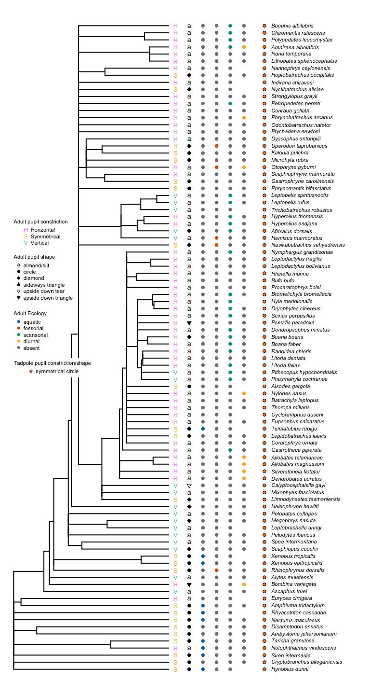
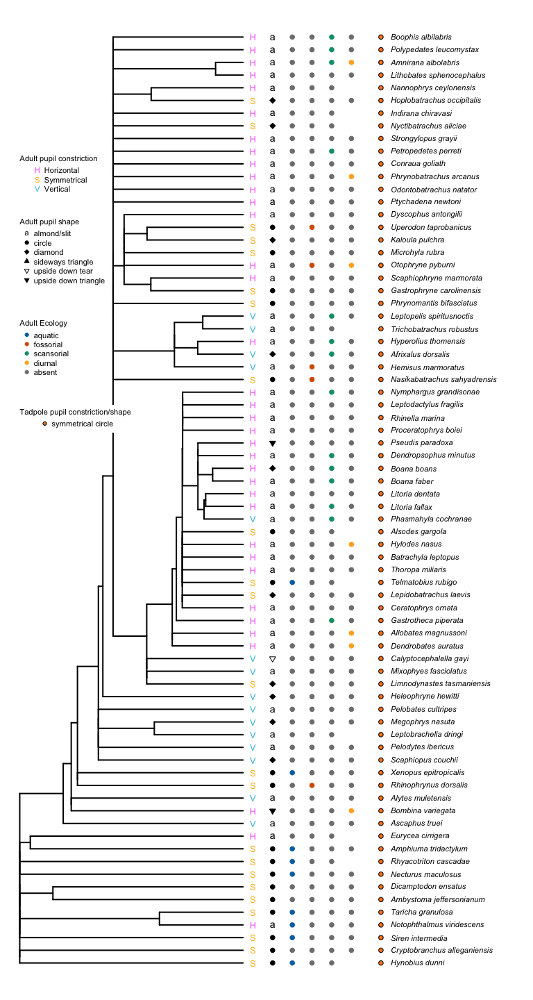

<style type="text/css">

body{ /* Normal  */
      font-size: 17px;
  }
  
</style>


# Data

## Import cleaned data and tree


```r
#import cleaned data
pupil.data <- data.frame(read.csv("../Data/Cleaned data/pupil_data_refs.csv",header=TRUE, na.strings=c("NA")))

#import cleaned tree
pupil.tree <- read.nexus(file = "../Data/Cleaned data/pupil_tree_cleaned")
```


## Subset data

First we subset our data to include only species with adult and tadpole pupil data. 


```r
# Subset data to species with tadpole data only -----
pupils.tads <- pupil.data %>%
  #omit species missing both tadpole pupil constriction and shape data.
    filter_at(vars(Tadpole_constriction, Tadpole_shape), any_vars(!is.na(.))) %>% 
  #remove direct developers
  filter(Tadpole_shape != "none") 
```

Then we prune our tree to these species. 


```r
#Prune tree to match tadpole species data

#make row names of the datafram the phylogeny tip labels
rownames(pupils.tads) <- pupils.tads$ASW_names

#make list of taxa to drop (in tree but not in dataset)
drops <- setdiff(pupil.tree$tip.label, pupils.tads$ASW_names)

#drop unwanted tips from phylogeny
tad.tree <- drop.tip(phy = pupil.tree, tip = drops) 

#check that tree tip labels match data subset
name.check(tad.tree, pupils.tads)
```

```
## [1] "OK"
```

```r
#reorder data to match tip labels
pupils.tads <- pupils.tads[tad.tree$tip.label,]
```

Finally, as we have some repeat sampling within family, we are going to prune the tree again so that it only shows one species per family/sub-family unless the adults differ in pupil constriciton or ecology. This will make the main-text figure easier to read. We will use this pruned tree for the figure. 


```r
#Prune tad data to drop some unnecessary species to show phylogenetic diversity

#create vector of species to drop
drops <- c("Xenopus_tropicalis",
           "Spea_intermontana",
           "Rana_temporaria",
           "Chiromantis_rufescens",
           "Leptopelis_rufus",
           "Hyperolius_endjami",
           "Allobates_talamancae",
         #  "Allobates_magnussoni",
           "Silverstoneia_flotator",
           "Cycloramphus_duseni",
           "Eupsophus_calcaratus",
           "Leptodactylus_bolivianus",
           "Bufo_bufo",
           "Pithecopus_hypochondrialis",
           "Ranoidea_chloris",
           "Scinax_perpusillus",
           "Bromeliohyla_bromeliacia",
           "Dryophytes_cinereus",
           "Hyla_meridionalis")

#Filter species out of tad dataset
pupils.tads_pruned <- pupils.tads %>%
  filter(!(ASW_names%in% drops))

#Prune tree to drop same species

#drop unwanted tips from phylogeny
tad.tree_pruned <- drop.tip(phy = tad.tree, tip = drops) 

#check that tree tip labels match data subset
name.check(tad.tree_pruned, pupils.tads_pruned)
```

```
## [1] "OK"
```

```r
#reorder data to match tip labels
pupils.tads_pruned <- pupils.tads_pruned[tad.tree_pruned$tip.label,]
```

## Summary

We have collected adult/tadpole pupil data from 0 species representing 85 genera and 56 families. 


# Tadpole pupil diversity

Our tadpole sampling (n = 92 species; all with symmetrical circle pupils) here is plotted alongside corresponding adult pupil constriction, shape, and ecology.


```r
# Designate color and shape vectors for plotting -----

#pupil constriction colors
col_constrict <- c("horizontal" = "#f768fc", #pink
                   "symmetrical" = "#ffba15", #orange
                   "vertical" = "#3abde2") #blue

#pupil constriction symbols
sh_constrict <- c("horizontal" = 72,
                  "symmetrical" = 83,
                  "vertical" = 86)
                   
#pupil shape symbols
sh_shape <- c("almond/slit" = 97,
              "circle"  = 19, 
              "diamond" = 23, 
              "sideways triangle" = 24,
              "upside down tear" = 6,
              "upside down triangle" = 25)

#aquatic cols
col_aq <- c("no" = "gray50",
            "yes" = "#0072B2")

#fossorial cols
col_foss <- c("no" = "gray50",
              "yes" = "#D55E00")

#scansorial cols
col_scans <- c("no" = "gray50",
               "yes" = "#009E73")

#diurnal cols
col_diur <- c("no" = "gray50",
              "yes" = "#FFAF27")

#colors for tads (excluding direct developers)
col_con_tad <- c("symmetrical" = "#6f32a8")

sh_con_tad <- c("symmetrical" = 83)

sh_shape_tad <- c("circle"  = 21)


# Plot tadpole-adult matched data onto phylogeny -----

#export as pdf
#pdf("../Outputs/Figures/phylogeny_tads-full.pdf", width = 8, height = 15)

#plot phylogeny
plot.phylo(tad.tree, 
           type = "phylogram", 
           show.tip.label = TRUE, 
           cex = 0.7, 
           no.margin = TRUE, 
           use.edge.length = TRUE, 
           edge.width = 2,
           label.offset = 75) 

#add tip labels for adult pupil constriction
tiplabels(col = col_constrict[pupils.tads$Final_Constriction], #sets color to pupil constriction 
          pch = sh_constrict[pupils.tads$Final_Constriction], #shape of labels
          cex = 0.8,
          offset = 5)

#add tip labels for adult pupil shape
tiplabels(col = "black", bg = "black",
          pch = sh_shape[pupils.tads$Final_Shape], #shape of labels
          cex = 0.9,
          offset = 15)

#add tip labels for aquatic
tiplabels(col = col_aq[pupils.tads$aquatic],
          pch = 19, 
          cex = 0.9,
          offset = 25) 

#add tip labels for fossorial
tiplabels(col = col_foss[pupils.tads$fossorial],
          pch = 19, 
          cex = 0.9,
          offset = 35) 

#add tip labels for scansorial
tiplabels(col = col_scans[pupils.tads$arboreal],
          pch = 19, 
          cex = 0.9,
          offset = 45) 

#add tip labels for diurnal
tiplabels(col = col_diur[pupils.tads$diurnal],
          pch = 19, 
          cex = 0.9,
          offset = 55) 

#add tip labels for tadpole pupil constriction and shape
tiplabels(bg = "#FF851B", col = "black",
          pch = sh_shape_tad[pupils.tads$Tadpole_shape], 
          cex = 0.9,
          offset = 70) 

#add legend for pupil constriction
legend(x = 0.05, y = 65, legend = c("Horizontal", "Symmetrical", "Vertical"), 
       col = col_constrict,
       pch = sh_constrict, #shape of labels
       cex = 0.7, 
       box.lty = 0, 
       title = "Adult pupil constriction", 
       title.adj = 0)

#add legend for pupil shape
legend(x = 0.05, y = 60, legend = names(sh_shape), 
       col = "black", pt.bg = "black",
       pch = sh_shape, #shape of labels
       cex = 0.7, 
       box.lty = 0, 
       title = "Adult pupil shape", 
       title.adj = 0)

#add legend for ecology
legend(x = 0.05, y = 52, legend = c("aquatic", "fossorial", "scansorial", "diurnal", "absent"), 
       col = c("#0072B2","#D55E00","#009E73", "#FFAF27","gray50"),
       pch = 19,
       cex = 0.7, 
       box.lty = 0, 
       title = "Adult Ecology", 
       title.adj = 0)

#add legend for tadpole pupil
legend(x = 0.05, y = 45, legend = "symmetrical circle", 
       col = "black", pt.bg = "#FF851B",
       pch = 21, #shape of labels
       cex = 0.7, 
       box.lty = 0, 
       title = "Tadpole pupil constriction/shape", 
       title.adj = 0)
```



```r
#finish pdf export
#dev.off()
```

Next we plot our reduced tadpole dataset with only one species representing each family/subfamily or weird ecology (n = 74 species; all with symmetrical circle pupils) plotted alongside corresponding adult pupil constriction, shape, and ecology.


```r
# Plot tadpole-adult matched data onto phylogeny 

#export as pdf
#pdf("../Outputs/Figures/phylogeny_tads-reduced.pdf", width = 8, height = 15)

#plot phylogeny
plot.phylo(tad.tree_pruned, 
           type = "phylogram", 
           show.tip.label = TRUE, 
           cex = 0.7, 
           no.margin = TRUE, 
           use.edge.length = TRUE, 
           edge.width = 2,
           label.offset = 75) 

#add tip labels for adult pupil constriction
tiplabels(col = col_constrict[pupils.tads_pruned$Final_Constriction], #sets color to pupil constriction 
          pch = sh_constrict[pupils.tads_pruned$Final_Constriction], #shape of labels
          cex = 0.8,
          offset = 5)

#add tip labels for adult pupil shape
tiplabels(col = "black", bg = "black",
          pch = sh_shape[pupils.tads_pruned$Final_Shape], #shape of labels
          cex = 0.9,
          offset = 15)

#add tip labels for aquatic
tiplabels(col = col_aq[pupils.tads_pruned$aquatic],
          pch = 19, 
          cex = 0.9,
          offset = 25) 

#add tip labels for fossorial
tiplabels(col = col_foss[pupils.tads_pruned$fossorial],
          pch = 19, 
          cex = 0.9,
          offset = 35) 

#add tip labels for scansorial
tiplabels(col = col_scans[pupils.tads_pruned$arboreal],
          pch = 19, 
          cex = 0.9,
          offset = 45) 

#add tip labels for diurnal
tiplabels(col = col_diur[pupils.tads_pruned$diurnal],
          pch = 19, 
          cex = 0.9,
          offset = 55) 

#add tip labels for tadpole pupil constriction and shape
tiplabels(bg = "#FF851B", col = "black",
          pch = sh_shape_tad[pupils.tads_pruned$Tadpole_shape], 
          cex = 0.9,
          offset = 70) 

#add legend for pupil constriction
legend(x = 0.05, y = 65, legend = c("Horizontal", "Symmetrical", "Vertical"), 
       col = col_constrict,
       pch = sh_constrict, #shape of labels
       cex = 0.7, 
       box.lty = 0, 
       title = "Adult pupil constriction", 
       title.adj = 0)

#add legend for pupil shape
legend(x = 0.05, y = 60, legend = names(sh_shape), 
       col = "black", pt.bg = "black",
       pch = sh_shape, #shape of labels
       cex = 0.7, 
       box.lty = 0, 
       title = "Adult pupil shape", 
       title.adj = 0)

#add legend for ecology
legend(x = 0.05, y = 52, legend = c("aquatic", "fossorial", "scansorial", "diurnal", "absent"), 
       col = c("#0072B2","#D55E00","#009E73", "#FFAF27","gray50"),
       pch = 19,
       cex = 0.7, 
       box.lty = 0, 
       title = "Adult Ecology", 
       title.adj = 0)

#add legend for tadpole pupil
legend(x = 0.05, y = 45, legend = "symmetrical circle", 
       col = "black", pt.bg = "#FF851B",
       pch = 21, #shape of labels
       cex = 0.7, 
       box.lty = 0, 
       title = "Tadpole pupil constriction/shape", 
       title.adj = 0)
```



```r
#finish pdf export
#dev.off()
```
