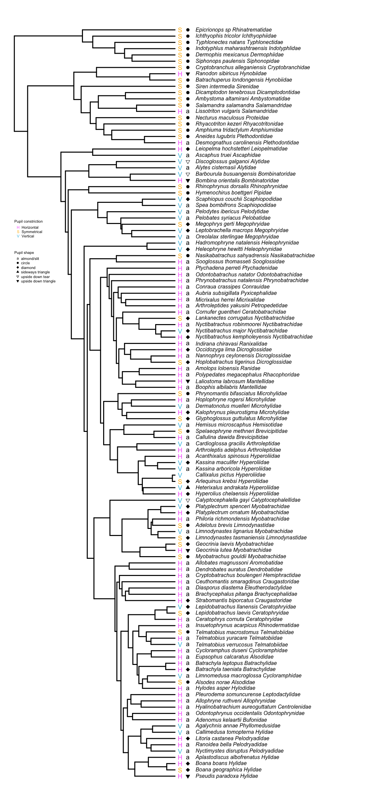
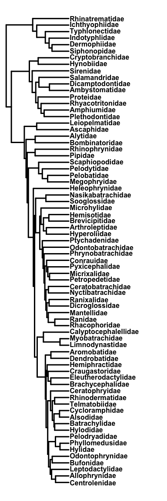
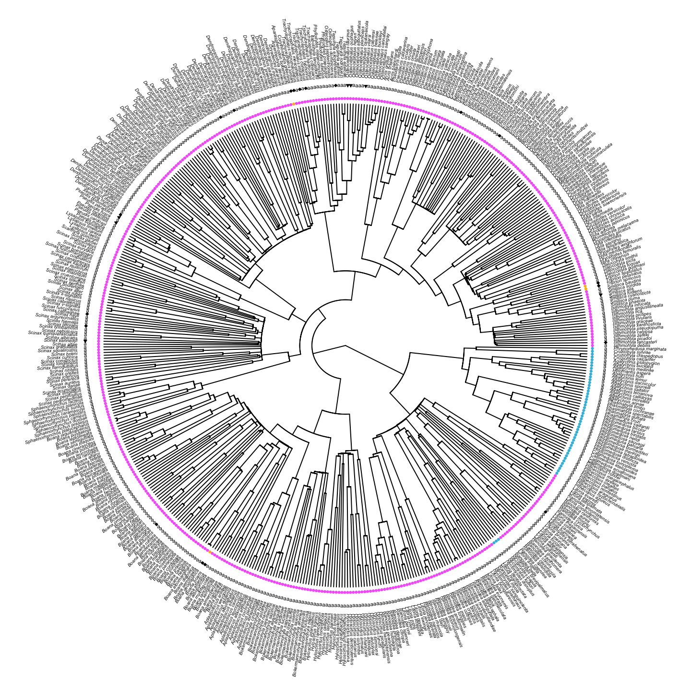
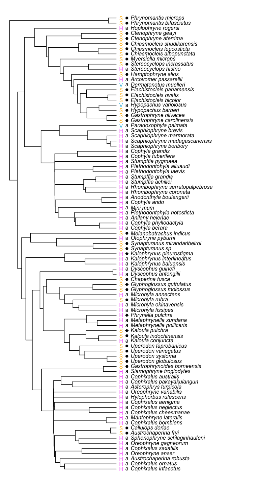
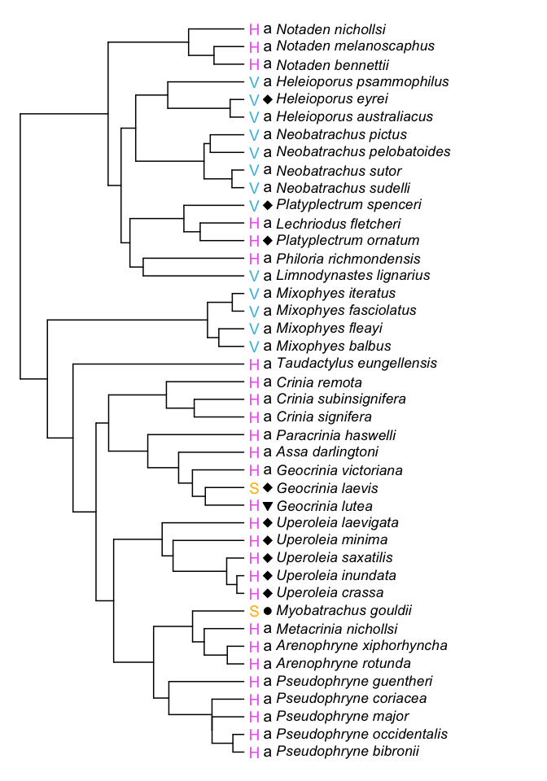
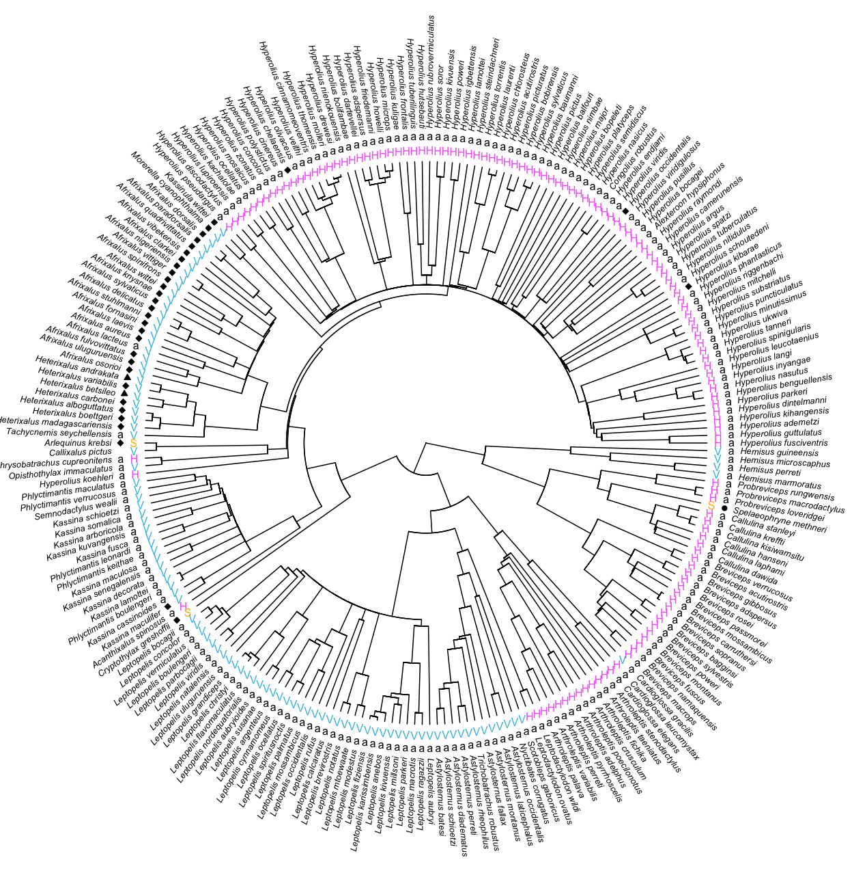
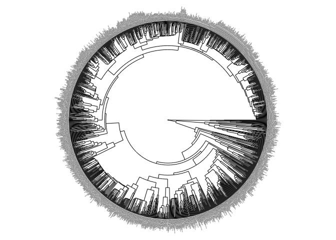
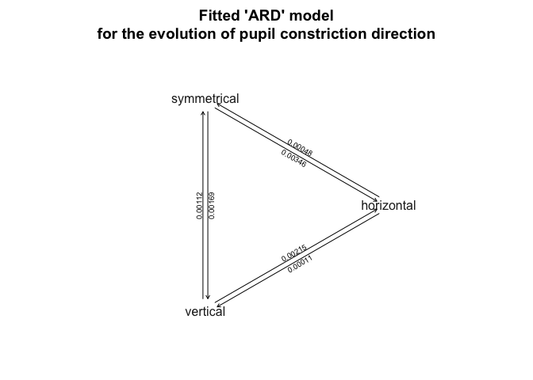
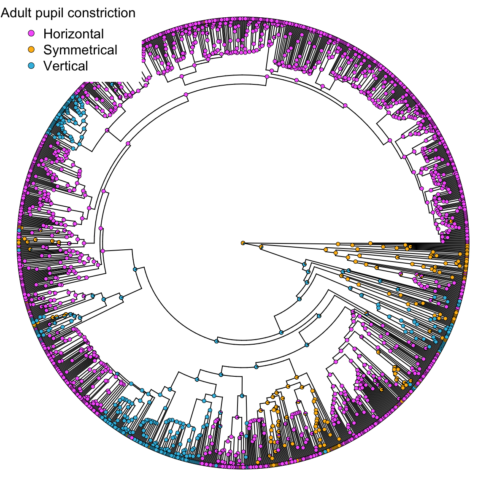

<style type="text/css">

body{ /* Normal  */
      font-size: 17px;
  }
  
</style>


# Import cleaned data and tree


```r
#import cleaned data
pupil.data <- data.frame(read.csv("../Data/Cleaned data/pupil_data_refs.csv",header=TRUE, na.strings=c("NA")))

#import cleaned tree
pupil.tree <- read.nexus(file = "../Data/Cleaned data/pupil_tree_cleaned")

#ladderize tree
pupil.tree <- ladderize(pupil.tree)

#make row names of the datafram the phylogeny tip labels
rownames(pupil.data) <- pupil.data$ASW_names

#check that tree tip labels match data subset
name.check(pupil.tree, pupil.data)
```

```
## [1] "OK"
```

```r
#put data into same order as tree tip labels
pupil.data <- pupil.data[pupil.tree$tip.label, ]
```


# Sampling

We have collected adult pupil data from 0 species representing 345 genera and 72 families. 

Sampling within family is uneven due to increased focus on families that seemed to exhibit more diversity in pupil shapes and constriction. 


```r
# Taxon sampling

#Number of speciessampled acros taxa
counts <-ddply(pupil.data, .(pupil.data$Order, pupil.data$Family), nrow)
names(counts) <- c("Order", "Family","Species Sampled")

#frog sampling
frogs<-pupil.data %>% filter(Order=="Anura")

#caudatan sampling
caudata<-pupil.data %>% filter(Order=="Caudata")

#caecilian sampling
gymno <- pupil.data %>% filter(Order=="Gymnophiona")

#create scrolling RMarkdown table of sampling
kable(counts[ , c("Order", "Family","Species Sampled")], caption = "Sampling of pupil shape across taxonomic groups of amphibians") %>%
  kable_styling(full_width = F) %>%
  collapse_rows(columns = 1, valign = "top") %>%
  scroll_box(height = "500px")
```

<div style="border: 1px solid #ddd; padding: 0px; overflow-y: scroll; height:500px; "><table class="table" style="width: auto !important; margin-left: auto; margin-right: auto;">
<caption>Sampling of pupil shape across taxonomic groups of amphibians</caption>
 <thead>
  <tr>
   <th style="text-align:left;position: sticky; top:0; background-color: #FFFFFF;"> Order </th>
   <th style="text-align:left;position: sticky; top:0; background-color: #FFFFFF;"> Family </th>
   <th style="text-align:right;position: sticky; top:0; background-color: #FFFFFF;"> Species Sampled </th>
  </tr>
 </thead>
<tbody>
  <tr>
   <td style="text-align:left;"> Anura </td>
   <td style="text-align:left;"> Allophrynidae </td>
   <td style="text-align:right;"> 1 </td>
  </tr>
  <tr>
   <td style="text-align:left;"> Anura </td>
   <td style="text-align:left;"> Alsodidae </td>
   <td style="text-align:right;"> 4 </td>
  </tr>
  <tr>
   <td style="text-align:left;"> Anura </td>
   <td style="text-align:left;"> Alytidae </td>
   <td style="text-align:right;"> 5 </td>
  </tr>
  <tr>
   <td style="text-align:left;"> Anura </td>
   <td style="text-align:left;"> Aromobatidae </td>
   <td style="text-align:right;"> 3 </td>
  </tr>
  <tr>
   <td style="text-align:left;"> Anura </td>
   <td style="text-align:left;"> Arthroleptidae </td>
   <td style="text-align:right;"> 63 </td>
  </tr>
  <tr>
   <td style="text-align:left;"> Anura </td>
   <td style="text-align:left;"> Ascaphidae </td>
   <td style="text-align:right;"> 1 </td>
  </tr>
  <tr>
   <td style="text-align:left;"> Anura </td>
   <td style="text-align:left;"> Batrachylidae </td>
   <td style="text-align:right;"> 2 </td>
  </tr>
  <tr>
   <td style="text-align:left;"> Anura </td>
   <td style="text-align:left;"> Bombinatoridae </td>
   <td style="text-align:right;"> 5 </td>
  </tr>
  <tr>
   <td style="text-align:left;"> Anura </td>
   <td style="text-align:left;"> Brachycephalidae </td>
   <td style="text-align:right;"> 5 </td>
  </tr>
  <tr>
   <td style="text-align:left;"> Anura </td>
   <td style="text-align:left;"> Brevicipitidae </td>
   <td style="text-align:right;"> 26 </td>
  </tr>
  <tr>
   <td style="text-align:left;"> Anura </td>
   <td style="text-align:left;"> Bufonidae </td>
   <td style="text-align:right;"> 45 </td>
  </tr>
  <tr>
   <td style="text-align:left;"> Anura </td>
   <td style="text-align:left;"> Calyptocephalellidae </td>
   <td style="text-align:right;"> 1 </td>
  </tr>
  <tr>
   <td style="text-align:left;"> Anura </td>
   <td style="text-align:left;"> Centrolenidae </td>
   <td style="text-align:right;"> 18 </td>
  </tr>
  <tr>
   <td style="text-align:left;"> Anura </td>
   <td style="text-align:left;"> Ceratobatrachidae </td>
   <td style="text-align:right;"> 3 </td>
  </tr>
  <tr>
   <td style="text-align:left;"> Anura </td>
   <td style="text-align:left;"> Ceratophryidae </td>
   <td style="text-align:right;"> 4 </td>
  </tr>
  <tr>
   <td style="text-align:left;"> Anura </td>
   <td style="text-align:left;"> Conrauidae </td>
   <td style="text-align:right;"> 2 </td>
  </tr>
  <tr>
   <td style="text-align:left;"> Anura </td>
   <td style="text-align:left;"> Craugastoridae </td>
   <td style="text-align:right;"> 14 </td>
  </tr>
  <tr>
   <td style="text-align:left;"> Anura </td>
   <td style="text-align:left;"> Cycloramphidae </td>
   <td style="text-align:right;"> 4 </td>
  </tr>
  <tr>
   <td style="text-align:left;"> Anura </td>
   <td style="text-align:left;"> Dendrobatidae </td>
   <td style="text-align:right;"> 5 </td>
  </tr>
  <tr>
   <td style="text-align:left;"> Anura </td>
   <td style="text-align:left;"> Dicroglossidae </td>
   <td style="text-align:right;"> 14 </td>
  </tr>
  <tr>
   <td style="text-align:left;"> Anura </td>
   <td style="text-align:left;"> Eleutherodactylidae </td>
   <td style="text-align:right;"> 5 </td>
  </tr>
  <tr>
   <td style="text-align:left;"> Anura </td>
   <td style="text-align:left;"> Heleophrynidae </td>
   <td style="text-align:right;"> 4 </td>
  </tr>
  <tr>
   <td style="text-align:left;"> Anura </td>
   <td style="text-align:left;"> Hemiphractidae </td>
   <td style="text-align:right;"> 9 </td>
  </tr>
  <tr>
   <td style="text-align:left;"> Anura </td>
   <td style="text-align:left;"> Hemisotidae </td>
   <td style="text-align:right;"> 4 </td>
  </tr>
  <tr>
   <td style="text-align:left;"> Anura </td>
   <td style="text-align:left;"> Hylidae </td>
   <td style="text-align:right;"> 421 </td>
  </tr>
  <tr>
   <td style="text-align:left;"> Anura </td>
   <td style="text-align:left;"> Hylodidae </td>
   <td style="text-align:right;"> 4 </td>
  </tr>
  <tr>
   <td style="text-align:left;"> Anura </td>
   <td style="text-align:left;"> Hyperoliidae </td>
   <td style="text-align:right;"> 141 </td>
  </tr>
  <tr>
   <td style="text-align:left;"> Anura </td>
   <td style="text-align:left;"> Leiopelmatidae </td>
   <td style="text-align:right;"> 1 </td>
  </tr>
  <tr>
   <td style="text-align:left;"> Anura </td>
   <td style="text-align:left;"> Leptodactylidae </td>
   <td style="text-align:right;"> 17 </td>
  </tr>
  <tr>
   <td style="text-align:left;"> Anura </td>
   <td style="text-align:left;"> Limnodynastidae </td>
   <td style="text-align:right;"> 4 </td>
  </tr>
  <tr>
   <td style="text-align:left;"> Anura </td>
   <td style="text-align:left;"> Mantellidae </td>
   <td style="text-align:right;"> 25 </td>
  </tr>
  <tr>
   <td style="text-align:left;"> Anura </td>
   <td style="text-align:left;"> Megophryidae </td>
   <td style="text-align:right;"> 16 </td>
  </tr>
  <tr>
   <td style="text-align:left;"> Anura </td>
   <td style="text-align:left;"> Micrixalidae </td>
   <td style="text-align:right;"> 3 </td>
  </tr>
  <tr>
   <td style="text-align:left;"> Anura </td>
   <td style="text-align:left;"> Microhylidae </td>
   <td style="text-align:right;"> 89 </td>
  </tr>
  <tr>
   <td style="text-align:left;"> Anura </td>
   <td style="text-align:left;"> Myobatrachidae </td>
   <td style="text-align:right;"> 42 </td>
  </tr>
  <tr>
   <td style="text-align:left;"> Anura </td>
   <td style="text-align:left;"> Nasikabatrachidae </td>
   <td style="text-align:right;"> 1 </td>
  </tr>
  <tr>
   <td style="text-align:left;"> Anura </td>
   <td style="text-align:left;"> Nyctibatrachidae </td>
   <td style="text-align:right;"> 15 </td>
  </tr>
  <tr>
   <td style="text-align:left;"> Anura </td>
   <td style="text-align:left;"> Odontobatrachidae </td>
   <td style="text-align:right;"> 1 </td>
  </tr>
  <tr>
   <td style="text-align:left;"> Anura </td>
   <td style="text-align:left;"> Odontophrynidae </td>
   <td style="text-align:right;"> 3 </td>
  </tr>
  <tr>
   <td style="text-align:left;"> Anura </td>
   <td style="text-align:left;"> Pelobatidae </td>
   <td style="text-align:right;"> 2 </td>
  </tr>
  <tr>
   <td style="text-align:left;"> Anura </td>
   <td style="text-align:left;"> Pelodryadidae </td>
   <td style="text-align:right;"> 76 </td>
  </tr>
  <tr>
   <td style="text-align:left;"> Anura </td>
   <td style="text-align:left;"> Pelodytidae </td>
   <td style="text-align:right;"> 2 </td>
  </tr>
  <tr>
   <td style="text-align:left;"> Anura </td>
   <td style="text-align:left;"> Petropedetidae </td>
   <td style="text-align:right;"> 6 </td>
  </tr>
  <tr>
   <td style="text-align:left;"> Anura </td>
   <td style="text-align:left;"> Phrynobatrachidae </td>
   <td style="text-align:right;"> 5 </td>
  </tr>
  <tr>
   <td style="text-align:left;"> Anura </td>
   <td style="text-align:left;"> Phyllomedusidae </td>
   <td style="text-align:right;"> 46 </td>
  </tr>
  <tr>
   <td style="text-align:left;"> Anura </td>
   <td style="text-align:left;"> Pipidae </td>
   <td style="text-align:right;"> 12 </td>
  </tr>
  <tr>
   <td style="text-align:left;"> Anura </td>
   <td style="text-align:left;"> Ptychadenidae </td>
   <td style="text-align:right;"> 4 </td>
  </tr>
  <tr>
   <td style="text-align:left;"> Anura </td>
   <td style="text-align:left;"> Pyxicephalidae </td>
   <td style="text-align:right;"> 5 </td>
  </tr>
  <tr>
   <td style="text-align:left;"> Anura </td>
   <td style="text-align:left;"> Ranidae </td>
   <td style="text-align:right;"> 27 </td>
  </tr>
  <tr>
   <td style="text-align:left;"> Anura </td>
   <td style="text-align:left;"> Ranixalidae </td>
   <td style="text-align:right;"> 2 </td>
  </tr>
  <tr>
   <td style="text-align:left;"> Anura </td>
   <td style="text-align:left;"> Rhacophoridae </td>
   <td style="text-align:right;"> 8 </td>
  </tr>
  <tr>
   <td style="text-align:left;"> Anura </td>
   <td style="text-align:left;"> Rhinodermatidae </td>
   <td style="text-align:right;"> 2 </td>
  </tr>
  <tr>
   <td style="text-align:left;"> Anura </td>
   <td style="text-align:left;"> Rhinophrynidae </td>
   <td style="text-align:right;"> 1 </td>
  </tr>
  <tr>
   <td style="text-align:left;"> Anura </td>
   <td style="text-align:left;"> Scaphiopodidae </td>
   <td style="text-align:right;"> 5 </td>
  </tr>
  <tr>
   <td style="text-align:left;"> Anura </td>
   <td style="text-align:left;"> Sooglossidae </td>
   <td style="text-align:right;"> 2 </td>
  </tr>
  <tr>
   <td style="text-align:left;"> Anura </td>
   <td style="text-align:left;"> Telmatobiidae </td>
   <td style="text-align:right;"> 6 </td>
  </tr>
  <tr>
   <td style="text-align:left;"> Caudata </td>
   <td style="text-align:left;"> Ambystomatidae </td>
   <td style="text-align:right;"> 5 </td>
  </tr>
  <tr>
   <td style="text-align:left;"> Caudata </td>
   <td style="text-align:left;"> Amphiumidae </td>
   <td style="text-align:right;"> 1 </td>
  </tr>
  <tr>
   <td style="text-align:left;"> Caudata </td>
   <td style="text-align:left;"> Cryptobranchidae </td>
   <td style="text-align:right;"> 3 </td>
  </tr>
  <tr>
   <td style="text-align:left;"> Caudata </td>
   <td style="text-align:left;"> Dicamptodontidae </td>
   <td style="text-align:right;"> 2 </td>
  </tr>
  <tr>
   <td style="text-align:left;"> Caudata </td>
   <td style="text-align:left;"> Hynobiidae </td>
   <td style="text-align:right;"> 3 </td>
  </tr>
  <tr>
   <td style="text-align:left;"> Caudata </td>
   <td style="text-align:left;"> Plethodontidae </td>
   <td style="text-align:right;"> 16 </td>
  </tr>
  <tr>
   <td style="text-align:left;"> Caudata </td>
   <td style="text-align:left;"> Proteidae </td>
   <td style="text-align:right;"> 1 </td>
  </tr>
  <tr>
   <td style="text-align:left;"> Caudata </td>
   <td style="text-align:left;"> Rhyacotritonidae </td>
   <td style="text-align:right;"> 2 </td>
  </tr>
  <tr>
   <td style="text-align:left;"> Caudata </td>
   <td style="text-align:left;"> Salamandridae </td>
   <td style="text-align:right;"> 8 </td>
  </tr>
  <tr>
   <td style="text-align:left;"> Caudata </td>
   <td style="text-align:left;"> Sirenidae </td>
   <td style="text-align:right;"> 2 </td>
  </tr>
  <tr>
   <td style="text-align:left;"> Gymnophiona </td>
   <td style="text-align:left;"> Dermophiidae </td>
   <td style="text-align:right;"> 1 </td>
  </tr>
  <tr>
   <td style="text-align:left;"> Gymnophiona </td>
   <td style="text-align:left;"> Ichthyophiidae </td>
   <td style="text-align:right;"> 2 </td>
  </tr>
  <tr>
   <td style="text-align:left;"> Gymnophiona </td>
   <td style="text-align:left;"> Indotyphlidae </td>
   <td style="text-align:right;"> 1 </td>
  </tr>
  <tr>
   <td style="text-align:left;"> Gymnophiona </td>
   <td style="text-align:left;"> Rhinatrematidae </td>
   <td style="text-align:right;"> 2 </td>
  </tr>
  <tr>
   <td style="text-align:left;"> Gymnophiona </td>
   <td style="text-align:left;"> Siphonopidae </td>
   <td style="text-align:right;"> 1 </td>
  </tr>
  <tr>
   <td style="text-align:left;"> Gymnophiona </td>
   <td style="text-align:left;"> Typhlonectidae </td>
   <td style="text-align:right;"> 2 </td>
  </tr>
</tbody>
</table></div>

Among the three amphibian orders, sampling is distributed as follows:

**Gymnophiona**
Families = 6
Species = 0

**Caudata**
Families = 10
Species = 0

**Anura**
Families = 56
Species = 0


# Family-level diversity

Here we examine how unique pupil classes are represented across each family. 


## One species representing each phenotype in each family

First, we group all adult pupil data by 1) family, 2) pupil constriction, and 3) pupil shape. I have pulled the first species listed for each unique set of these 3 traits to use for the phylogeny, and have listed the number of additional species that represent that family/phenotype. To subset the data, I grouped for each unique combination of family, constriction direction, and pupil shape, and only kept one species as a representative (dropping any others with an identical phenotype in the family).


```r
#summarize data by family, constriction direction, and pupil shape
pupil_fams <- pupil.data %>%
  mutate(species_fam = as.factor(paste(ASW_names, Family, sep = "_"))) %>% 
  group_by(Family, Final_Constriction, Final_Shape) %>%
  dplyr::summarise(n_species = n(), 
                   example_species = as.character(first(ASW_names)), 
                   name = as.character(first(species_fam))) %>%
  filter_at(vars(Final_Constriction, Final_Shape), any_vars(!is.na(.))) #omit species missing both tadpole pupil

#generate scrolling table in RMarkdown
kable(pupil_fams, caption = "Diversity of pupil constriction and shape phenotypes found in each family sampled") %>% 
                      kable_styling(full_width = F) %>% 
                      collapse_rows(columns = 1, valign = "top") %>%
                      scroll_box(height = "400px") 
```

<div style="border: 1px solid #ddd; padding: 0px; overflow-y: scroll; height:400px; "><table class="table" style="width: auto !important; margin-left: auto; margin-right: auto;">
<caption>Diversity of pupil constriction and shape phenotypes found in each family sampled</caption>
 <thead>
  <tr>
   <th style="text-align:left;position: sticky; top:0; background-color: #FFFFFF;"> Family </th>
   <th style="text-align:left;position: sticky; top:0; background-color: #FFFFFF;"> Final_Constriction </th>
   <th style="text-align:left;position: sticky; top:0; background-color: #FFFFFF;"> Final_Shape </th>
   <th style="text-align:right;position: sticky; top:0; background-color: #FFFFFF;"> n_species </th>
   <th style="text-align:left;position: sticky; top:0; background-color: #FFFFFF;"> example_species </th>
   <th style="text-align:left;position: sticky; top:0; background-color: #FFFFFF;"> name </th>
  </tr>
 </thead>
<tbody>
  <tr>
   <td style="text-align:left;"> Allophrynidae </td>
   <td style="text-align:left;"> horizontal </td>
   <td style="text-align:left;"> almond/slit </td>
   <td style="text-align:right;"> 1 </td>
   <td style="text-align:left;"> Allophryne_ruthveni </td>
   <td style="text-align:left;"> Allophryne_ruthveni_Allophrynidae </td>
  </tr>
  <tr>
   <td style="text-align:left;"> Alsodidae </td>
   <td style="text-align:left;"> horizontal </td>
   <td style="text-align:left;"> almond/slit </td>
   <td style="text-align:right;"> 2 </td>
   <td style="text-align:left;"> Eupsophus_calcaratus </td>
   <td style="text-align:left;"> Eupsophus_calcaratus_Alsodidae </td>
  </tr>
  <tr>
   <td style="text-align:left;"> Alsodidae </td>
   <td style="text-align:left;"> symmetrical </td>
   <td style="text-align:left;"> circle </td>
   <td style="text-align:right;"> 2 </td>
   <td style="text-align:left;"> Alsodes_norae </td>
   <td style="text-align:left;"> Alsodes_norae_Alsodidae </td>
  </tr>
  <tr>
   <td style="text-align:left;"> Alytidae </td>
   <td style="text-align:left;"> vertical </td>
   <td style="text-align:left;"> almond/slit </td>
   <td style="text-align:right;"> 3 </td>
   <td style="text-align:left;"> Alytes_cisternasii </td>
   <td style="text-align:left;"> Alytes_cisternasii_Alytidae </td>
  </tr>
  <tr>
   <td style="text-align:left;"> Alytidae </td>
   <td style="text-align:left;"> vertical </td>
   <td style="text-align:left;"> upside down tear </td>
   <td style="text-align:right;"> 2 </td>
   <td style="text-align:left;"> Discoglossus_galganoi </td>
   <td style="text-align:left;"> Discoglossus_galganoi_Alytidae </td>
  </tr>
  <tr>
   <td style="text-align:left;"> Ambystomatidae </td>
   <td style="text-align:left;"> symmetrical </td>
   <td style="text-align:left;"> circle </td>
   <td style="text-align:right;"> 5 </td>
   <td style="text-align:left;"> Ambystoma_altamirani </td>
   <td style="text-align:left;"> Ambystoma_altamirani_Ambystomatidae </td>
  </tr>
  <tr>
   <td style="text-align:left;"> Amphiumidae </td>
   <td style="text-align:left;"> symmetrical </td>
   <td style="text-align:left;"> circle </td>
   <td style="text-align:right;"> 1 </td>
   <td style="text-align:left;"> Amphiuma_tridactylum </td>
   <td style="text-align:left;"> Amphiuma_tridactylum_Amphiumidae </td>
  </tr>
  <tr>
   <td style="text-align:left;"> Aromobatidae </td>
   <td style="text-align:left;"> horizontal </td>
   <td style="text-align:left;"> almond/slit </td>
   <td style="text-align:right;"> 3 </td>
   <td style="text-align:left;"> Allobates_magnussoni </td>
   <td style="text-align:left;"> Allobates_magnussoni_Aromobatidae </td>
  </tr>
  <tr>
   <td style="text-align:left;"> Arthroleptidae </td>
   <td style="text-align:left;"> horizontal </td>
   <td style="text-align:left;"> almond/slit </td>
   <td style="text-align:right;"> 14 </td>
   <td style="text-align:left;"> Arthroleptis_adelphus </td>
   <td style="text-align:left;"> Arthroleptis_adelphus_Arthroleptidae </td>
  </tr>
  <tr>
   <td style="text-align:left;"> Arthroleptidae </td>
   <td style="text-align:left;"> vertical </td>
   <td style="text-align:left;"> almond/slit </td>
   <td style="text-align:right;"> 49 </td>
   <td style="text-align:left;"> Cardioglossa_gracilis </td>
   <td style="text-align:left;"> Cardioglossa_gracilis_Arthroleptidae </td>
  </tr>
  <tr>
   <td style="text-align:left;"> Ascaphidae </td>
   <td style="text-align:left;"> vertical </td>
   <td style="text-align:left;"> almond/slit </td>
   <td style="text-align:right;"> 1 </td>
   <td style="text-align:left;"> Ascaphus_truei </td>
   <td style="text-align:left;"> Ascaphus_truei_Ascaphidae </td>
  </tr>
  <tr>
   <td style="text-align:left;"> Batrachylidae </td>
   <td style="text-align:left;"> horizontal </td>
   <td style="text-align:left;"> almond/slit </td>
   <td style="text-align:right;"> 1 </td>
   <td style="text-align:left;"> Batrachyla_leptopus </td>
   <td style="text-align:left;"> Batrachyla_leptopus_Batrachylidae </td>
  </tr>
  <tr>
   <td style="text-align:left;"> Batrachylidae </td>
   <td style="text-align:left;"> horizontal </td>
   <td style="text-align:left;"> diamond </td>
   <td style="text-align:right;"> 1 </td>
   <td style="text-align:left;"> Batrachyla_taeniata </td>
   <td style="text-align:left;"> Batrachyla_taeniata_Batrachylidae </td>
  </tr>
  <tr>
   <td style="text-align:left;"> Bombinatoridae </td>
   <td style="text-align:left;"> horizontal </td>
   <td style="text-align:left;"> upside down triangle </td>
   <td style="text-align:right;"> 4 </td>
   <td style="text-align:left;"> Bombina_orientalis </td>
   <td style="text-align:left;"> Bombina_orientalis_Bombinatoridae </td>
  </tr>
  <tr>
   <td style="text-align:left;"> Bombinatoridae </td>
   <td style="text-align:left;"> vertical </td>
   <td style="text-align:left;"> upside down tear </td>
   <td style="text-align:right;"> 1 </td>
   <td style="text-align:left;"> Barbourula_busuangensis </td>
   <td style="text-align:left;"> Barbourula_busuangensis_Bombinatoridae </td>
  </tr>
  <tr>
   <td style="text-align:left;"> Brachycephalidae </td>
   <td style="text-align:left;"> horizontal </td>
   <td style="text-align:left;"> almond/slit </td>
   <td style="text-align:right;"> 5 </td>
   <td style="text-align:left;"> Brachycephalus_pitanga </td>
   <td style="text-align:left;"> Brachycephalus_pitanga_Brachycephalidae </td>
  </tr>
  <tr>
   <td style="text-align:left;"> Brevicipitidae </td>
   <td style="text-align:left;"> horizontal </td>
   <td style="text-align:left;"> almond/slit </td>
   <td style="text-align:right;"> 25 </td>
   <td style="text-align:left;"> Callulina_dawida </td>
   <td style="text-align:left;"> Callulina_dawida_Brevicipitidae </td>
  </tr>
  <tr>
   <td style="text-align:left;"> Brevicipitidae </td>
   <td style="text-align:left;"> symmetrical </td>
   <td style="text-align:left;"> circle </td>
   <td style="text-align:right;"> 1 </td>
   <td style="text-align:left;"> Spelaeophryne_methneri </td>
   <td style="text-align:left;"> Spelaeophryne_methneri_Brevicipitidae </td>
  </tr>
  <tr>
   <td style="text-align:left;"> Bufonidae </td>
   <td style="text-align:left;"> horizontal </td>
   <td style="text-align:left;"> almond/slit </td>
   <td style="text-align:right;"> 45 </td>
   <td style="text-align:left;"> Adenomus_kelaartii </td>
   <td style="text-align:left;"> Adenomus_kelaartii_Bufonidae </td>
  </tr>
  <tr>
   <td style="text-align:left;"> Calyptocephalellidae </td>
   <td style="text-align:left;"> vertical </td>
   <td style="text-align:left;"> upside down tear </td>
   <td style="text-align:right;"> 1 </td>
   <td style="text-align:left;"> Calyptocephalella_gayi </td>
   <td style="text-align:left;"> Calyptocephalella_gayi_Calyptocephalellidae </td>
  </tr>
  <tr>
   <td style="text-align:left;"> Centrolenidae </td>
   <td style="text-align:left;"> horizontal </td>
   <td style="text-align:left;"> almond/slit </td>
   <td style="text-align:right;"> 18 </td>
   <td style="text-align:left;"> Hyalinobatrachium_aureoguttatum </td>
   <td style="text-align:left;"> Hyalinobatrachium_aureoguttatum_Centrolenidae </td>
  </tr>
  <tr>
   <td style="text-align:left;"> Ceratobatrachidae </td>
   <td style="text-align:left;"> horizontal </td>
   <td style="text-align:left;"> almond/slit </td>
   <td style="text-align:right;"> 3 </td>
   <td style="text-align:left;"> Cornufer_guentheri </td>
   <td style="text-align:left;"> Cornufer_guentheri_Ceratobatrachidae </td>
  </tr>
  <tr>
   <td style="text-align:left;"> Ceratophryidae </td>
   <td style="text-align:left;"> horizontal </td>
   <td style="text-align:left;"> almond/slit </td>
   <td style="text-align:right;"> 2 </td>
   <td style="text-align:left;"> Ceratophrys_cornuta </td>
   <td style="text-align:left;"> Ceratophrys_cornuta_Ceratophryidae </td>
  </tr>
  <tr>
   <td style="text-align:left;"> Ceratophryidae </td>
   <td style="text-align:left;"> symmetrical </td>
   <td style="text-align:left;"> diamond </td>
   <td style="text-align:right;"> 1 </td>
   <td style="text-align:left;"> Lepidobatrachus_laevis </td>
   <td style="text-align:left;"> Lepidobatrachus_laevis_Ceratophryidae </td>
  </tr>
  <tr>
   <td style="text-align:left;"> Ceratophryidae </td>
   <td style="text-align:left;"> vertical </td>
   <td style="text-align:left;"> diamond </td>
   <td style="text-align:right;"> 1 </td>
   <td style="text-align:left;"> Lepidobatrachus_llanensis </td>
   <td style="text-align:left;"> Lepidobatrachus_llanensis_Ceratophryidae </td>
  </tr>
  <tr>
   <td style="text-align:left;"> Conrauidae </td>
   <td style="text-align:left;"> horizontal </td>
   <td style="text-align:left;"> almond/slit </td>
   <td style="text-align:right;"> 2 </td>
   <td style="text-align:left;"> Conraua_crassipes </td>
   <td style="text-align:left;"> Conraua_crassipes_Conrauidae </td>
  </tr>
  <tr>
   <td style="text-align:left;"> Craugastoridae </td>
   <td style="text-align:left;"> horizontal </td>
   <td style="text-align:left;"> almond/slit </td>
   <td style="text-align:right;"> 13 </td>
   <td style="text-align:left;"> Ceuthomantis_smaragdinus </td>
   <td style="text-align:left;"> Ceuthomantis_smaragdinus_Craugastoridae </td>
  </tr>
  <tr>
   <td style="text-align:left;"> Craugastoridae </td>
   <td style="text-align:left;"> horizontal </td>
   <td style="text-align:left;"> diamond </td>
   <td style="text-align:right;"> 1 </td>
   <td style="text-align:left;"> Strabomantis_biporcatus </td>
   <td style="text-align:left;"> Strabomantis_biporcatus_Craugastoridae </td>
  </tr>
  <tr>
   <td style="text-align:left;"> Cryptobranchidae </td>
   <td style="text-align:left;"> symmetrical </td>
   <td style="text-align:left;"> circle </td>
   <td style="text-align:right;"> 3 </td>
   <td style="text-align:left;"> Cryptobranchus_alleganiensis </td>
   <td style="text-align:left;"> Cryptobranchus_alleganiensis_Cryptobranchidae </td>
  </tr>
  <tr>
   <td style="text-align:left;"> Cycloramphidae </td>
   <td style="text-align:left;"> horizontal </td>
   <td style="text-align:left;"> almond/slit </td>
   <td style="text-align:right;"> 3 </td>
   <td style="text-align:left;"> Cycloramphus_duseni </td>
   <td style="text-align:left;"> Cycloramphus_duseni_Cycloramphidae </td>
  </tr>
  <tr>
   <td style="text-align:left;"> Cycloramphidae </td>
   <td style="text-align:left;"> vertical </td>
   <td style="text-align:left;"> almond/slit </td>
   <td style="text-align:right;"> 1 </td>
   <td style="text-align:left;"> Limnomedusa_macroglossa </td>
   <td style="text-align:left;"> Limnomedusa_macroglossa_Cycloramphidae </td>
  </tr>
  <tr>
   <td style="text-align:left;"> Dendrobatidae </td>
   <td style="text-align:left;"> horizontal </td>
   <td style="text-align:left;"> almond/slit </td>
   <td style="text-align:right;"> 5 </td>
   <td style="text-align:left;"> Dendrobates_auratus </td>
   <td style="text-align:left;"> Dendrobates_auratus_Dendrobatidae </td>
  </tr>
  <tr>
   <td style="text-align:left;"> Dermophiidae </td>
   <td style="text-align:left;"> symmetrical </td>
   <td style="text-align:left;"> circle </td>
   <td style="text-align:right;"> 1 </td>
   <td style="text-align:left;"> Dermophis_mexicanus </td>
   <td style="text-align:left;"> Dermophis_mexicanus_Dermophiidae </td>
  </tr>
  <tr>
   <td style="text-align:left;"> Dicamptodontidae </td>
   <td style="text-align:left;"> symmetrical </td>
   <td style="text-align:left;"> circle </td>
   <td style="text-align:right;"> 2 </td>
   <td style="text-align:left;"> Dicamptodon_tenebrosus </td>
   <td style="text-align:left;"> Dicamptodon_tenebrosus_Dicamptodontidae </td>
  </tr>
  <tr>
   <td style="text-align:left;"> Dicroglossidae </td>
   <td style="text-align:left;"> horizontal </td>
   <td style="text-align:left;"> almond/slit </td>
   <td style="text-align:right;"> 6 </td>
   <td style="text-align:left;"> Nannophrys_ceylonensis </td>
   <td style="text-align:left;"> Nannophrys_ceylonensis_Dicroglossidae </td>
  </tr>
  <tr>
   <td style="text-align:left;"> Dicroglossidae </td>
   <td style="text-align:left;"> horizontal </td>
   <td style="text-align:left;"> diamond </td>
   <td style="text-align:right;"> 5 </td>
   <td style="text-align:left;"> Occidozyga_lima </td>
   <td style="text-align:left;"> Occidozyga_lima_Dicroglossidae </td>
  </tr>
  <tr>
   <td style="text-align:left;"> Dicroglossidae </td>
   <td style="text-align:left;"> symmetrical </td>
   <td style="text-align:left;"> diamond </td>
   <td style="text-align:right;"> 3 </td>
   <td style="text-align:left;"> Hoplobatrachus_tigerinus </td>
   <td style="text-align:left;"> Hoplobatrachus_tigerinus_Dicroglossidae </td>
  </tr>
  <tr>
   <td style="text-align:left;"> Eleutherodactylidae </td>
   <td style="text-align:left;"> horizontal </td>
   <td style="text-align:left;"> almond/slit </td>
   <td style="text-align:right;"> 5 </td>
   <td style="text-align:left;"> Diasporus_diastema </td>
   <td style="text-align:left;"> Diasporus_diastema_Eleutherodactylidae </td>
  </tr>
  <tr>
   <td style="text-align:left;"> Heleophrynidae </td>
   <td style="text-align:left;"> vertical </td>
   <td style="text-align:left;"> almond/slit </td>
   <td style="text-align:right;"> 1 </td>
   <td style="text-align:left;"> Hadromophryne_natalensis </td>
   <td style="text-align:left;"> Hadromophryne_natalensis_Heleophrynidae </td>
  </tr>
  <tr>
   <td style="text-align:left;"> Heleophrynidae </td>
   <td style="text-align:left;"> vertical </td>
   <td style="text-align:left;"> diamond </td>
   <td style="text-align:right;"> 3 </td>
   <td style="text-align:left;"> Heleophryne_hewitti </td>
   <td style="text-align:left;"> Heleophryne_hewitti_Heleophrynidae </td>
  </tr>
  <tr>
   <td style="text-align:left;"> Hemiphractidae </td>
   <td style="text-align:left;"> horizontal </td>
   <td style="text-align:left;"> almond/slit </td>
   <td style="text-align:right;"> 9 </td>
   <td style="text-align:left;"> Cryptobatrachus_boulengeri </td>
   <td style="text-align:left;"> Cryptobatrachus_boulengeri_Hemiphractidae </td>
  </tr>
  <tr>
   <td style="text-align:left;"> Hemisotidae </td>
   <td style="text-align:left;"> vertical </td>
   <td style="text-align:left;"> almond/slit </td>
   <td style="text-align:right;"> 4 </td>
   <td style="text-align:left;"> Hemisus_microscaphus </td>
   <td style="text-align:left;"> Hemisus_microscaphus_Hemisotidae </td>
  </tr>
  <tr>
   <td style="text-align:left;"> Hylidae </td>
   <td style="text-align:left;"> horizontal </td>
   <td style="text-align:left;"> almond/slit </td>
   <td style="text-align:right;"> 394 </td>
   <td style="text-align:left;"> Aplastodiscus_albofrenatus </td>
   <td style="text-align:left;"> Aplastodiscus_albofrenatus_Hylidae </td>
  </tr>
  <tr>
   <td style="text-align:left;"> Hylidae </td>
   <td style="text-align:left;"> horizontal </td>
   <td style="text-align:left;"> diamond </td>
   <td style="text-align:right;"> 14 </td>
   <td style="text-align:left;"> Boana_boans </td>
   <td style="text-align:left;"> Boana_boans_Hylidae </td>
  </tr>
  <tr>
   <td style="text-align:left;"> Hylidae </td>
   <td style="text-align:left;"> horizontal </td>
   <td style="text-align:left;"> upside down triangle </td>
   <td style="text-align:right;"> 7 </td>
   <td style="text-align:left;"> Pseudis_paradoxa </td>
   <td style="text-align:left;"> Pseudis_paradoxa_Hylidae </td>
  </tr>
  <tr>
   <td style="text-align:left;"> Hylidae </td>
   <td style="text-align:left;"> symmetrical </td>
   <td style="text-align:left;"> diamond </td>
   <td style="text-align:right;"> 4 </td>
   <td style="text-align:left;"> Boana_geographica </td>
   <td style="text-align:left;"> Boana_geographica_Hylidae </td>
  </tr>
  <tr>
   <td style="text-align:left;"> Hylidae </td>
   <td style="text-align:left;"> vertical </td>
   <td style="text-align:left;"> almond/slit </td>
   <td style="text-align:right;"> 2 </td>
   <td style="text-align:left;"> Callimedusa_tomopterna </td>
   <td style="text-align:left;"> Callimedusa_tomopterna_Hylidae </td>
  </tr>
  <tr>
   <td style="text-align:left;"> Hylodidae </td>
   <td style="text-align:left;"> horizontal </td>
   <td style="text-align:left;"> almond/slit </td>
   <td style="text-align:right;"> 4 </td>
   <td style="text-align:left;"> Hylodes_asper </td>
   <td style="text-align:left;"> Hylodes_asper_Hylodidae </td>
  </tr>
  <tr>
   <td style="text-align:left;"> Hynobiidae </td>
   <td style="text-align:left;"> horizontal </td>
   <td style="text-align:left;"> upside down triangle </td>
   <td style="text-align:right;"> 1 </td>
   <td style="text-align:left;"> Ranodon_sibiricus </td>
   <td style="text-align:left;"> Ranodon_sibiricus_Hynobiidae </td>
  </tr>
  <tr>
   <td style="text-align:left;"> Hynobiidae </td>
   <td style="text-align:left;"> symmetrical </td>
   <td style="text-align:left;"> circle </td>
   <td style="text-align:right;"> 2 </td>
   <td style="text-align:left;"> Batrachuperus_londongensis </td>
   <td style="text-align:left;"> Batrachuperus_londongensis_Hynobiidae </td>
  </tr>
  <tr>
   <td style="text-align:left;"> Hyperoliidae </td>
   <td style="text-align:left;"> horizontal </td>
   <td style="text-align:left;"> almond/slit </td>
   <td style="text-align:right;"> 87 </td>
   <td style="text-align:left;"> Acanthixalus_spinosus </td>
   <td style="text-align:left;"> Acanthixalus_spinosus_Hyperoliidae </td>
  </tr>
  <tr>
   <td style="text-align:left;"> Hyperoliidae </td>
   <td style="text-align:left;"> horizontal </td>
   <td style="text-align:left;"> diamond </td>
   <td style="text-align:right;"> 3 </td>
   <td style="text-align:left;"> Hyperolius_chelaensis </td>
   <td style="text-align:left;"> Hyperolius_chelaensis_Hyperoliidae </td>
  </tr>
  <tr>
   <td style="text-align:left;"> Hyperoliidae </td>
   <td style="text-align:left;"> symmetrical </td>
   <td style="text-align:left;"> diamond </td>
   <td style="text-align:right;"> 2 </td>
   <td style="text-align:left;"> Arlequinus_krebsi </td>
   <td style="text-align:left;"> Arlequinus_krebsi_Hyperoliidae </td>
  </tr>
  <tr>
   <td style="text-align:left;"> Hyperoliidae </td>
   <td style="text-align:left;"> vertical </td>
   <td style="text-align:left;"> almond/slit </td>
   <td style="text-align:right;"> 19 </td>
   <td style="text-align:left;"> Kassina_arboricola </td>
   <td style="text-align:left;"> Kassina_arboricola_Hyperoliidae </td>
  </tr>
  <tr>
   <td style="text-align:left;"> Hyperoliidae </td>
   <td style="text-align:left;"> vertical </td>
   <td style="text-align:left;"> diamond </td>
   <td style="text-align:right;"> 27 </td>
   <td style="text-align:left;"> Kassina_maculifer </td>
   <td style="text-align:left;"> Kassina_maculifer_Hyperoliidae </td>
  </tr>
  <tr>
   <td style="text-align:left;"> Hyperoliidae </td>
   <td style="text-align:left;"> vertical </td>
   <td style="text-align:left;"> sideways triangle </td>
   <td style="text-align:right;"> 2 </td>
   <td style="text-align:left;"> Heterixalus_andrakata </td>
   <td style="text-align:left;"> Heterixalus_andrakata_Hyperoliidae </td>
  </tr>
  <tr>
   <td style="text-align:left;"> Hyperoliidae </td>
   <td style="text-align:left;"> vertical </td>
   <td style="text-align:left;"> NA </td>
   <td style="text-align:right;"> 1 </td>
   <td style="text-align:left;"> Callixalus_pictus </td>
   <td style="text-align:left;"> Callixalus_pictus_Hyperoliidae </td>
  </tr>
  <tr>
   <td style="text-align:left;"> Ichthyophiidae </td>
   <td style="text-align:left;"> symmetrical </td>
   <td style="text-align:left;"> circle </td>
   <td style="text-align:right;"> 2 </td>
   <td style="text-align:left;"> Ichthyophis_tricolor </td>
   <td style="text-align:left;"> Ichthyophis_tricolor_Ichthyophiidae </td>
  </tr>
  <tr>
   <td style="text-align:left;"> Indotyphlidae </td>
   <td style="text-align:left;"> symmetrical </td>
   <td style="text-align:left;"> circle </td>
   <td style="text-align:right;"> 1 </td>
   <td style="text-align:left;"> Indotyphlus_maharashtraensis </td>
   <td style="text-align:left;"> Indotyphlus_maharashtraensis_Indotyphlidae </td>
  </tr>
  <tr>
   <td style="text-align:left;"> Leiopelmatidae </td>
   <td style="text-align:left;"> horizontal </td>
   <td style="text-align:left;"> diamond </td>
   <td style="text-align:right;"> 1 </td>
   <td style="text-align:left;"> Leiopelma_hochstetteri </td>
   <td style="text-align:left;"> Leiopelma_hochstetteri_Leiopelmatidae </td>
  </tr>
  <tr>
   <td style="text-align:left;"> Leptodactylidae </td>
   <td style="text-align:left;"> horizontal </td>
   <td style="text-align:left;"> almond/slit </td>
   <td style="text-align:right;"> 17 </td>
   <td style="text-align:left;"> Pleurodema_somuncurense </td>
   <td style="text-align:left;"> Pleurodema_somuncurense_Leptodactylidae </td>
  </tr>
  <tr>
   <td style="text-align:left;"> Limnodynastidae </td>
   <td style="text-align:left;"> symmetrical </td>
   <td style="text-align:left;"> circle </td>
   <td style="text-align:right;"> 2 </td>
   <td style="text-align:left;"> Adelotus_brevis </td>
   <td style="text-align:left;"> Adelotus_brevis_Limnodynastidae </td>
  </tr>
  <tr>
   <td style="text-align:left;"> Limnodynastidae </td>
   <td style="text-align:left;"> symmetrical </td>
   <td style="text-align:left;"> diamond </td>
   <td style="text-align:right;"> 2 </td>
   <td style="text-align:left;"> Limnodynastes_tasmaniensis </td>
   <td style="text-align:left;"> Limnodynastes_tasmaniensis_Limnodynastidae </td>
  </tr>
  <tr>
   <td style="text-align:left;"> Mantellidae </td>
   <td style="text-align:left;"> horizontal </td>
   <td style="text-align:left;"> almond/slit </td>
   <td style="text-align:right;"> 24 </td>
   <td style="text-align:left;"> Boophis_albilabris </td>
   <td style="text-align:left;"> Boophis_albilabris_Mantellidae </td>
  </tr>
  <tr>
   <td style="text-align:left;"> Mantellidae </td>
   <td style="text-align:left;"> horizontal </td>
   <td style="text-align:left;"> upside down triangle </td>
   <td style="text-align:right;"> 1 </td>
   <td style="text-align:left;"> Laliostoma_labrosum </td>
   <td style="text-align:left;"> Laliostoma_labrosum_Mantellidae </td>
  </tr>
  <tr>
   <td style="text-align:left;"> Megophryidae </td>
   <td style="text-align:left;"> symmetrical </td>
   <td style="text-align:left;"> diamond </td>
   <td style="text-align:right;"> 3 </td>
   <td style="text-align:left;"> Megophrys_gerti </td>
   <td style="text-align:left;"> Megophrys_gerti_Megophryidae </td>
  </tr>
  <tr>
   <td style="text-align:left;"> Megophryidae </td>
   <td style="text-align:left;"> vertical </td>
   <td style="text-align:left;"> almond/slit </td>
   <td style="text-align:right;"> 10 </td>
   <td style="text-align:left;"> Oreolalax_sterlingae </td>
   <td style="text-align:left;"> Oreolalax_sterlingae_Megophryidae </td>
  </tr>
  <tr>
   <td style="text-align:left;"> Megophryidae </td>
   <td style="text-align:left;"> vertical </td>
   <td style="text-align:left;"> diamond </td>
   <td style="text-align:right;"> 3 </td>
   <td style="text-align:left;"> Leptobrachella_macrops </td>
   <td style="text-align:left;"> Leptobrachella_macrops_Megophryidae </td>
  </tr>
  <tr>
   <td style="text-align:left;"> Micrixalidae </td>
   <td style="text-align:left;"> horizontal </td>
   <td style="text-align:left;"> almond/slit </td>
   <td style="text-align:right;"> 3 </td>
   <td style="text-align:left;"> Micrixalus_herrei </td>
   <td style="text-align:left;"> Micrixalus_herrei_Micrixalidae </td>
  </tr>
  <tr>
   <td style="text-align:left;"> Microhylidae </td>
   <td style="text-align:left;"> horizontal </td>
   <td style="text-align:left;"> almond/slit </td>
   <td style="text-align:right;"> 52 </td>
   <td style="text-align:left;"> Hoplophryne_rogersi </td>
   <td style="text-align:left;"> Hoplophryne_rogersi_Microhylidae </td>
  </tr>
  <tr>
   <td style="text-align:left;"> Microhylidae </td>
   <td style="text-align:left;"> horizontal </td>
   <td style="text-align:left;"> diamond </td>
   <td style="text-align:right;"> 2 </td>
   <td style="text-align:left;"> Kalophrynus_pleurostigma </td>
   <td style="text-align:left;"> Kalophrynus_pleurostigma_Microhylidae </td>
  </tr>
  <tr>
   <td style="text-align:left;"> Microhylidae </td>
   <td style="text-align:left;"> symmetrical </td>
   <td style="text-align:left;"> circle </td>
   <td style="text-align:right;"> 30 </td>
   <td style="text-align:left;"> Phrynomantis_bifasciatus </td>
   <td style="text-align:left;"> Phrynomantis_bifasciatus_Microhylidae </td>
  </tr>
  <tr>
   <td style="text-align:left;"> Microhylidae </td>
   <td style="text-align:left;"> symmetrical </td>
   <td style="text-align:left;"> diamond </td>
   <td style="text-align:right;"> 2 </td>
   <td style="text-align:left;"> Glyphoglossus_guttulatus </td>
   <td style="text-align:left;"> Glyphoglossus_guttulatus_Microhylidae </td>
  </tr>
  <tr>
   <td style="text-align:left;"> Microhylidae </td>
   <td style="text-align:left;"> vertical </td>
   <td style="text-align:left;"> almond/slit </td>
   <td style="text-align:right;"> 3 </td>
   <td style="text-align:left;"> Dermatonotus_muelleri </td>
   <td style="text-align:left;"> Dermatonotus_muelleri_Microhylidae </td>
  </tr>
  <tr>
   <td style="text-align:left;"> Myobatrachidae </td>
   <td style="text-align:left;"> horizontal </td>
   <td style="text-align:left;"> almond/slit </td>
   <td style="text-align:right;"> 20 </td>
   <td style="text-align:left;"> Philoria_richmondensis </td>
   <td style="text-align:left;"> Philoria_richmondensis_Myobatrachidae </td>
  </tr>
  <tr>
   <td style="text-align:left;"> Myobatrachidae </td>
   <td style="text-align:left;"> horizontal </td>
   <td style="text-align:left;"> diamond </td>
   <td style="text-align:right;"> 6 </td>
   <td style="text-align:left;"> Platyplectrum_ornatum </td>
   <td style="text-align:left;"> Platyplectrum_ornatum_Myobatrachidae </td>
  </tr>
  <tr>
   <td style="text-align:left;"> Myobatrachidae </td>
   <td style="text-align:left;"> horizontal </td>
   <td style="text-align:left;"> upside down triangle </td>
   <td style="text-align:right;"> 1 </td>
   <td style="text-align:left;"> Geocrinia_lutea </td>
   <td style="text-align:left;"> Geocrinia_lutea_Myobatrachidae </td>
  </tr>
  <tr>
   <td style="text-align:left;"> Myobatrachidae </td>
   <td style="text-align:left;"> symmetrical </td>
   <td style="text-align:left;"> circle </td>
   <td style="text-align:right;"> 1 </td>
   <td style="text-align:left;"> Myobatrachus_gouldii </td>
   <td style="text-align:left;"> Myobatrachus_gouldii_Myobatrachidae </td>
  </tr>
  <tr>
   <td style="text-align:left;"> Myobatrachidae </td>
   <td style="text-align:left;"> symmetrical </td>
   <td style="text-align:left;"> diamond </td>
   <td style="text-align:right;"> 1 </td>
   <td style="text-align:left;"> Geocrinia_laevis </td>
   <td style="text-align:left;"> Geocrinia_laevis_Myobatrachidae </td>
  </tr>
  <tr>
   <td style="text-align:left;"> Myobatrachidae </td>
   <td style="text-align:left;"> vertical </td>
   <td style="text-align:left;"> almond/slit </td>
   <td style="text-align:right;"> 11 </td>
   <td style="text-align:left;"> Limnodynastes_lignarius </td>
   <td style="text-align:left;"> Limnodynastes_lignarius_Myobatrachidae </td>
  </tr>
  <tr>
   <td style="text-align:left;"> Myobatrachidae </td>
   <td style="text-align:left;"> vertical </td>
   <td style="text-align:left;"> diamond </td>
   <td style="text-align:right;"> 2 </td>
   <td style="text-align:left;"> Platyplectrum_spenceri </td>
   <td style="text-align:left;"> Platyplectrum_spenceri_Myobatrachidae </td>
  </tr>
  <tr>
   <td style="text-align:left;"> Nasikabatrachidae </td>
   <td style="text-align:left;"> symmetrical </td>
   <td style="text-align:left;"> circle </td>
   <td style="text-align:right;"> 1 </td>
   <td style="text-align:left;"> Nasikabatrachus_sahyadrensis </td>
   <td style="text-align:left;"> Nasikabatrachus_sahyadrensis_Nasikabatrachidae </td>
  </tr>
  <tr>
   <td style="text-align:left;"> Nyctibatrachidae </td>
   <td style="text-align:left;"> horizontal </td>
   <td style="text-align:left;"> almond/slit </td>
   <td style="text-align:right;"> 2 </td>
   <td style="text-align:left;"> Nyctibatrachus_robinmoorei </td>
   <td style="text-align:left;"> Nyctibatrachus_robinmoorei_Nyctibatrachidae </td>
  </tr>
  <tr>
   <td style="text-align:left;"> Nyctibatrachidae </td>
   <td style="text-align:left;"> horizontal </td>
   <td style="text-align:left;"> diamond </td>
   <td style="text-align:right;"> 1 </td>
   <td style="text-align:left;"> Nyctibatrachus_kempholeyensis </td>
   <td style="text-align:left;"> Nyctibatrachus_kempholeyensis_Nyctibatrachidae </td>
  </tr>
  <tr>
   <td style="text-align:left;"> Nyctibatrachidae </td>
   <td style="text-align:left;"> symmetrical </td>
   <td style="text-align:left;"> diamond </td>
   <td style="text-align:right;"> 6 </td>
   <td style="text-align:left;"> Lankanectes_corrugatus </td>
   <td style="text-align:left;"> Lankanectes_corrugatus_Nyctibatrachidae </td>
  </tr>
  <tr>
   <td style="text-align:left;"> Nyctibatrachidae </td>
   <td style="text-align:left;"> vertical </td>
   <td style="text-align:left;"> diamond </td>
   <td style="text-align:right;"> 6 </td>
   <td style="text-align:left;"> Nyctibatrachus_major </td>
   <td style="text-align:left;"> Nyctibatrachus_major_Nyctibatrachidae </td>
  </tr>
  <tr>
   <td style="text-align:left;"> Odontobatrachidae </td>
   <td style="text-align:left;"> horizontal </td>
   <td style="text-align:left;"> almond/slit </td>
   <td style="text-align:right;"> 1 </td>
   <td style="text-align:left;"> Odontobatrachus_natator </td>
   <td style="text-align:left;"> Odontobatrachus_natator_Odontobatrachidae </td>
  </tr>
  <tr>
   <td style="text-align:left;"> Odontophrynidae </td>
   <td style="text-align:left;"> horizontal </td>
   <td style="text-align:left;"> almond/slit </td>
   <td style="text-align:right;"> 3 </td>
   <td style="text-align:left;"> Odontophrynus_occidentalis </td>
   <td style="text-align:left;"> Odontophrynus_occidentalis_Odontophrynidae </td>
  </tr>
  <tr>
   <td style="text-align:left;"> Pelobatidae </td>
   <td style="text-align:left;"> vertical </td>
   <td style="text-align:left;"> almond/slit </td>
   <td style="text-align:right;"> 2 </td>
   <td style="text-align:left;"> Pelobates_syriacus </td>
   <td style="text-align:left;"> Pelobates_syriacus_Pelobatidae </td>
  </tr>
  <tr>
   <td style="text-align:left;"> Pelodryadidae </td>
   <td style="text-align:left;"> horizontal </td>
   <td style="text-align:left;"> almond/slit </td>
   <td style="text-align:right;"> 73 </td>
   <td style="text-align:left;"> Ranoidea_bella </td>
   <td style="text-align:left;"> Ranoidea_bella_Pelodryadidae </td>
  </tr>
  <tr>
   <td style="text-align:left;"> Pelodryadidae </td>
   <td style="text-align:left;"> horizontal </td>
   <td style="text-align:left;"> diamond </td>
   <td style="text-align:right;"> 1 </td>
   <td style="text-align:left;"> Litoria_castanea </td>
   <td style="text-align:left;"> Litoria_castanea_Pelodryadidae </td>
  </tr>
  <tr>
   <td style="text-align:left;"> Pelodryadidae </td>
   <td style="text-align:left;"> vertical </td>
   <td style="text-align:left;"> almond/slit </td>
   <td style="text-align:right;"> 2 </td>
   <td style="text-align:left;"> Nyctimystes_disruptus </td>
   <td style="text-align:left;"> Nyctimystes_disruptus_Pelodryadidae </td>
  </tr>
  <tr>
   <td style="text-align:left;"> Pelodytidae </td>
   <td style="text-align:left;"> vertical </td>
   <td style="text-align:left;"> almond/slit </td>
   <td style="text-align:right;"> 2 </td>
   <td style="text-align:left;"> Pelodytes_ibericus </td>
   <td style="text-align:left;"> Pelodytes_ibericus_Pelodytidae </td>
  </tr>
  <tr>
   <td style="text-align:left;"> Petropedetidae </td>
   <td style="text-align:left;"> horizontal </td>
   <td style="text-align:left;"> almond/slit </td>
   <td style="text-align:right;"> 6 </td>
   <td style="text-align:left;"> Arthroleptides_yakusini </td>
   <td style="text-align:left;"> Arthroleptides_yakusini_Petropedetidae </td>
  </tr>
  <tr>
   <td style="text-align:left;"> Phrynobatrachidae </td>
   <td style="text-align:left;"> horizontal </td>
   <td style="text-align:left;"> almond/slit </td>
   <td style="text-align:right;"> 5 </td>
   <td style="text-align:left;"> Phrynobatrachus_natalensis </td>
   <td style="text-align:left;"> Phrynobatrachus_natalensis_Phrynobatrachidae </td>
  </tr>
  <tr>
   <td style="text-align:left;"> Phyllomedusidae </td>
   <td style="text-align:left;"> vertical </td>
   <td style="text-align:left;"> almond/slit </td>
   <td style="text-align:right;"> 46 </td>
   <td style="text-align:left;"> Agalychnis_annae </td>
   <td style="text-align:left;"> Agalychnis_annae_Phyllomedusidae </td>
  </tr>
  <tr>
   <td style="text-align:left;"> Pipidae </td>
   <td style="text-align:left;"> symmetrical </td>
   <td style="text-align:left;"> circle </td>
   <td style="text-align:right;"> 12 </td>
   <td style="text-align:left;"> Hymenochirus_boettgeri </td>
   <td style="text-align:left;"> Hymenochirus_boettgeri_Pipidae </td>
  </tr>
  <tr>
   <td style="text-align:left;"> Plethodontidae </td>
   <td style="text-align:left;"> horizontal </td>
   <td style="text-align:left;"> almond/slit </td>
   <td style="text-align:right;"> 15 </td>
   <td style="text-align:left;"> Desmognathus_carolinensis </td>
   <td style="text-align:left;"> Desmognathus_carolinensis_Plethodontidae </td>
  </tr>
  <tr>
   <td style="text-align:left;"> Plethodontidae </td>
   <td style="text-align:left;"> symmetrical </td>
   <td style="text-align:left;"> circle </td>
   <td style="text-align:right;"> 1 </td>
   <td style="text-align:left;"> Aneides_lugubris </td>
   <td style="text-align:left;"> Aneides_lugubris_Plethodontidae </td>
  </tr>
  <tr>
   <td style="text-align:left;"> Proteidae </td>
   <td style="text-align:left;"> symmetrical </td>
   <td style="text-align:left;"> circle </td>
   <td style="text-align:right;"> 1 </td>
   <td style="text-align:left;"> Necturus_maculosus </td>
   <td style="text-align:left;"> Necturus_maculosus_Proteidae </td>
  </tr>
  <tr>
   <td style="text-align:left;"> Ptychadenidae </td>
   <td style="text-align:left;"> horizontal </td>
   <td style="text-align:left;"> almond/slit </td>
   <td style="text-align:right;"> 4 </td>
   <td style="text-align:left;"> Ptychadena_perreti </td>
   <td style="text-align:left;"> Ptychadena_perreti_Ptychadenidae </td>
  </tr>
  <tr>
   <td style="text-align:left;"> Pyxicephalidae </td>
   <td style="text-align:left;"> horizontal </td>
   <td style="text-align:left;"> almond/slit </td>
   <td style="text-align:right;"> 5 </td>
   <td style="text-align:left;"> Aubria_subsigillata </td>
   <td style="text-align:left;"> Aubria_subsigillata_Pyxicephalidae </td>
  </tr>
  <tr>
   <td style="text-align:left;"> Ranidae </td>
   <td style="text-align:left;"> horizontal </td>
   <td style="text-align:left;"> almond/slit </td>
   <td style="text-align:right;"> 27 </td>
   <td style="text-align:left;"> Amolops_loloensis </td>
   <td style="text-align:left;"> Amolops_loloensis_Ranidae </td>
  </tr>
  <tr>
   <td style="text-align:left;"> Ranixalidae </td>
   <td style="text-align:left;"> horizontal </td>
   <td style="text-align:left;"> almond/slit </td>
   <td style="text-align:right;"> 2 </td>
   <td style="text-align:left;"> Indirana_chiravasi </td>
   <td style="text-align:left;"> Indirana_chiravasi_Ranixalidae </td>
  </tr>
  <tr>
   <td style="text-align:left;"> Rhacophoridae </td>
   <td style="text-align:left;"> horizontal </td>
   <td style="text-align:left;"> almond/slit </td>
   <td style="text-align:right;"> 8 </td>
   <td style="text-align:left;"> Polypedates_megacephalus </td>
   <td style="text-align:left;"> Polypedates_megacephalus_Rhacophoridae </td>
  </tr>
  <tr>
   <td style="text-align:left;"> Rhinatrematidae </td>
   <td style="text-align:left;"> symmetrical </td>
   <td style="text-align:left;"> circle </td>
   <td style="text-align:right;"> 2 </td>
   <td style="text-align:left;"> Epicrionops_sp </td>
   <td style="text-align:left;"> Epicrionops_sp_Rhinatrematidae </td>
  </tr>
  <tr>
   <td style="text-align:left;"> Rhinodermatidae </td>
   <td style="text-align:left;"> horizontal </td>
   <td style="text-align:left;"> almond/slit </td>
   <td style="text-align:right;"> 2 </td>
   <td style="text-align:left;"> Insuetophrynus_acarpicus </td>
   <td style="text-align:left;"> Insuetophrynus_acarpicus_Rhinodermatidae </td>
  </tr>
  <tr>
   <td style="text-align:left;"> Rhinophrynidae </td>
   <td style="text-align:left;"> symmetrical </td>
   <td style="text-align:left;"> circle </td>
   <td style="text-align:right;"> 1 </td>
   <td style="text-align:left;"> Rhinophrynus_dorsalis </td>
   <td style="text-align:left;"> Rhinophrynus_dorsalis_Rhinophrynidae </td>
  </tr>
  <tr>
   <td style="text-align:left;"> Rhyacotritonidae </td>
   <td style="text-align:left;"> symmetrical </td>
   <td style="text-align:left;"> circle </td>
   <td style="text-align:right;"> 2 </td>
   <td style="text-align:left;"> Rhyacotriton_kezeri </td>
   <td style="text-align:left;"> Rhyacotriton_kezeri_Rhyacotritonidae </td>
  </tr>
  <tr>
   <td style="text-align:left;"> Salamandridae </td>
   <td style="text-align:left;"> horizontal </td>
   <td style="text-align:left;"> almond/slit </td>
   <td style="text-align:right;"> 2 </td>
   <td style="text-align:left;"> Lissotriton_vulgaris </td>
   <td style="text-align:left;"> Lissotriton_vulgaris_Salamandridae </td>
  </tr>
  <tr>
   <td style="text-align:left;"> Salamandridae </td>
   <td style="text-align:left;"> symmetrical </td>
   <td style="text-align:left;"> circle </td>
   <td style="text-align:right;"> 6 </td>
   <td style="text-align:left;"> Salamandra_salamandra </td>
   <td style="text-align:left;"> Salamandra_salamandra_Salamandridae </td>
  </tr>
  <tr>
   <td style="text-align:left;"> Scaphiopodidae </td>
   <td style="text-align:left;"> vertical </td>
   <td style="text-align:left;"> almond/slit </td>
   <td style="text-align:right;"> 2 </td>
   <td style="text-align:left;"> Spea_bombifrons </td>
   <td style="text-align:left;"> Spea_bombifrons_Scaphiopodidae </td>
  </tr>
  <tr>
   <td style="text-align:left;"> Scaphiopodidae </td>
   <td style="text-align:left;"> vertical </td>
   <td style="text-align:left;"> diamond </td>
   <td style="text-align:right;"> 3 </td>
   <td style="text-align:left;"> Scaphiopus_couchii </td>
   <td style="text-align:left;"> Scaphiopus_couchii_Scaphiopodidae </td>
  </tr>
  <tr>
   <td style="text-align:left;"> Siphonopidae </td>
   <td style="text-align:left;"> symmetrical </td>
   <td style="text-align:left;"> circle </td>
   <td style="text-align:right;"> 1 </td>
   <td style="text-align:left;"> Siphonops_paulensis </td>
   <td style="text-align:left;"> Siphonops_paulensis_Siphonopidae </td>
  </tr>
  <tr>
   <td style="text-align:left;"> Sirenidae </td>
   <td style="text-align:left;"> symmetrical </td>
   <td style="text-align:left;"> circle </td>
   <td style="text-align:right;"> 2 </td>
   <td style="text-align:left;"> Siren_intermedia </td>
   <td style="text-align:left;"> Siren_intermedia_Sirenidae </td>
  </tr>
  <tr>
   <td style="text-align:left;"> Sooglossidae </td>
   <td style="text-align:left;"> horizontal </td>
   <td style="text-align:left;"> almond/slit </td>
   <td style="text-align:right;"> 2 </td>
   <td style="text-align:left;"> Sooglossus_thomasseti </td>
   <td style="text-align:left;"> Sooglossus_thomasseti_Sooglossidae </td>
  </tr>
  <tr>
   <td style="text-align:left;"> Telmatobiidae </td>
   <td style="text-align:left;"> horizontal </td>
   <td style="text-align:left;"> almond/slit </td>
   <td style="text-align:right;"> 1 </td>
   <td style="text-align:left;"> Telmatobius_yuracare </td>
   <td style="text-align:left;"> Telmatobius_yuracare_Telmatobiidae </td>
  </tr>
  <tr>
   <td style="text-align:left;"> Telmatobiidae </td>
   <td style="text-align:left;"> symmetrical </td>
   <td style="text-align:left;"> circle </td>
   <td style="text-align:right;"> 4 </td>
   <td style="text-align:left;"> Telmatobius_macrostomus </td>
   <td style="text-align:left;"> Telmatobius_macrostomus_Telmatobiidae </td>
  </tr>
  <tr>
   <td style="text-align:left;"> Telmatobiidae </td>
   <td style="text-align:left;"> vertical </td>
   <td style="text-align:left;"> almond/slit </td>
   <td style="text-align:right;"> 1 </td>
   <td style="text-align:left;"> Telmatobius_verrucosus </td>
   <td style="text-align:left;"> Telmatobius_verrucosus_Telmatobiidae </td>
  </tr>
  <tr>
   <td style="text-align:left;"> Typhlonectidae </td>
   <td style="text-align:left;"> symmetrical </td>
   <td style="text-align:left;"> circle </td>
   <td style="text-align:right;"> 2 </td>
   <td style="text-align:left;"> Typhlonectes_natans </td>
   <td style="text-align:left;"> Typhlonectes_natans_Typhlonectidae </td>
  </tr>
</tbody>
</table></div>

```r
#export this for later fig construction
#write.csv(pupil_fams, file = "../Outputs/family_pupils.csv")
```


```r
# Prune tree to match data subset -------

#make row names of the dataframe the phylogeny tip labels
rownames(pupil_fams) <- pupil_fams$example_species

#make list of taxa to drop (in tree but not in dataset)
drops <- setdiff(pupil.tree$tip.label, pupil_fams$example_species)

#drop unwanted tips from phylogeny
fam.tree <- drop.tip(phy = pupil.tree, tip = drops) 

#check that tree tip labels match data subset
name.check(fam.tree, pupil_fams)

#rename tip labels from phylogeny to include family
fam.tree$tip.label <- pupil_fams[["name"]][match(fam.tree$tip.label, pupil_fams[["example_species"]])]

#name rows of pupil_fams to new tips
rownames(pupil_fams) <- pupil_fams$name

#check that phylogeny tips and data match exactly (if they match will return "OK")
name.check(fam.tree, pupil_fams)

#reorder data to match tip labels
pupil_fams <- pupil_fams[fam.tree$tip.label,]
```


```r
#plot colors and shapes
# create vector of colors for pupil constriction and shape

#pupil constriction colors
col_constrict <- c("horizontal" = "#f768fc", #pink
                   "symmetrical" = "#ffba15", #orange
                   "vertical" = "#3abde2") #blue

#pupil constriction symbols
sh_constrict <- c("horizontal" = 72,
                  "symmetrical" = 83,
                  "vertical" = 86)
                   
#pupil shape symbols
sh_shape <- c("almond/slit" = 97,
              "circle"  = 19, 
              "diamond" = 23, 
              "sideways triangle" = 24,
              "upside down tear" = 6,
              "upside down triangle" = 25)

#aquatic cols
col_aq <- c("no" = "gray50",
            "yes" = "#0072B2")

#fossorial cols
col_foss <- c("no" = "gray50",
              "yes" = "#D55E00")

#scansorial cols
col_scans <- c("no" = "gray50",
               "yes" = "#009E73")

#diurnal cols
col_diur <- c("no" = "gray50",
              "yes" = "#FFAF27")

#colors for tads (excluding direct developers)
col_con_tad <- c("symmetrical" = "#6f32a8")

sh_con_tad <- c("symmetrical" = 83)

sh_shape_tad <- c("circle"  = 21)
```


```r
#export as pdf: fan with tip labels ---------
#pdf("../Outputs/Figures/family-fig.pdf", width = 12, height = 20)

#plot phylogeny
plot.phylo(fam.tree, 
           type = "phylogram", 
           show.tip.label = TRUE, 
           cex = 1, #text size
           no.margin = TRUE, 
           use.edge.length = TRUE, 
           edge.width = 3,
           label.offset = 40) 

#add tip labels for pupil constriction
tiplabels(col = col_constrict[pupil_fams$Final_Constriction], #sets color to pupil constriction 
          pch = sh_constrict[pupil_fams$Final_Constriction], #shape of labels
          cex = 1.2,
          offset = 10) #size of labels

#add tip labels for pupil shape
tiplabels(col = "black", bg = "black",
          pch = sh_shape[pupil_fams$Final_Shape], #shape of labels
          cex = 1.2,
          offset = 25) #size of labels

#finish pdf export without legends
#dev.off()

#add legend for pupil constriction
legend(x = 0.05, y = 90, legend = c("Horizontal", "Symmetrical", "Vertical"), 
       col = col_constrict,
       pch = sh_constrict, #shape of labels
       cex = 0.7, 
       box.lty = 0, 
       title = "Pupil constriction", 
       title.adj = 0)

#add legend for pupil shape
legend(x = 0.05, y = 85, legend = names(sh_shape), 
       col = "black", pt.bg = "black",
       pch = sh_shape, #shape of labels
       cex = 0.7, 
       box.lty = 0, 
       title = "Pupil shape", 
       title.adj = 0)
```



```r
#finish pdf export
#dev.off()
```

## One species representing each family

Here I will extract one representative species for each family, and prune the phylogeny based on these taxa. This will allow us to manually make a figure showing the diversity of pupil shapes and constriction found within each family (as well as add sample sizes potentially). 


```r
#pull out one species per family
pupil_fams2 <- pupil.data %>%
  mutate(species_fam = as.factor(paste(ASW_names, Family, sep = "_"))) %>% 
  group_by(Family) %>%
  dplyr::summarise(n_species = n(), 
                   example_species = as.character(first(ASW_names)), 
                   name = as.character(first(species_fam))) %>%
  ungroup()

#convert family to character
pupil_fams2$Family <- as.character(pupil_fams2$Family)
```

We have 72 species, each representing one family sampled. Now we prune the tree to match. 


```r
# Prune tree to match data subset

#make row names of the dataframe the phylogeny tip labels
rownames(pupil_fams2) <- pupil_fams2$example_species

#make list of taxa to drop (in tree but not in dataset)
drops <- setdiff(pupil.tree$tip.label, pupil_fams2$example_species)

#drop unwanted tips from phylogeny
fam.tree2 <- drop.tip(phy = pupil.tree, tip = drops) 

#check that tree tip labels match data subset
name.check(fam.tree2, pupil_fams2)
```

```
## [1] "OK"
```

```r
#rename tip labels from phylogeny to the family name
fam.tree2$tip.label <- pupil_fams2[["Family"]][match(fam.tree2$tip.label, pupil_fams2[["example_species"]])]

#name rows of pupil_fams to new tips
rownames(pupil_fams2) <- pupil_fams2$Family

#check that phylogeny tips and data match exactly (if they match will return "OK")
name.check(fam.tree2, pupil_fams2)
```

```
## [1] "OK"
```

```r
#ladderize tree
fam.tree2 <- ladderize(fam.tree2)
```

Finally, we plot the tree with family names on the tips. We can add our nice diagrams for pupil shapes and constrictions to this in Illustrator. 


```r
#pdf("../Outputs/Figures/family-phylo.pdf", width = 8, height = 16)

#plot phylogeny
plot.phylo(fam.tree2, 
           type = "phylogram", 
           show.tip.label = TRUE, 
           cex = 1, 
           font = 2, 
           no.margin = TRUE, 
           use.edge.length = TRUE, 
           edge.width = 3,
           label.offset = 5) 
```

<!-- -->

```r
#dev.off()
```


# Species-level visualizations of diversity

## All data collected

Here I export a phylogeny showing all of the data we have for all species (too large to include in RMarkdown report, see exported pdf)


```r
#export as pdf
pdf("../Outputs/Figures/all_data_phylo.pdf", width = 10, height = 150)

#plot phylogeny
plot.phylo(pupil.tree, 
           type = "phylogram", 
           show.tip.label = TRUE, 
           cex = 0.7, #text size
           no.margin = TRUE, 
           use.edge.length = TRUE, 
           edge.width = 2,
           label.offset = 100) 

#add tip labels for pupil constriction
tiplabels(col = col_constrict[pupil.data$Final_Constriction], #sets color to pupil constriction 
          pch = sh_constrict[pupil.data$Final_Constriction], #shape of labels
          cex = 0.8,
          offset = 5) 

#add tip labels for pupil shape
tiplabels(col = "black", bg = "black",
          pch = sh_shape[pupil.data$Final_Shape], #shape of labels
          cex = 0.9,
          offset = 15) 

#add tip labels for aquatic
tiplabels(col = col_aq[pupil.data$aquatic],
          pch = 19, 
          cex = 0.9,
          offset = 35) 

#add tip labels for fossorial
tiplabels(col = col_foss[pupil.data$fossorial],
          pch = 19, 
          cex = 0.9,
          offset = 45) 

#add tip labels for scansorial
tiplabels(col = col_scans[pupil.data$arboreal],
          pch = 19, 
          cex = 0.9,
          offset = 55) 

#add tip labels for diurnal
tiplabels(col = col_diur[pupil.data$diurnal],
          pch = 19, 
          cex = 0.9,
          offset = 65) 

#add tip labels for tadpole pupil shape
tiplabels(bg = "#FF851B", col = "black",
          pch = sh_shape_tad[pupil.data$Tadpole_shape], 
          cex = 0.9,
          offset = 80) 

#add legend for pupil constriction
legend(x = 100, y = 1325, legend = c("Horizontal", "Symmetrical", "Vertical"), 
       col = col_constrict,
       pch = sh_constrict, 
       cex = 0.7, 
       box.lty = 0, 
       title = "Adult pupil constriction", 
       title.adj = 0)

#add legend for pupil shape
legend(x = 200, y = 1325, legend = names(sh_shape), 
       col = "black", pt.bg = "black",
       pch = sh_shape, #shape of labels
       cex = 0.7, 
       box.lty = 0, 
       title = "Adult pupil shape", 
       title.adj = 0)

#add legend for ecology
legend(x = 350, y = 1325, legend = c("aquatic", "fossorial", "scansorial", "diurnal", "absent"), 
       col = c("#0072B2","#D55E00","#009E73", "#FFAF27","gray50"),
       pch = 19,
       cex = 0.7, 
       box.lty = 0, 
       title = "Adult Ecology", 
       title.adj = 0)

#add legend for tadpole pupil
legend(x = 450, y = 1325, legend = "symmetrical circle", 
       col = "black", pt.bg = "#FF851B",
       pch = 21, #shape of labels
       cex = 0.7, 
       box.lty = 0, 
       title = "Tadpole pupil shape", 
       title.adj = 0)

#finish pdf export
dev.off()
```

{width=100%}


## Pupil constriction among all adults sampled

Here are all species coded for adult pupil constriction on a fan tree, with species names colored by the pupil constriction direction (vertical/horizontal/symmetrical). 


```r
# Adult pupil constriction direction: all species

pdf("../Outputs/Figures/adult_constriciton_fan.pdf", width = 15, height = 15)

#plot phylogeny
plot.phylo(pupil.tree, 
           type = "fan", 
           show.tip.label = TRUE, 
           cex = 0.25,
           tip.color = col_constrict[pupil.data$Final_Constriction], #sets color to pupil constriction
           use.edge.length = TRUE, 
           edge.width = 0.3,
           label.offset = 2) 

#add legend for pupil constriction
legend(x = 0.05, y = 100, legend = c("Horizontal", "Symmetrical", "Vertical"), 
       col = col_constrict,
       pch = 15,
       cex = 0.7, 
       box.lty = 0, 
       title = "Pupil constriction", 
       title.adj = 0)

#finish pdf export without legends
dev.off()
```

```
## quartz_off_screen 
##                 2
```


## Pupil constriction among deep-dive clades

We focused on increased sampling within four clades that seemed to have more frequent transitions in pupil shape and constriction: Hylidae, Microhylidae, Myobatrachidae, and Afrobatrachia. 

### "Hylidae" deep dive

This finer sampling includes Hylidae + 2 families that were formerly subfamilies of Hylidae, but now are separate families according to Frost (2020): Hylidae, Phyllomedusidae, and Pelodryadidae. 

Hylidae deep dive (all species sampled; n = 543)


```r
#summarize data by family, constriction direction, and pupil shape
pupil.hylid <- pupil.data %>%
  filter(Family %in% c("Hylidae", "Pelodryadidae", "Phyllomedusidae"))

# Prune tree to match data subset

#make row names of the datafram the phylogeny tip labels
rownames(pupil.hylid) <- pupil.hylid$ASW_names

#make list of taxa to drop (in tree but not in dataset)
drops <- setdiff(pupil.tree$tip.label, pupil.hylid$ASW_names)

#drop unwanted tips from phylogeny
hylid.tree <- drop.tip(phy = pupil.tree, tip = drops) 

#check that tree tip labels match data subset
name.check(hylid.tree, pupil.hylid)

#reorder data to match tip labels
pupil.hylid <- pupil.hylid[hylid.tree$tip.label,]
```


```r
#export as pdf: fan with tip labels ---------
#pdf("../Outputs/Figures/hylidae.pdf", width = 16, height = 16)

#plot phylogeny
plot.phylo(hylid.tree, 
           type = "fan", 
           show.tip.label = TRUE, 
           cex = 0.6, #text size
           no.margin = TRUE, 
           use.edge.length = TRUE, 
           edge.width = 2,
           label.offset = 10) 

#add tip labels for pupil constriction
tiplabels(col = col_constrict[pupil.hylid$Final_Constriction], #sets color to pupil constriction 
          #pch = sh_constrict[pupil.hylid$Final_Constriction], #shape of labels
          pch = 19,
          cex = 0.7,
          offset = 2) #size of labels

#add tip labels for pupil shape
tiplabels(col = "black", bg = "black",
          pch = sh_shape[pupil.hylid$Final_Shape], #shape of labels
          cex = 0.7,
          offset = 7) #size of labels
```



```r
#finish pdf export without legends
#dev.off()
```


### Microhylidae deep dive

Mycrohylidae deep dive (all species sampled; n = 89)


```r
#summarize data by family, constriction direction, and pupil shape
pupil.micro <- pupil.data %>%
  filter(Family == "Microhylidae")

# Prune tree to match data subset

#make row names of the datafram the phylogeny tip labels
rownames(pupil.micro) <- pupil.micro$ASW_names

#make list of taxa to drop (in tree but not in dataset)
drops <- setdiff(pupil.tree$tip.label, pupil.micro$ASW_names)

#drop unwanted tips from phylogeny
micro.tree <- drop.tip(phy = pupil.tree, tip = drops) 

#check that tree tip labels match data subset
name.check(micro.tree, pupil.micro)

#reorder data to match tip labels
pupil.micro <- pupil.micro[micro.tree$tip.label,]
```


```r
#export as pdf: fan with tip labels ---------
#pdf("../Outputs/Figures/microhylidae.pdf", width = 7, height = 15)

#plot phylogeny
plot.phylo(micro.tree, 
           type = "phylogram", 
           show.tip.label = TRUE, 
           cex = 1, #text size
           no.margin = TRUE, 
           use.edge.length = TRUE, 
           edge.width = 1.5,
           label.offset = 15) 

#add tip labels for pupil constriction
tiplabels(col = col_constrict[pupil.micro$Final_Constriction], #sets color to pupil constriction 
          pch = sh_constrict[pupil.micro$Final_Constriction], #shape of labels
          cex = 1,
          offset = 5) 

#add tip labels for pupil shape
tiplabels(col = "black", bg = "black",
          pch = sh_shape[pupil.micro$Final_Shape], 
          cex = 1,
          offset = 11) 
```



```r
#finish pdf export without legends
#dev.off()
```

### Myobatrachidae deep dive

Myobatrachidae deep dive (all species sampled; n = 42)


```r
#summarize data by family, constriction direction, and pupil shape
pupil.myo <- pupil.data %>%
  filter(Family == "Myobatrachidae") 

# Prune tree to match data subset

#make row names of the datafram the phylogeny tip labels
rownames(pupil.myo) <- pupil.myo$ASW_names

#make list of taxa to drop (in tree but not in dataset)
drops <- setdiff(pupil.tree$tip.label, pupil.myo$ASW_names)

#drop unwanted tips from phylogeny
myo.tree <- drop.tip(phy = pupil.tree, tip = drops) 

#check that tree tip labels match data subset
name.check(myo.tree, pupil.myo)

#reorder data to match tip labels
pupil.myo <- pupil.myo[myo.tree$tip.label, ]
```


```r
#export as pdf: fan with tip labels ---------
#pdf("../Outputs/Figures/myobatrachidae.pdf", width = 8, height = 12)

#plot phylogeny
plot.phylo(myo.tree, 
           type = "phylogram", 
           show.tip.label = TRUE, 
           cex = 1.1, #text size
           no.margin = TRUE, 
           use.edge.length = TRUE, 
           edge.width = 1.5,
           label.offset = 15) 

#add tip labels for pupil constriction
tiplabels(col = col_constrict[pupil.myo$Final_Constriction], #sets color to pupil constriction 
          pch = sh_constrict[pupil.myo$Final_Constriction], #shape of labels
          cex = 1.2,
          offset = 5) 

#add tip labels for pupil shape
tiplabels(col = "black", bg = "black",
          pch = sh_shape[pupil.myo$Final_Shape], 
          cex = 1.2,
          offset = 11) 
```



```r
#finish pdf export without legends
#dev.off()
```

### Afrobatrachia deep dive

Afrobatrachia consists of Arthroleptidae, Hyperoliidae, Hemisotidae, Brevicepitidae. 

Afrobatrachia deep dive (all species sampled; n = 234)


```r
#summarize data by family, constriction direction, and pupil shape
pupil.afro <- pupil.data %>%
  filter(Family %in% c("Arthroleptidae", "Hyperoliidae", "Hemisotidae", "Brevicipitidae"))

# Prune tree to match data subset

#make row names of the datafram the phylogeny tip labels
rownames(pupil.afro) <- pupil.afro$ASW_names

#make list of taxa to drop (in tree but not in dataset)
drops <- setdiff(pupil.tree$tip.label, pupil.afro$ASW_names)

#drop unwanted tips from phylogeny
afro.tree <- drop.tip(phy = pupil.tree, tip = drops) 

#check that tree tip labels match data subset
name.check(afro.tree, pupil.afro)

#reorder data to match tip labels
pupil.afro <- pupil.afro[afro.tree$tip.label, ]
```


```r
#export as pdf: fan with tip labels ---------
#pdf("../Outputs/Figures/afrobatrachia.pdf", width = 13.5, height = 13)

#plot phylogeny
plot.phylo(afro.tree, 
           type = "fan", 
           show.tip.label = TRUE, 
           cex = 0.8, #text size
           no.margin = TRUE, 
           use.edge.length = TRUE, 
           edge.width = 1.5,
           label.offset = 15) 

#add tip labels for pupil constriction
tiplabels(col = col_constrict[pupil.afro$Final_Constriction], #sets color to pupil constriction 
          pch = sh_constrict[pupil.afro$Final_Constriction], #shape of labels
          cex = 1,
          offset = 5) 

#add tip labels for pupil shape
tiplabels(col = "black", bg = "black",
          pch = sh_shape[pupil.afro$Final_Shape], 
          cex = 1,
          offset = 11) 
```



```r
#finish pdf export without legends
#dev.off()
```


# Analyses: Evolution of pupil constriction

Here, we use Mk models and extended Mk models of discrete character evolution to examine how pupil constriction axis evolves across amphibians. We compare models with 1) equal transition rates, 2) symmetrical transition rates, and 3) all different transition rates across pupil constriction states (vertical, symmetrical, horizontal) among all species sampled (n = 1293).

## Compare discrete models of pupil constriction


```r
#look at tree
plotTree(pupil.tree, type="fan", lwd=1, fsize=0.13)
```

<!-- -->

```r
#subset data
cons <- as.character(pupil.data$Final_Constriction)
names(cons) <- pupil.data$ASW_names

#check tree and data match
name.check(pupil.tree, cons)
```

```
## [1] "OK"
```

```r
#fit equal rates (ER) model 
fitER <- fitDiscrete(pupil.tree, cons, model = "ER")

#print ER model
fitER
```

```
## GEIGER-fitted comparative model of discrete data
##  fitted Q matrix:
##                    horizontal   symmetrical      vertical
##     horizontal  -0.0015604068  0.0007802034  0.0007802034
##     symmetrical  0.0007802034 -0.0015604068  0.0007802034
##     vertical     0.0007802034  0.0007802034 -0.0015604068
## 
##  model summary:
## 	log-likelihood = -346.088401
## 	AIC = 694.176802
## 	AICc = 694.179900
## 	free parameters = 1
## 
## Convergence diagnostics:
## 	optimization iterations = 100
## 	failed iterations = 0
## 	number of iterations with same best fit = 100
## 	frequency of best fit = 1.00
## 
##  object summary:
## 	'lik' -- likelihood function
## 	'bnd' -- bounds for likelihood search
## 	'res' -- optimization iteration summary
## 	'opt' -- maximum likelihood parameter estimates
```

```r
#fit symmetric (SYM) model
fitSYM <- fitDiscrete(pupil.tree, cons, model = "SYM")

#print SYM model
fitSYM
```

```
## GEIGER-fitted comparative model of discrete data
##  fitted Q matrix:
##                    horizontal   symmetrical      vertical
##     horizontal  -0.0014633777  0.0009747331  0.0004886445
##     symmetrical  0.0009747331 -0.0021753347  0.0012006016
##     vertical     0.0004886445  0.0012006016 -0.0016892461
## 
##  model summary:
## 	log-likelihood = -342.695367
## 	AIC = 691.390734
## 	AICc = 691.409353
## 	free parameters = 3
## 
## Convergence diagnostics:
## 	optimization iterations = 100
## 	failed iterations = 0
## 	number of iterations with same best fit = 37
## 	frequency of best fit = 0.37
## 
##  object summary:
## 	'lik' -- likelihood function
## 	'bnd' -- bounds for likelihood search
## 	'res' -- optimization iteration summary
## 	'opt' -- maximum likelihood parameter estimates
```

```r
#fit all rates different (ARD) model
fitARD <- fitDiscrete(pupil.tree, cons, model = "ARD")

#print ARD model
fitARD
```

```
## GEIGER-fitted comparative model of discrete data
##  fitted Q matrix:
##                    horizontal   symmetrical      vertical
##     horizontal  -0.0005814523  0.0004760552  0.0001053971
##     symmetrical  0.0034583952 -0.0051521162  0.0016937210
##     vertical     0.0021502081  0.0011244321 -0.0032746402
## 
##  model summary:
## 	log-likelihood = -318.738123
## 	AIC = 649.476247
## 	AICc = 649.541566
## 	free parameters = 6
## 
## Convergence diagnostics:
## 	optimization iterations = 100
## 	failed iterations = 0
## 	number of iterations with same best fit = 1
## 	frequency of best fit = 0.01
## 
##  object summary:
## 	'lik' -- likelihood function
## 	'bnd' -- bounds for likelihood search
## 	'res' -- optimization iteration summary
## 	'opt' -- maximum likelihood parameter estimates
```

```r
#compare AIC values for 3 models
aic<-setNames(
    c(fitER$opt$aicc,fitSYM$opt$aicc,fitARD$opt$aicc),
    c("ER","SYM","ARD"))

#show AIC scores
aic
```

```
##       ER      SYM      ARD 
## 694.1799 691.4094 649.5416
```

```r
#compare AIC weights
aic.w(aic)
```

```
##  ER SYM ARD 
##   0   0   1
```

The "all rates different" (ARD) model is the best fit, and this is strongly supported by AIC scores and AIC weights. 

We can plot a diagram of this best-fit model.


```r
#visualize ARD model
plot(fitARD, signif=5)
title(main="Fitted 'ARD' model\nfor the evolution of pupil constriction direction")
```

<!-- -->


## Estimate likely transitions across the tree

Finally, we will use the best-fit model of discrete trait evolution (the ARD model, with equal probabilities of all three states at the root) to simulate the evolution of pupil constriction across the amphibian tree via stochastic character mapping (Bayesian MCMC approach). This produces an unambiguous history for each simulation, which we repeat here 100 times, and together these histories allow us to estimate the probability of ancestral states. 


```r
#ancestral state estimation for tree (using best-fit ARD model)
ace.adults <- make.simmap(pupil.tree, cons, model = "ARD", nsim = 100)
```

```
## make.simmap is sampling character histories conditioned on
## the transition matrix
## 
## Q =
##                horizontal   symmetrical      vertical
## horizontal  -0.0005821135  0.0004751726  0.0001069409
## symmetrical  0.0034841509 -0.0051162762  0.0016321253
## vertical     0.0021415199  0.0012205751 -0.0033620950
## (estimated using likelihood);
## and (mean) root node prior probabilities
## pi =
##  horizontal symmetrical    vertical 
##   0.3333333   0.3333333   0.3333333
```

Finally, we visualize our ancestral state estimation onto the tree, with nodes showing the posterior probability of each state for each node. 


```r
#plot estimation
plot(summary(ace.adults),colors=col_constrict, type="fan", ftype="off", cex = .2)

#add legend for pupil constriction
legend(x="topleft", legend = c("Horizontal", "Symmetrical", "Vertical"), 
       pt.bg = col_constrict,
       pch = 21, 
       pt.cex = 2, 
       cex = 2, 
       box.lty = 0, 
       title = "Adult pupil constriction", 
       title.adj = 0)
```

<!-- -->

Alternatively, we can color branches based on the highest probablity state at each node. 

I did this using a custom function from Christoph Liedtkie (thanks Christoph!!!). 


```r
#custom function by Christoph Liedtkie

## start of function
find_transitions<-function(phy, tip_states, node_states, simmap=T, stem_prop=0.25) {
  
  # make data frame of all branches with start and end states
  branch_states<-data.frame(start_node=phy$edge[,1],
                            end_node=phy$edge[,2],
                            start_state=c(tip_states,node_states)[phy$edge[,1]],
                            end_state=c(tip_states,node_states)[phy$edge[,2]])
  
  # identify branches with shifts
  branch_states$shifts<-branch_states$start_state!=branch_states$end_state
  
  ## return simmap 
  if(simmap) {
    # reorder nodes to paint only downstream from root
    branch_states<-branch_states[order(branch_states$start_node),]
    # delete tip.states as this causes problems with paintSubTree()
    tree<-phy
    tree$tip.states<-NULL
    # apply 'base coat' of root state
    painted<-paintSubTree(tree = tree,
                          node = 1+length(phy$tip.label),
                          state = node_states[1],
                          anc.state = node_states[1],
                          stem = F)
    
    # loop through shifts to paint downstream clades
    for(i in which(branch_states$shifts)){
      painted<-paintSubTree(tree = painted,
                            node = branch_states$end_node[i],
                            state = branch_states$end_state[i],
                            stem = stem_prop)
    }
    
  }
  ifelse(simmap, return(painted), return(branch_states))
}
```


```r
#save summary of ACE
pupil_ace <- describe.simmap(ace.adults, plot = F)

# pull out most likely ancestral state per node
pupil_states <- colnames(pupil_ace$ace)[apply(MAR=1, FUN=which.max, X = pupil_ace$ace)]

# create a simmap object with the branches painted according to the ancestral state reconstruction
tree_painted <- find_transitions(phy=pupil.tree,
                                 tip_states = pupil.data$Final_Constriction,
                                       node_states = pupil_states,
                                       simmap = T,
                                       stem_prop = 1)
```


```r
pdf("../Outputs/Figures/ASR-branches.pdf", width = 15, height = 15)

#plot tree with painted branches
plot(tree_painted, 
     type = "fan",
     colors=col_constrict, 
     ftype="off")

legend("bottomleft",
       col=col_constrict,
       legend=names(col_constrict),
       pch=19)

dev.off()
```

```
## quartz_off_screen 
##                 2
```

We can also count how many transitions have likely occurred between each set of states. Here, I have just looked at the mean number of transitions across the 100 trees we ran, as well as the mean number from each state to each other state (again, across 100 trees).


```r
#summary of ACE
describe.simmap(ace.adults)
```

```
## 100 trees with a mapped discrete character with states:
##  horizontal, symmetrical, vertical 
## 
## trees have 84.16 changes between states on average
## 
## changes are of the following types:
##      horizontal,symmetrical horizontal,vertical symmetrical,horizontal
## x->y                  16.14                 3.8                  26.03
##      symmetrical,vertical vertical,horizontal vertical,symmetrical
## x->y                12.51               16.42                 9.26
## 
## mean total time spent in each state is:
##        horizontal  symmetrical     vertical    total
## raw  3.406493e+04 7553.2873129 7639.9179122 49258.14
## prop 6.915595e-01    0.1533409    0.1550996     1.00
```


