<style type="text/css">

body{ /* Normal  */
      font-size: 17px;
  }
  
</style>


# Data

## Import cleaned data and tree


```r
#import cleaned data
pupil.data <- data.frame(read.csv("../Data/Cleaned data/pupil_data_refs.csv",header=TRUE, na.strings=c("NA")))

#import cleaned tree
pupil.tree <- read.nexus(file = "../Data/Cleaned data/pupil_tree_cleaned")
```


## Subset data

### Ecology

First we subset our data to include only species with ecological trait data (n = 909) and make a corresponding species tree. 


```r
# Subset data to species with ecological trait data -----
pupils.eco <- pupil.data %>%
  filter_at(vars(aquatic, diurnal, fossorial, arboreal), any_vars(!is.na(.)))  #omit species missing all adult ecology data.

# Prune tree to match data subset -------

#make row names of the datafram the phylogeny tip labels
rownames(pupils.eco) <- pupils.eco$ASW_names

#make list of taxa to drop (in tree but not in dataset)
drops <- setdiff(pupil.tree$tip.label, pupils.eco$ASW_names)

#drop unwanted tips from phylogeny
eco.tree <- drop.tip(phy = pupil.tree, tip = drops) 

#check that tree tip labels match data subset
name.check(eco.tree, pupils.eco)
```

```
## [1] "OK"
```

```r
#reorder data to match tip labels
pupils.eco <- pupils.eco[eco.tree$tip.label,]
```


### Eye size

Next we subset our data to species that have eye size data available from our previous work (n = 207; Thomas et al. 2020).


```r
# Subset data to species with eye size data only -----
pupils.eye <- pupil.data %>%
  filter(!is.na(eye_av)) %>%
  mutate(binary_constriction = recode(Final_Constriction,"horizontal" = "elongated", "vertical" = "elongated")) 

# Prune tree to match data subset -------

#make row names of the datafram the phylogeny tip labels
rownames(pupils.eye) <- pupils.eye$ASW_names

#make list of taxa to drop (in tree but not in dataset)
drops <- setdiff(pupil.tree$tip.label, pupils.eye$ASW_names)

#drop unwanted tips from phylogeny
eye.tree <- drop.tip(phy = pupil.tree, tip = drops) 

#check that tree tip labels match data subset
name.check(eye.tree, pupils.eye)

#reorder data to match tree
pupils.eye <- pupils.eye[eye.tree$tip.label,]
```


# Adult pupils across ecology

## Visualize data

Here, we plot adult pupil constriction  alongside binary ecological trait data for whether each species is arboreal, aquatic, fossorial, or diurnal. Species names are colored by pupil constriction and each binary trait is  colored as present (colored) or absent (gray). Missing trait data is left as white space.


```r
# Designate color and shape vectors for plotting -----

#pupil constriction colors
col_constrict <- c("horizontal" = "#f768fc",
                   "symmetrical" = "#ffba15",
                   "vertical" = "#3abde2")

#pupil constriction symbols
sh_constrict <- c("horizontal" = 72,
                  "symmetrical" = 83,
                  "vertical" = 86)
                   
#pupil shape symbols
sh_shape <- c("almond/slit" = 97,
              "circle"  = 19, 
              "diamond" = 23, 
              "sideways triangle" = 24,
              "upside down tear" = 6,
              "upside down triangle" = 25)

#aquatic cols
col_aq <- c("no" = "gray50",
            "yes" = "#0072B2")

#fossorial cols
col_foss <- c("no" = "gray50",
              "yes" = "#D55E00")

#scansorial cols
col_scans <- c("no" = "gray50",
               "yes" = "#009E73")

#diurnal cols
col_diur <- c("no" = "gray50",
              "yes" = "#FFAF27")
```


```r
#export as pdf
#pdf("../Outputs/Figures/ecology_phylo.pdf", width = 20, height = 20)

#plot phylogeny
plot.phylo(eco.tree, 
           type = "fan",
           show.tip.label = TRUE, 
           cex = 0.4,
           tip.color = col_constrict[pupils.eco$Final_Constriction], #
           use.edge.length = TRUE, 
           edge.width = 0.3,
           label.offset = 30) 

#add tip labels for aquatic
tiplabels(col = col_aq[pupils.eco$aquatic],
          pch = 19, 
          cex = 0.6,
          offset = 5) 

#add tip labels for fossorial
tiplabels(col = col_foss[pupils.eco$fossorial],
          pch = 19, 
          cex = 0.6,
          offset = 10) 

#add tip labels for scansorial
tiplabels(col = col_scans[pupils.eco$arboreal],
          pch = 19, 
          cex = 0.6,
          offset = 15) 

#add tip labels for diurnal
tiplabels(col = col_diur[pupils.eco$diurnal],
          pch = 19, 
          cex = 0.6,
          offset = 20) 

#add legend for pupil constriction
legend(x = 0.05, y = -20, legend = c("Horizontal", "Symmetrical", "Vertical"), 
       col = col_constrict,
       pch = 15,
       cex = 0.7, 
       box.lty = 0, 
       title = "Pupil constriction", 
       title.adj = 0)

#add legend for ecology
legend(x = 0.05, y = -50, legend = c("aquatic", "fossorial", "scansorial", "diurnal", "absent"), 
       col = c("#0072B2","#D55E00","#009E73", "#FFAF27","gray50"),
       pch = 19,
       cex = 0.7, 
       box.lty = 0, 
       title = "Adult Ecology", 
       title.adj = 0)
```

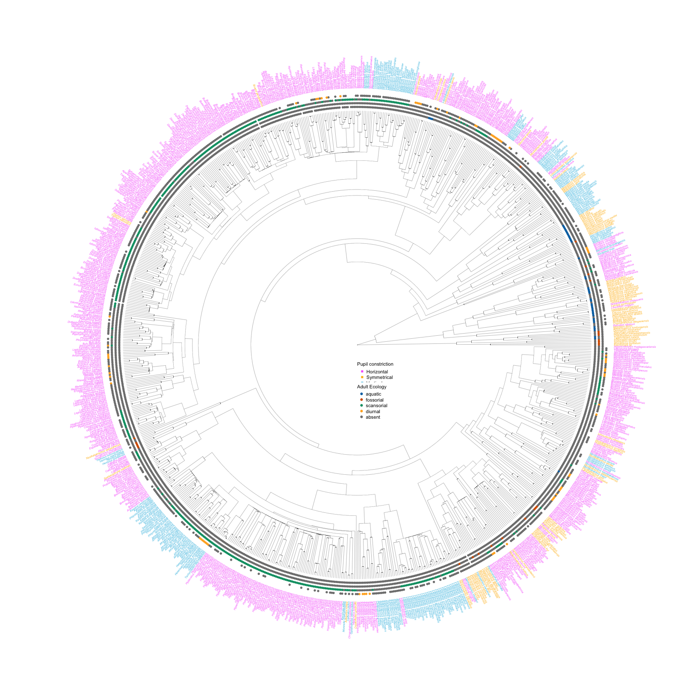<!-- -->

```r
#finish pdf export without legends
#dev.off()

#finish pdf export
#dev.off()
```

## Adult pupil shape and ecology

We previously ran models of discrete correlated character evolution in BayesTraits to test for associations between pupil shape and ecology, but MCMC results did not converge properly and ML transition rates were difficult to interpret. Our new approach here is to use multivariate phylogenetic logistic regression using the R package phylolm. Specifically, we will examine the correlation structure of binary states for pupil shape, activity pattern, habitat and the interaction between activity pattern and habitat using the logistic_MPLE method, which maximizes the penalized likelihood of the logistic regression. 

Our ecological data is already in binary format, with "yes" indicating the presence of an ecological trait of interest and "no" the absence. We also need to make pupil shape binary depending on the hypothesis we are testing. Specifically, we need one column for vertical pupil vs. nonvertical (horizontal or symmetrical) pupil, and one column for symmetrical pupil vs. nonsymmetrical (elongated horizontal or vertical) pupil. 


```r
#convert traits to 0 and 1
pupils.binary <- pupils.eco %>%
  select(ASW_names, Final_Constriction, aquatic, fossorial, arboreal, diurnal) %>%
  mutate(pupil_vert_bi = recode(Final_Constriction, "vertical" = 1, "horizontal" = 0, "symmetrical" = 0)) %>%
  mutate(pupil_symm_bi = recode(Final_Constriction, "vertical" = 0, "horizontal" = 0, "symmetrical" = 1)) %>%
  
  mutate(aquatic_bi = recode(aquatic, "yes" = 1, "no" = 0)) %>%
  mutate(fossorial_bi = recode(fossorial, "yes" = 1, "no" = 0)) %>%
  mutate(arboreal_bi = recode(arboreal, "yes" = 1, "no" = 0)) %>%
  mutate(diurnal_bi = recode(diurnal, "yes" = 1, "no" = 0)) %>%
  mutate(foss_aq_bi = if_else(fossorial=="yes"|aquatic=="yes", 1, 0))
```

Now we can run the phylogenetic GLMs. I will subset these by the hypothesis that is being tested. So far, I have not included interaction terms, as the sample sizes for just the main hypotheses are often quite small already. We can add though as desired. 

## Are diurnal activity patterns correlated with symmetrical pupils?

First we take a quick look at the distribution of all 4 combinations of these 2 binary traits. 


```r
#find counts for each combination of states
counts_diurnal <- pupils.binary %>%
  filter(!is.na(diurnal_bi)) %>%
  mutate(dual_state = case_when(pupil_symm_bi==1 & diurnal_bi==1 ~ "symmmetrical & diurnal",
                                pupil_symm_bi==0 & diurnal_bi==1 ~ "nonsymmetrical & diurnal",
                                pupil_symm_bi==1 & diurnal_bi==0 ~ "symmmetrical & nondiurnal",
                                pupil_symm_bi==0 & diurnal_bi==0 ~ "nonsymmetrical & nondiurnal"))

#print table
kable(count(counts_diurnal, dual_state))
```

<table>
 <thead>
  <tr>
   <th style="text-align:left;"> dual_state </th>
   <th style="text-align:right;"> n </th>
  </tr>
 </thead>
<tbody>
  <tr>
   <td style="text-align:left;"> nonsymmetrical &amp; diurnal </td>
   <td style="text-align:right;"> 72 </td>
  </tr>
  <tr>
   <td style="text-align:left;"> nonsymmetrical &amp; nondiurnal </td>
   <td style="text-align:right;"> 513 </td>
  </tr>
  <tr>
   <td style="text-align:left;"> symmmetrical &amp; nondiurnal </td>
   <td style="text-align:right;"> 63 </td>
  </tr>
</tbody>
</table>

```r
dicount <- count(counts_diurnal, dual_state) %>%
  add_row(dual_state = "symmmetrical & diurnal", n = 0)


#plot states
plot_D <- ggplot(data=dicount, 
                  aes(x=n, y=dual_state)) +
  geom_bar(stat="identity")+
  geom_text(aes(label=n), hjust=0)+
  theme(text = element_text(size=14), panel.background = element_blank(), axis.line = element_line(colour = "black"), legend.key = element_rect(fill = NA)) + #controls background +
  xlab("Number of species") +
  ylab("Pupil constriction and activity period")

plot(plot_D)
```

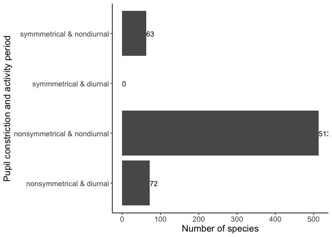<!-- -->
Then we can run the model in phyloglm. 


```r
DiurnalGLM <- phyloglm(pupil_symm_bi ~ diurnal_bi, 
                       data = pupils.binary, 
                       phy = eco.tree, 
                       method = "logistic_MPLE", 
                       boot = 1000)
summary(DiurnalGLM)
```

```
## 
## Call:
## phyloglm(formula = pupil_symm_bi ~ diurnal_bi, data = pupils.binary, 
##     phy = eco.tree, method = "logistic_MPLE", boot = 1000)
##        AIC     logLik Pen.logLik 
##      259.1     -126.5     -125.2 
## 
## Method: logistic_MPLE
## Mean tip height: 286.8982
## Parameter estimate(s):
## alpha: 0.004333099 
##       bootstrap mean: 0.004594472 (on log scale, then back transformed)
##       so possible upward bias.
##       bootstrap 95% CI: (0.001505478,0.01428289)
## 
## Coefficients:
##              Estimate    StdErr   z.value lowerbootCI upperbootCI p.value
## (Intercept) -1.517582  1.039764 -1.459545   -2.607696     -0.2681  0.1444
## diurnal_bi  -0.067718  0.256213 -0.264303   -0.568679      0.2814  0.7915
## 
## Note: Wald-type p-values for coefficients, conditional on alpha=0.004333099
##       Parametric bootstrap results based on 1000 fitted replicates
```

```r
plot(DiurnalGLM)
```

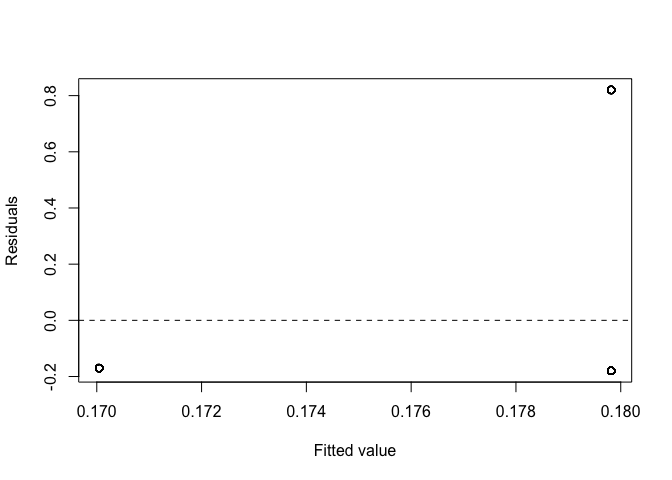<!-- -->


## Are scansorial habitats correlated with vertical pupils?

First we take a quick look at the distribution of all 4 combinations of these 2 binary traits. 


```r
#find counts for each combination of states
counts_scans <- pupils.binary %>%
  filter(!is.na(arboreal_bi)) %>%
  mutate(dual_state = case_when(pupil_vert_bi==1 & arboreal_bi==1 ~ "vertical & scansorial",
                                pupil_vert_bi==0 & arboreal_bi==1 ~ "nonvertical & scansorial",
                                pupil_vert_bi==1 & arboreal_bi==0 ~ "vertical & nonscansorial",
                                pupil_vert_bi==0 & arboreal_bi==0 ~ "nonvertical & nonscansorial"))

#print table
kable(count(counts_scans, dual_state))
```

<table>
 <thead>
  <tr>
   <th style="text-align:left;"> dual_state </th>
   <th style="text-align:right;"> n </th>
  </tr>
 </thead>
<tbody>
  <tr>
   <td style="text-align:left;"> nonvertical &amp; nonscansorial </td>
   <td style="text-align:right;"> 402 </td>
  </tr>
  <tr>
   <td style="text-align:left;"> nonvertical &amp; scansorial </td>
   <td style="text-align:right;"> 325 </td>
  </tr>
  <tr>
   <td style="text-align:left;"> vertical &amp; nonscansorial </td>
   <td style="text-align:right;"> 83 </td>
  </tr>
  <tr>
   <td style="text-align:left;"> vertical &amp; scansorial </td>
   <td style="text-align:right;"> 94 </td>
  </tr>
</tbody>
</table>

```r
#plot states
plot_S <- ggplot(data=count(counts_scans, dual_state), 
                  aes(x=n, y=dual_state)) +
  geom_bar(stat="identity")+
  geom_text(aes(label=n), hjust=0)+
  theme(text = element_text(size=14), panel.background = element_blank(), axis.line = element_line(colour = "black"), legend.key = element_rect(fill = NA)) + #controls background +
  xlab("Number of species") +
  ylab("Pupil constriction and habitat")

plot(plot_S)
```

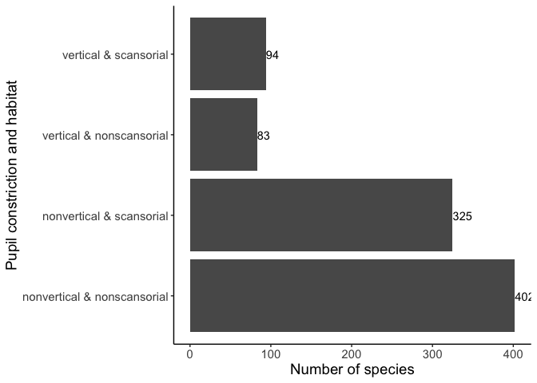<!-- -->

Then we can run the model in phyloglm. 


```r
ScansGLM <- phyloglm(pupil_vert_bi ~ arboreal_bi, 
                       data = pupils.binary, 
                       phy = eco.tree, 
                       method = "logistic_MPLE", 
                       boot = 1000)
summary(ScansGLM)
```

```
## 
## Call:
## phyloglm(formula = pupil_vert_bi ~ arboreal_bi, data = pupils.binary, 
##     phy = eco.tree, method = "logistic_MPLE", boot = 1000)
##        AIC     logLik Pen.logLik 
##      290.6     -142.3     -141.0 
## 
## Method: logistic_MPLE
## Mean tip height: 312.7661
## Parameter estimate(s):
## alpha: 0.004519846 
##       bootstrap mean: 0.002988665 (on log scale, then back transformed)
##       so possible downward bias.
##       bootstrap 95% CI: (0.0004631565,0.009432051)
## 
## Coefficients:
##               Estimate     StdErr    z.value lowerbootCI upperbootCI p.value  
## (Intercept) -2.4033221  1.2856936 -1.8692807  -3.1214764     -0.2380 0.06158 .
## arboreal_bi  0.0035868  0.2057460  0.0174330  -0.1909055      0.1267 0.98609  
## ---
## Signif. codes:  0 '***' 0.001 '**' 0.01 '*' 0.05 '.' 0.1 ' ' 1
## 
## Note: Wald-type p-values for coefficients, conditional on alpha=0.004519846
##       Parametric bootstrap results based on 1000 fitted replicates
```

```r
plot(ScansGLM)
```

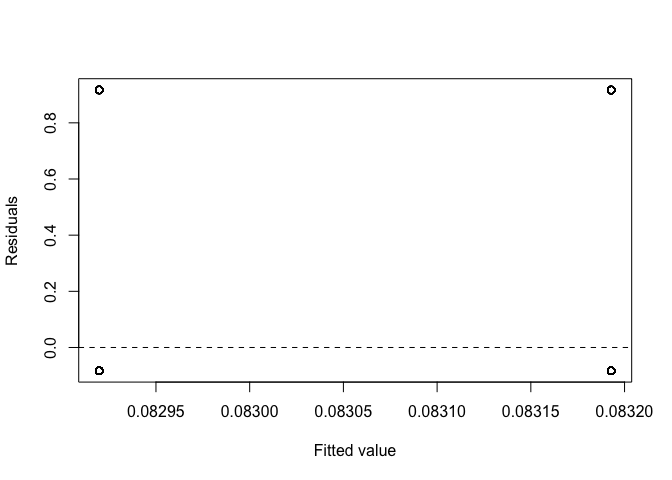<!-- -->

## Are fossorial and aquatic habitats correlated with symmetrical pupils?

First we take a quick look at the distribution of all 4 combinations of these 2 binary traits. 


```r
#find counts for each combination of states
counts_foss_aq <- pupils.binary %>%
  filter(!is.na(foss_aq_bi)) %>%
  mutate(dual_state = case_when(pupil_symm_bi==1 & foss_aq_bi==1 ~ "symmmetrical & fossorial/aquatic",
                                pupil_symm_bi==0 & foss_aq_bi==1 ~ "nonsymmetrical &  fossorial/aquatic",
                                pupil_symm_bi==1 & foss_aq_bi==0 ~ "symmmetrical & not fossorial/aquatic",
                                pupil_symm_bi==0 & foss_aq_bi==0 ~ "nonsymmetrical & not fossorial/aquatic"))

#print table
kable(count(counts_foss_aq,dual_state))
```

<table>
 <thead>
  <tr>
   <th style="text-align:left;"> dual_state </th>
   <th style="text-align:right;"> n </th>
  </tr>
 </thead>
<tbody>
  <tr>
   <td style="text-align:left;"> nonsymmetrical &amp;  fossorial/aquatic </td>
   <td style="text-align:right;"> 18 </td>
  </tr>
  <tr>
   <td style="text-align:left;"> nonsymmetrical &amp; not fossorial/aquatic </td>
   <td style="text-align:right;"> 786 </td>
  </tr>
  <tr>
   <td style="text-align:left;"> symmmetrical &amp; fossorial/aquatic </td>
   <td style="text-align:right;"> 49 </td>
  </tr>
  <tr>
   <td style="text-align:left;"> symmmetrical &amp; not fossorial/aquatic </td>
   <td style="text-align:right;"> 49 </td>
  </tr>
</tbody>
</table>

```r
#plot states
plot_FA <- ggplot(data=count(counts_foss_aq,dual_state), 
                  aes(x=n, y=dual_state)) +
  geom_bar(stat="identity")+
  geom_text(aes(label=n), hjust=0)+
  theme(text = element_text(size=14), panel.background = element_blank(), axis.line = element_line(colour = "black"), legend.key = element_rect(fill = NA)) + #controls background +
  xlab("Number of species") +
  ylab("Pupil constriction and habitat")

plot(plot_FA)
```

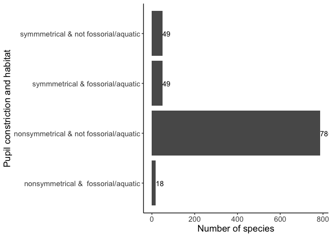<!-- -->


For this model, fossorial and aquatic habitats are combined to increase power. 

```r
FossAqGLM <- phyloglm(pupil_symm_bi ~ foss_aq_bi, 
                       data = pupils.binary, 
                       phy = eco.tree, 
                       method = "logistic_MPLE", 
                       boot = 1000)
summary(FossAqGLM)
```

```
## 
## Call:
## phyloglm(formula = pupil_symm_bi ~ foss_aq_bi, data = pupils.binary, 
##     phy = eco.tree, method = "logistic_MPLE", boot = 1000)
##        AIC     logLik Pen.logLik 
##      341.1     -167.6     -166.2 
## 
## Method: logistic_MPLE
## Mean tip height: 312.7661
## Parameter estimate(s):
## alpha: 0.005192477 
##       bootstrap mean: 0.005966181 (on log scale, then back transformed)
##       so possible upward bias.
##       bootstrap 95% CI: (0.002082824,0.01888321)
## 
## Coefficients:
##             Estimate   StdErr  z.value lowerbootCI upperbootCI  p.value   
## (Intercept) -2.06037  0.96771 -2.12911    -3.34320     -1.1002 0.033245 * 
## foss_aq_bi   2.23292  0.80305  2.78056     1.53858      3.3131 0.005427 **
## ---
## Signif. codes:  0 '***' 0.001 '**' 0.01 '*' 0.05 '.' 0.1 ' ' 1
## 
## Note: Wald-type p-values for coefficients, conditional on alpha=0.005192477
##       Parametric bootstrap results based on 1000 fitted replicates
```

```r
plot(FossAqGLM)
```

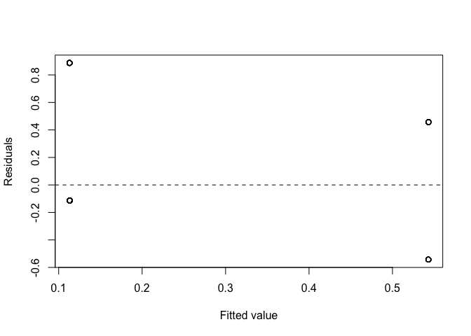<!-- -->

It looks like there may be an association between pupil shape and fossorial/aquatic ecologies. We can also see if there is an additive or interaction effect with diurnality, as we also predicted that would be associated with symmetrical pupils.

We can compare models of pupil ~ diurnal, pupil ~ foss/aq, and pupil ~ diurnal + foss/aq. However, for this we need to make sure the dataset is exactly the same for all three models we will compare. So we will drop NAs from the dataset first.  


```r
#drop NAs for activity period or fossorial/aquatic from dataset
pupils.binary_habact <- pupils.binary %>%
  filter(across(c(foss_aq_bi, diurnal_bi), ~ !is.na(.x)))

#run pupil ~ habitat
HabGLM <- phyloglm(pupil_symm_bi ~ foss_aq_bi, 
                       data = pupils.binary_habact, 
                       phy = eco.tree, 
                       method = "logistic_MPLE", 
                       boot = 1000)
summary(HabGLM)
```

```
## 
## Call:
## phyloglm(formula = pupil_symm_bi ~ foss_aq_bi, data = pupils.binary_habact, 
##     phy = eco.tree, method = "logistic_MPLE", boot = 1000)
##        AIC     logLik Pen.logLik 
##      235.7     -114.9     -113.8 
## 
## Method: logistic_MPLE
## Mean tip height: 286.8982
## Parameter estimate(s):
## alpha: 0.005212592 
##       bootstrap mean: 0.006346816 (on log scale, then back transformed)
##       so possible upward bias.
##       bootstrap 95% CI: (0.001805655,0.02948846)
## 
## Coefficients:
##             Estimate   StdErr  z.value lowerbootCI upperbootCI  p.value   
## (Intercept) -1.99811  0.99709 -2.00393    -3.35895     -0.8876 0.045077 * 
## foss_aq_bi   2.38813  0.86593  2.75789     1.48639      3.7098 0.005818 **
## ---
## Signif. codes:  0 '***' 0.001 '**' 0.01 '*' 0.05 '.' 0.1 ' ' 1
## 
## Note: Wald-type p-values for coefficients, conditional on alpha=0.005212592
##       Parametric bootstrap results based on 1000 fitted replicates
```

```r
plot(HabGLM)
```

<!-- -->

```r
#run pupil ~ activity period
ActGLM <- phyloglm(pupil_symm_bi ~ diurnal_bi, 
                       data = pupils.binary_habact, 
                       phy = eco.tree, 
                       method = "logistic_MPLE", 
                       boot = 1000)
summary(ActGLM)
```

```
## 
## Call:
## phyloglm(formula = pupil_symm_bi ~ diurnal_bi, data = pupils.binary_habact, 
##     phy = eco.tree, method = "logistic_MPLE", boot = 1000)
##        AIC     logLik Pen.logLik 
##      257.7     -125.9     -124.6 
## 
## Method: logistic_MPLE
## Mean tip height: 286.8982
## Parameter estimate(s):
## alpha: 0.004382139 
##       bootstrap mean: 0.004644442 (on log scale, then back transformed)
##       so possible upward bias.
##       bootstrap 95% CI: (0.001420268,0.01307197)
## 
## Coefficients:
##              Estimate    StdErr   z.value lowerbootCI upperbootCI p.value
## (Intercept) -1.529130  1.033732 -1.479232   -2.652215     -0.2442  0.1391
## diurnal_bi  -0.078583  0.266082 -0.295335   -0.602753      0.3041  0.7677
## 
## Note: Wald-type p-values for coefficients, conditional on alpha=0.004382139
##       Parametric bootstrap results based on 1000 fitted replicates
```

```r
plot(ActGLM)
```

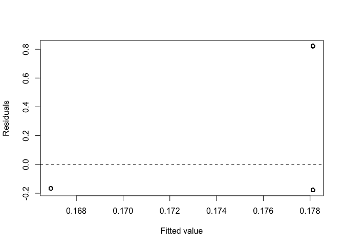<!-- -->

```r
#run pupil ~ habitat + activity period
HabActGLM_add <- phyloglm(pupil_symm_bi ~ foss_aq_bi + diurnal_bi, 
                       data = pupils.binary_habact, 
                       phy = eco.tree, 
                       method = "logistic_MPLE", 
                       boot = 1000)
summary(HabActGLM_add)
```

```
## 
## Call:
## phyloglm(formula = pupil_symm_bi ~ foss_aq_bi + diurnal_bi, data = pupils.binary_habact, 
##     phy = eco.tree, method = "logistic_MPLE", boot = 1000)
##        AIC     logLik Pen.logLik 
##      232.0     -112.0     -111.1 
## 
## Method: logistic_MPLE
## Mean tip height: 286.8982
## Parameter estimate(s):
## alpha: 0.00628871 
##       bootstrap mean: 0.00665769 (on log scale, then back transformed)
##       so possible upward bias.
##       bootstrap 95% CI: (0.001867303,0.0282248)
## 
## Coefficients:
##             Estimate   StdErr  z.value lowerbootCI upperbootCI p.value   
## (Intercept) -2.01971  0.87020 -2.32098    -3.12272     -0.9664 0.02029 * 
## foss_aq_bi   2.58285  0.80796  3.19674    -0.14050      3.5790 0.00139 **
## diurnal_bi  -2.86505  1.28266 -2.23369    -3.91346     -0.0043 0.02550 * 
## ---
## Signif. codes:  0 '***' 0.001 '**' 0.01 '*' 0.05 '.' 0.1 ' ' 1
## 
## Note: Wald-type p-values for coefficients, conditional on alpha=0.00628871
##       Parametric bootstrap results based on 1000 fitted replicates
```

```r
plot(HabActGLM_add)
```

<!-- -->

```r
#run pupil ~ habitat + activity period + habitat*activity period
HabActGLM_int <- phyloglm(pupil_symm_bi ~ foss_aq_bi + diurnal_bi + foss_aq_bi*diurnal_bi, 
                       data = pupils.binary_habact, 
                       phy = eco.tree, 
                       method = "logistic_MPLE", 
                       boot = 1000)
summary(HabActGLM_int)
```

```
## 
## Call:
## phyloglm(formula = pupil_symm_bi ~ foss_aq_bi + diurnal_bi + 
##     foss_aq_bi * diurnal_bi, data = pupils.binary_habact, phy = eco.tree, 
##     method = "logistic_MPLE", boot = 1000)
##        AIC     logLik Pen.logLik 
##      235.2     -112.6     -112.2 
## 
## Method: logistic_MPLE
## Mean tip height: 286.8982
## Parameter estimate(s):
## alpha: 0.005769425 
##       bootstrap mean: 0.005635702 (on log scale, then back transformed)
##       so possible downward bias.
##       bootstrap 95% CI: (0.001643074,0.01840111)
## 
## Coefficients:
##                       Estimate   StdErr  z.value lowerbootCI upperbootCI
## (Intercept)           -1.96767  0.93510 -2.10422    -3.02204     -0.7292
## foss_aq_bi             2.57146  0.85378  3.01185    -0.13180      3.6861
## diurnal_bi            -1.24254  0.64760 -1.91869    -2.34302      0.3336
## foss_aq_bi:diurnal_bi -1.63220  3.30963 -0.49317    -2.37232      1.2108
##                        p.value   
## (Intercept)           0.035359 * 
## foss_aq_bi            0.002597 **
## diurnal_bi            0.055024 . 
## foss_aq_bi:diurnal_bi 0.621895   
## ---
## Signif. codes:  0 '***' 0.001 '**' 0.01 '*' 0.05 '.' 0.1 ' ' 1
## 
## Note: Wald-type p-values for coefficients, conditional on alpha=0.005769425
##       Parametric bootstrap results based on 1000 fitted replicates
```

```r
plot(HabActGLM_int)
```

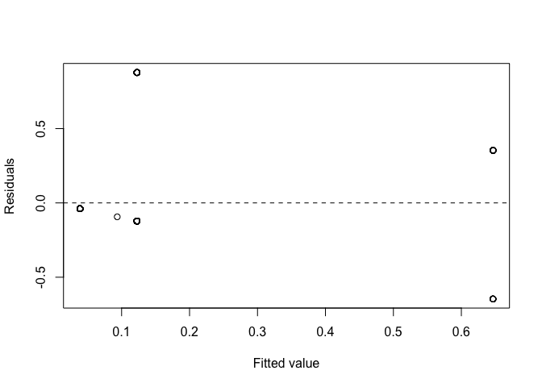<!-- -->

From p-values alone in the interaction model, it looks like aquatic/fossoriality and diurnality both have effects on pupil shape, but there is no interaction (which makes sense, because I don't know if we even have any fossorial diurnal things, since we defined diurnal as active during the day above ground which would exclude fossorial diurnal things from the category. There might have been a couple aquatic diurnal things?). 

From AIC, it looks like the additive model that includes aquatic/fossoriality and diurnality is the best at describing pupil shape as symmetrical or nonsymmetrical. 

Just to take a quick look at sample sizes for these categories so we know what we have in this model:


```r
samples <- pupils.binary %>%
  count(pupil_symm_bi, foss_aq_bi, diurnal_bi)

kable(samples, caption = "Number of obsercations in each combination of states for model. ") %>%
  kable_styling(full_width = F) %>%
  collapse_rows(columns = 1, valign = "top") %>%
  scroll_box(height = "500px")
```

<div style="border: 1px solid #ddd; padding: 0px; overflow-y: scroll; height:500px; "><table class="table" style="width: auto !important; margin-left: auto; margin-right: auto;">
<caption>Number of obsercations in each combination of states for model. </caption>
 <thead>
  <tr>
   <th style="text-align:right;position: sticky; top:0; background-color: #FFFFFF;"> pupil_symm_bi </th>
   <th style="text-align:right;position: sticky; top:0; background-color: #FFFFFF;"> foss_aq_bi </th>
   <th style="text-align:right;position: sticky; top:0; background-color: #FFFFFF;"> diurnal_bi </th>
   <th style="text-align:right;position: sticky; top:0; background-color: #FFFFFF;"> n </th>
  </tr>
 </thead>
<tbody>
  <tr>
   <td style="text-align:right;"> 0 </td>
   <td style="text-align:right;"> 0 </td>
   <td style="text-align:right;"> 0 </td>
   <td style="text-align:right;"> 501 </td>
  </tr>
  <tr>
   <td style="text-align:right;"> 0 </td>
   <td style="text-align:right;"> 0 </td>
   <td style="text-align:right;"> 1 </td>
   <td style="text-align:right;"> 70 </td>
  </tr>
  <tr>
   <td style="text-align:right;"> 0 </td>
   <td style="text-align:right;"> 0 </td>
   <td style="text-align:right;"> NA </td>
   <td style="text-align:right;"> 215 </td>
  </tr>
  <tr>
   <td style="text-align:right;"> 0 </td>
   <td style="text-align:right;"> 1 </td>
   <td style="text-align:right;"> 0 </td>
   <td style="text-align:right;"> 9 </td>
  </tr>
  <tr>
   <td style="text-align:right;"> 0 </td>
   <td style="text-align:right;"> 1 </td>
   <td style="text-align:right;"> 1 </td>
   <td style="text-align:right;"> 1 </td>
  </tr>
  <tr>
   <td style="text-align:right;"> 0 </td>
   <td style="text-align:right;"> 1 </td>
   <td style="text-align:right;"> NA </td>
   <td style="text-align:right;"> 8 </td>
  </tr>
  <tr>
   <td style="text-align:right;"> 0 </td>
   <td style="text-align:right;"> NA </td>
   <td style="text-align:right;"> 0 </td>
   <td style="text-align:right;"> 3 </td>
  </tr>
  <tr>
   <td style="text-align:right;"> 0 </td>
   <td style="text-align:right;"> NA </td>
   <td style="text-align:right;"> 1 </td>
   <td style="text-align:right;"> 1 </td>
  </tr>
  <tr>
   <td style="text-align:right;"> 0 </td>
   <td style="text-align:right;"> NA </td>
   <td style="text-align:right;"> NA </td>
   <td style="text-align:right;"> 2 </td>
  </tr>
  <tr>
   <td style="text-align:right;"> 1 </td>
   <td style="text-align:right;"> 0 </td>
   <td style="text-align:right;"> 0 </td>
   <td style="text-align:right;"> 38 </td>
  </tr>
  <tr>
   <td style="text-align:right;"> 1 </td>
   <td style="text-align:right;"> 0 </td>
   <td style="text-align:right;"> NA </td>
   <td style="text-align:right;"> 11 </td>
  </tr>
  <tr>
   <td style="text-align:right;"> 1 </td>
   <td style="text-align:right;"> 1 </td>
   <td style="text-align:right;"> 0 </td>
   <td style="text-align:right;"> 24 </td>
  </tr>
  <tr>
   <td style="text-align:right;"> 1 </td>
   <td style="text-align:right;"> 1 </td>
   <td style="text-align:right;"> NA </td>
   <td style="text-align:right;"> 25 </td>
  </tr>
  <tr>
   <td style="text-align:right;"> 1 </td>
   <td style="text-align:right;"> NA </td>
   <td style="text-align:right;"> 0 </td>
   <td style="text-align:right;"> 1 </td>
  </tr>
</tbody>
</table></div>

In this table, 1 = symmetrical, fossorial/aquatic, and diurnal, respectively. Important to note that  all the diurnal things have nonsymmetrical pupils, so while it's a significant predictor in this model it may not be in the direction we predicted! I don't know how to fully interpret this output..


We can also investigate fossorial and aquatic traits in separate models, though both have few species representing them. 


```r
FossGLM <- phyloglm(pupil_symm_bi ~ fossorial_bi, 
                       data = pupils.binary, 
                       phy = eco.tree, 
                       method = "logistic_MPLE", 
                       boot = 1000)
summary(FossGLM)
```

```
## 
## Call:
## phyloglm(formula = pupil_symm_bi ~ fossorial_bi, data = pupils.binary, 
##     phy = eco.tree, method = "logistic_MPLE", boot = 1000)
##        AIC     logLik Pen.logLik 
##      357.6     -175.8     -174.9 
## 
## Method: logistic_MPLE
## Mean tip height: 312.7661
## Parameter estimate(s):
## alpha: 0.004169545 
##       bootstrap mean: 0.004661665 (on log scale, then back transformed)
##       so possible upward bias.
##       bootstrap 95% CI: (0.001878408,0.01321751)
## 
## Coefficients:
##              Estimate   StdErr  z.value lowerbootCI upperbootCI p.value  
## (Intercept)  -1.57328  1.01083 -1.55642    -2.73467     -0.6563 0.11961  
## fossorial_bi  1.36123  0.74972  1.81567     0.60385      2.4079 0.06942 .
## ---
## Signif. codes:  0 '***' 0.001 '**' 0.01 '*' 0.05 '.' 0.1 ' ' 1
## 
## Note: Wald-type p-values for coefficients, conditional on alpha=0.004169545
##       Parametric bootstrap results based on 1000 fitted replicates
```

```r
plot(FossGLM)
```

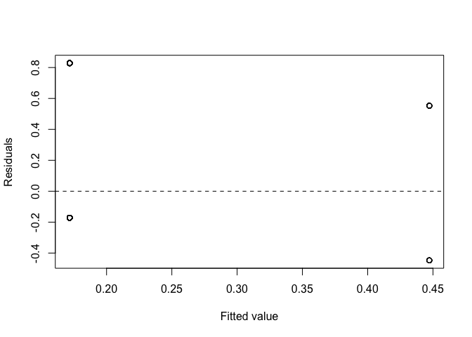<!-- -->

On its own, fossoriality does not seem to be significantly associated with symmetrical pupils, though I don't understand how to interpret this model output fully. 


```r
AquaticGLM <- phyloglm(pupil_symm_bi ~ aquatic_bi, 
                       data = pupils.binary, 
                       phy = eco.tree, 
                       method = "logistic_MPLE", 
                       boot = 1000)
summary(AquaticGLM)
```

```
## 
## Call:
## phyloglm(formula = pupil_symm_bi ~ aquatic_bi, data = pupils.binary, 
##     phy = eco.tree, method = "logistic_MPLE", boot = 1000)
##        AIC     logLik Pen.logLik 
##      348.1     -171.1     -170.0 
## 
## Method: logistic_MPLE
## Mean tip height: 312.7661
## Parameter estimate(s):
## alpha: 0.004643716 
##       bootstrap mean: 0.005291097 (on log scale, then back transformed)
##       so possible upward bias.
##       bootstrap 95% CI: (0.002296853,0.01371479)
## 
## Coefficients:
##             Estimate   StdErr  z.value lowerbootCI upperbootCI  p.value   
## (Intercept) -1.75751  0.93233 -1.88508    -2.89031     -0.9242 0.059418 . 
## aquatic_bi   2.46061  0.80673  3.05011     1.68226      3.6251 0.002288 **
## ---
## Signif. codes:  0 '***' 0.001 '**' 0.01 '*' 0.05 '.' 0.1 ' ' 1
## 
## Note: Wald-type p-values for coefficients, conditional on alpha=0.004643716
##       Parametric bootstrap results based on 1000 fitted replicates
```

```r
plot(AquaticGLM)
```

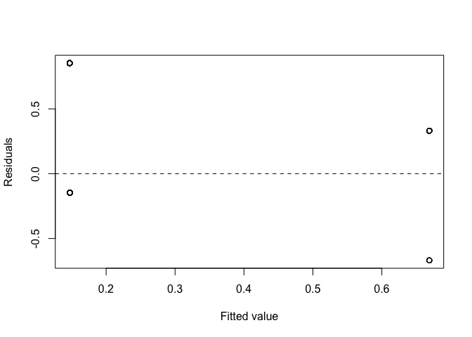<!-- -->

Aquatic habitat maybe is correlated with symmetrical pupil on its own? Again, not quite sure how to interpret this output but the p-value is significant. 


# Adult pupil shape and eye size

We might predict that species with larger eyes would benefit from having a slit pupil. 

## Pupil shape and eye size

Here, we plot pupil shape and constriction data are the same and absolute eye size (scaled purple circles). 


```r
#export as pdf
#pdf("../Outputs/Figures/phylogeny_eyesize.pdf", width = 8, height = 30)

#plot phylogeny
plot.phylo(eye.tree, 
           type = "phylogram", 
           show.tip.label = TRUE, 
           cex = 0.8, #text size
           no.margin = TRUE, 
           use.edge.length = TRUE, 
           edge.width = 2,
           label.offset = 75) 

#add tip labels for pupil constriction
tiplabels(col = col_constrict[pupils.eye$Final_Constriction], #sets color to pupil constriction 
          pch = sh_constrict[pupils.eye$Final_Constriction], #shape of labels
          cex = 0.8,
          offset = 5) #size of labels

#add tip labels for pupil shape
tiplabels(col = "black", bg = "black",
          pch = sh_shape[pupils.eye$Final_Shape], #shape of labels
          cex = 0.9,
          offset = 15) #size of labels

#add tip labels for eye size
tiplabels(cex = 0.17*pupils.eye$eye_av,
          pch = 19, #shape of labels
          col = "mediumpurple",
          offset = 35) 


#add legend for pupil constriction
legend(x = 40, y = 209,
       legend = c("Horizontal", "Symmetrical", "Vertical"), 
       col = col_constrict,
       pch = sh_constrict, #shape of labels
       cex = 0.7, 
       box.lty = 0, 
       title = "Pupil constriction", 
       title.adj = 0)

#add legend for pupil shape
legend(x = 110, y = 209, legend = c("Almond", "Circle", "Diamond", "Slit", "Upside down tear","Upside down triangle"),
       col = "black", pt.bg = "black",
       pch = sh_shape, #shape of labels
       cex = 0.7, 
       box.lty = 0, 
       title = "Pupil shape", 
       title.adj = 0)
```

<!-- -->

```r
#finish pdf export
#dev.off()
```

Alternatively, we can plot eye size with a bar plot in ggtree and color by pupil constriction. 


```r
# Prep data and phylogeny-----

#subset data for eye diameter and constriction
eye.bars <- pupils.eye %>%
  mutate(tiplab = ASW_names,
         fam = Family,
         abseye = eye_av, 
         pupil = Final_Constriction, 
         pupil_bi = binary_constriction) %>%
  select(tiplab, fam, abseye, pupil, pupil_bi)

# set row names in dataset to match the tip labels in the tree
row.names(eye.bars) <- eye.bars$tiplab

#check that phylogeny and data match exactly
name.check(eye.bars, eye.tree)
```

```
## [1] "OK"
```

```r
#ladderize tree
eye.tree <- ladderize(eye.tree)

#resort trait dataset to the order of tree tip labels
eye.bars <- eye.bars[eye.tree$tip.label, ] 

#make trait vector for absolute eye size
aveye <- as.vector(eye.bars$abseye) 

#add tip label names to vector
names(aveye) <- eye.bars$tiplab 

#make trait vector of pupil constrictions
pups <- as.vector(eye.bars$pupil) 

#make vector of colors corresponding to phylogeny tips
tipcols.pup <- unname(col_constrict[pups]) 

# Make plot------

#export pdf 
#pdf(file = "../Outputs/Figures/eyesize_phylo_fams.pdf", height=30, width=7)
pdf(file = "../Outputs/Figures/eyesize_phylo.pdf", height=20, width=7)

#call plot with phylo, tip labels, and absolute eye diameters
plotTree.wBars(eye.tree, aveye, 
               scale = 6, 
               width = 1,
               tip.labels = FALSE, 
               offset = 0.4,
               col = tipcols.pup)

#add labels for family
#tiplabels(eye.bars$fam, cex = 0.7, adj = 1) 

#add legend for habitat states
legend(x  ="left", legend = c("Horizontal", "Symmetrical", "Vertical"), pch = 22, pt.cex= 2, pt.bg = col_constrict, cex = 1, bty = "n",horiz = F)

dev.off()
```

```
## quartz_off_screen 
##                 2
```

## Test for correlation 

Here, we use a PGLS in caper to test whether there is a correlation between eye size (absolute eye diameter) and pupil constriction orientation (elongated vs. symmetrical) while accounting for evolutionary relationships. 

First we put our data and tree into a matched comparative object for caper. 


```r
#check that tree tip labels match data subset
name.check(eye.tree, pupils.eye)
```

```
## [1] "OK"
```

```r
#make sure order is same in tree and data
pupils.eye <- pupils.eye[eye.tree$tip.label,]

#use caper function to combine phylogeny and data into one object 
#(this function also matches species names in tree and dataset)
pupil_eye.comp <- comparative.data(phy = eye.tree, data = pupils.eye, 
                             names.col = ASW_names, 
                             vcv = TRUE, 
                             na.omit = FALSE, 
                             warn.dropped = TRUE)

#check for dropped tips or dropped species
pupil_eye.comp$dropped$tips #phylogeny
```

```
## character(0)
```

```r
pupil_eye.comp$dropped$unmatched.rows #dataset
```

```
## character(0)
```

Next we can fit the PGLS model for pupil constriction vs. eye diameter. 


```r
#elongated pupils vs. eye diameter
pgls_pupil.eye <- pgls(eye_av ~ binary_constriction, 
               data = pupil_eye.comp,
               lambda = "ML", 
               param.CI = 0.95)
```

We need to check that model assumptions are being met. 


```r
#evaluate model assumptions
par(mfrow = c(2,2)) #makes your plot window into 2x2 panels
plot(pgls_pupil.eye) #plot the linear model
```

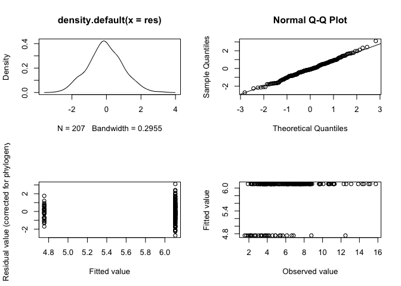<!-- -->

```r
par(mfrow = c(1,1)) #set plotting window back to one plot
```

These look ok. Next we look at the model parameter estimates. 


```r
#main effects
kable(anova(pgls_pupil.eye), digits = 3, caption= "ANOVA Table for eye size ~ pupil constriction ") %>%
  kable_styling(full_width = F) %>%
  collapse_rows(columns = 1, valign = "top")
```

<table class="table" style="width: auto !important; margin-left: auto; margin-right: auto;">
<caption>ANOVA Table for eye size ~ pupil constriction </caption>
 <thead>
  <tr>
   <th style="text-align:left;">   </th>
   <th style="text-align:right;"> Df </th>
   <th style="text-align:right;"> Sum Sq </th>
   <th style="text-align:right;"> Mean Sq </th>
   <th style="text-align:right;"> F value </th>
   <th style="text-align:right;"> Pr(&gt;F) </th>
  </tr>
 </thead>
<tbody>
  <tr>
   <td style="text-align:left;"> binary_constriction </td>
   <td style="text-align:right;"> 1 </td>
   <td style="text-align:right;"> 0.216 </td>
   <td style="text-align:right;"> 0.216 </td>
   <td style="text-align:right;"> 5.241 </td>
   <td style="text-align:right;"> 0.023 </td>
  </tr>
  <tr>
   <td style="text-align:left;"> Residuals </td>
   <td style="text-align:right;"> 205 </td>
   <td style="text-align:right;"> 8.445 </td>
   <td style="text-align:right;"> 0.041 </td>
   <td style="text-align:right;"> NA </td>
   <td style="text-align:right;"> NA </td>
  </tr>
</tbody>
</table>

```r
#parameter estimates
summary(pgls_pupil.eye)
```

```
## 
## Call:
## pgls(formula = eye_av ~ binary_constriction, data = pupil_eye.comp, 
##     lambda = "ML", param.CI = 0.95)
## 
## Residuals:
##      Min       1Q   Median       3Q      Max 
## -0.54905 -0.14278 -0.02117  0.11555  0.62681 
## 
## Branch length transformations:
## 
## kappa  [Fix]  : 1.000
## lambda [ ML]  : 0.514
##    lower bound : 0.000, p = 1.3607e-06
##    upper bound : 1.000, p = 1.4433e-15
##    95.0% CI   : (0.271, 0.722)
## delta  [Fix]  : 1.000
## 
## Coefficients:
##                                Estimate Std. Error t value  Pr(>|t|)    
## (Intercept)                     6.10762    0.83818  7.2868 6.732e-12 ***
## binary_constrictionsymmetrical -1.35330    0.59112 -2.2894   0.02308 *  
## ---
## Signif. codes:  0 '***' 0.001 '**' 0.01 '*' 0.05 '.' 0.1 ' ' 1
## 
## Residual standard error: 0.203 on 205 degrees of freedom
## Multiple R-squared: 0.02493,	Adjusted R-squared: 0.02017 
## F-statistic: 5.241 on 1 and 205 DF,  p-value: 0.02308
```

Among species we have eye size data for from the ProcB paper (n = 207), there is a significant association between pupil constriction axis and eye diameter. Species with elongated pupils have significantly larger eyes than species with symmetrical pupils.

Model is significant overall (p <0.001) but R2 is extremely low (0.02) so I’d interpret this with caution, as it doesn’t have high explanatory power despite being significant.

We can make boxplots comparing eye size across pupil types. 


```r
#shapes for boxplots
sh_constrict2 <- c("horizontal" = 22,
                   "symmetrical" = 21,
                   "vertical" = 25)

# boxplot of eye size across pupil constrictions
boxplot_eyesize <- ggplot(data = pupils.eye, 
                       aes(y = binary_constriction, x = eye_av)) + 
  geom_boxplot(notch = FALSE, outlier.shape = NA, alpha = 0.9) + #controls boxes  
 geom_jitter(aes(fill = Final_Constriction, shape = Final_Constriction), size = 3, alpha = 0.7, position = position_jitter(0.15)) +
  scale_fill_manual(values = col_constrict,
                     name = "",
                     breaks = c("symmetrical", "horizontal", "vertical")) +
  stat_summary(fun.x = mean, colour = "black", geom = "point", shape = 18, size = 4, show_guide = FALSE) + #controls what stats shown
  scale_shape_manual(values = sh_constrict2,
                     name = "",
                     breaks = c("symmetrical","horizontal", "vertical")) +
  theme(text = element_text(size=16), panel.background = element_blank(), axis.line = element_line(colour = "black"), legend.key = element_rect(fill = NA)) + #controls background +
  ylab("Pupil constriction") +
  xlab("Eye diameter (mm)")

boxplot_eyesize
```

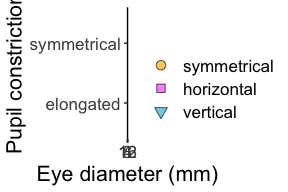<!-- -->

```r
#export pdf 
pdf(file = "../Outputs/Figures/eyesize_boxplot.pdf", height=4, width=10)
boxplot_eyesize
dev.off()
```

```
## quartz_off_screen 
##                 2
```

Let's look at this with 3 states


```r
# boxplot of eye size across pupil constrictions
boxplot_eyesize2 <- ggplot(data = pupils.eye, 
                       aes(x = eye_av, y = Final_Constriction)) + 
  geom_boxplot(notch = FALSE, outlier.shape = NA, alpha = 0.9) + #controls boxes  
 geom_jitter(size = 2, alpha = 0.7, position = position_jitter(0.15)) +
  stat_summary(fun.y = mean, colour = "black", geom = "point", shape = 18, size = 3, show_guide = FALSE) + #controls what stats shown
  theme(text = element_text(size=14), panel.background = element_blank(), axis.line = element_line(colour = "black"), legend.key = element_rect(fill = NA)) + #controls background +
  xlab("eye diameter (mm)") +
  ylab("")

boxplot_eyesize2
```

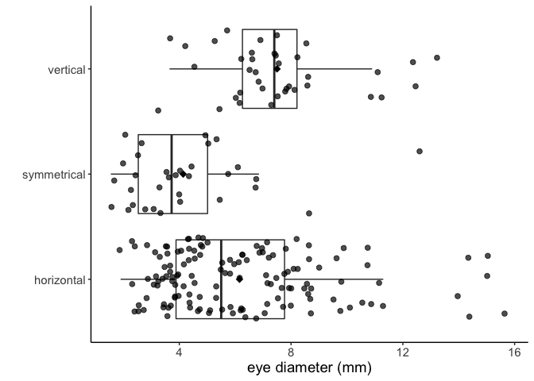<!-- -->

